<h3><a href="https://github.com/mclix85/main" target="_blank">View Source Code</a></h3>

<h3>Course Description</h3>

<p class="course__description">Learning Python is crucial for any aspiring data science practitioner. Learn to visualize real data with Matplotlib’s functions and get acquainted with data structures such as the dictionary and pandas DataFrame. This four-hour intermediate course will help you to build on your existing Python skills and explore new Python applications and functions that expand your repertoire and help you work more efficiently.
<br><br>
You'll discover how dictionaries offer an alternative to Python lists, and why the pandas dataframe is the most popular way of working with tabular data. In the second chapter of this course, you’ll find out how you can create and manipulate datasets, and how to access them using these structures. Hands-on practice throughout the course will build your confidence in each area.
<br><br>
As you progress, you’ll look at logic, control flow, filtering and loops. These functions work to control decision-making in Python programs and help you to perform more operations with your data, including repeated statements. You’ll finish the course by applying all of your new skills by using hacker statistics to calculate your chances of winning a bet.
<br><br>
Once you’ve completed all of the chapters, you’ll be ready to apply your new skills in your job, new career, or personal project, and be prepared to move onto more advanced Python learning.</p>

# Matplotlib

<p class="chapter__description">
    Data visualization is a key skill for aspiring data scientists. Matplotlib makes it easy to create meaningful and insightful plots. In this chapter, you’ll learn how to build various types of plots, and customize them to be more visually appealing and interpretable.
  </p>

## Basic plots with Matplotlib


### Line plot (1)


<div class>
<p>With matplotlib, you can create a bunch of different plots in Python. The most basic plot is the line plot. A general recipe is given here.</p>
<pre><code>import matplotlib.pyplot as plt
plt.plot(x,y)
plt.show()
</code></pre>
<p>In the video, you already saw how much the world population has grown over the past years. Will it continue to do so? The world bank has estimates of the world population for the years 1950 up to 2100. The years are loaded in your workspace as a list called <code>year</code>, and the corresponding populations as a list called <code>pop</code>.</p>
<p><em>This course touches on a lot of concepts you may have forgotten, so if you ever need a quick refresher, download the <a href="https://datacamp-community-prod.s3.amazonaws.com/0eff0330-e87d-4c34-88d5-73e80cb955f2">Python for data science Cheat Sheet</a> and keep it handy!</em></p>
</div>

<li>
<a href="https://docs.python.org/3/library/functions.html#print"><code>print()</code></a> the last item from both the <code>year</code> and the <code>pop</code> list to see what the predicted population for the year 2100 is. Use two <code>print()</code> functions.</li>

<li>Before you can start, you should import <code>matplotlib.pyplot</code> as <code>plt</code>. <code>pyplot</code> is a sub-package of <code>matplotlib</code>, hence the dot. </li>

<li>Use <a href="https://matplotlib.org/stable/api/_as_gen/matplotlib.pyplot.plot.html"><code>plt.plot()</code></a> to build a line plot. <code>year</code> should be mapped on the horizontal axis, <code>pop</code> on the vertical axis. Don't forget to finish off with the <a href="https://matplotlib.org/stable/api/_as_gen/matplotlib.pyplot.show.html"><code>plt.show()</code></a> function to actually display the plot.</li>
<div>

```python
# edited/added
import numpy as np
year=list(range(1950,2100+1))
pop=list(np.loadtxt('datasets/Intermediate-Python/pop1.txt', dtype=float))

# Print the last item from years and populations
print(year[-1])
```

```
## 2100
```

```python
print(pop[-1])
```

```
## 10.85
```
</div>

<div>

```python
# Import matplotlib.pyplot as plt
import matplotlib.pyplot as plt

# Make a line plot: year on the x-axis, pop on the y-axis
plt.plot(year,pop) 
# Display the plot with plt.show()
plt.show()
```

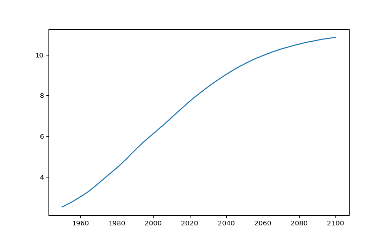
</div>

<p class="">Great! Let's interpret the plot you just created.</p>

### Line Plot (2): Interpretation


<div class><p>Have another look at the plot you created in the previous exercise; it's shown on the right. Based on the plot, in <strong>approximately</strong> what year will there be more than ten billion human beings on this planet?</p></div>

- [ ] 2040
- [x] 2060
- [ ] 2085
- [ ] 2095

<p class="">Correct! Time to take your data visualization skills to the next level!</p>

### Line plot (3)


<div class>
<p>Now that you've built your first line plot, let's start working on the data that professor Hans Rosling used to build his beautiful bubble chart. It was collected in 2007. Two lists are available for you:</p>
<ul>
<li>
<code>life_exp</code> which contains the life expectancy for each country and</li>
<li>
<code>gdp_cap</code>, which contains the GDP per capita (i.e. per person) for each country expressed in US Dollars.</li>
</ul>
<p>GDP stands for Gross Domestic Product. It basically represents the size of the economy of a country. Divide this by the population and you get the GDP per capita.</p>
<p><code>matplotlib.pyplot</code> is already imported as <code>plt</code>, so you can get started straight away.</p>
</div>

<li>Print the last item from both the list <code>gdp_cap</code>, and the list <code>life_exp</code>; it is information about Zimbabwe.</li>

<li>Build a line chart, with <code>gdp_cap</code> on the x-axis, and <code>life_exp</code> on the y-axis. Does it make sense to plot this data on a line plot? </li>
<div>

```python
# edited/added
gdp_cap=list(np.loadtxt('datasets/Intermediate-Python/gdp_cap.txt', dtype=float))
life_exp=list(np.loadtxt('datasets/Intermediate-Python/life_exp.txt', dtype=float))

# Print the last item of gdp_cap and life_exp
print(gdp_cap[-1])
```

```
## 469.709298
```

```python
print(life_exp[-1])
```

```
## 43.487
```
</div>
<div>

```python
# Make a line plot, gdp_cap on the x-axis, life_exp on the y-axis
plt.plot(gdp_cap, life_exp)
plt.show()
```

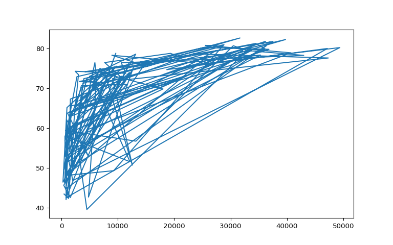
</div>

<p class="">Well done, but this doesn't look right. Let's build a plot that makes more sense.</p>

### Scatter Plot (1)


<div class>
<p>When you have a time scale along the horizontal axis, the line plot is your friend. But in many other cases, when you're trying to assess if there's a correlation between two variables, for example, the scatter plot is the better choice. Below is an example of how to build a scatter plot.</p>
<pre><code>import matplotlib.pyplot as plt
plt.scatter(x,y)
plt.show()
</code></pre>
<p>Let's continue with the <code>gdp_cap</code> versus <code>life_exp</code> plot, the GDP and life expectancy data for different countries in 2007. Maybe a scatter plot will be a better alternative?</p>
<p>Again, the <code>matplotlib.pyplot</code> package is available as <code>plt</code>.</p>
</div>

<li>Change the line plot that's coded in the script to a scatter plot.</li>
<li>A correlation will become clear when you display the GDP per capita on a logarithmic scale. Add the line <code>plt.xscale('log')</code>.</li>
<li>Finish off your script with <code>plt.show()</code> to display the plot.</li>
<div>

```python
# Change the line plot below to a scatter plot
plt.scatter(gdp_cap, life_exp)

# Put the x-axis on a logarithmic scale
plt.xscale('log')

# Show plot
plt.show()
```

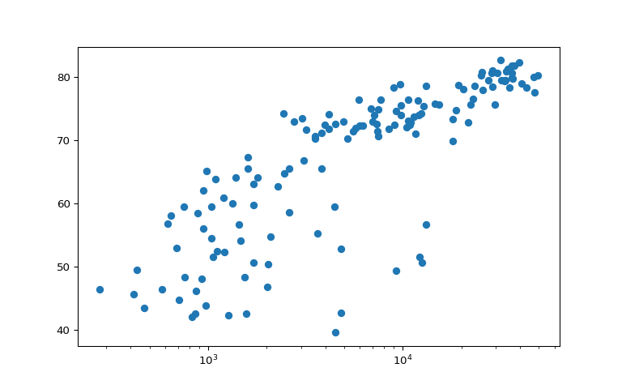
</div>

<p class="">Great! That looks much better!</p>

### Scatter plot (2)


<div class>
<p>In the previous exercise, you saw that the higher GDP usually corresponds to a higher life expectancy. In other words, there is a positive correlation.</p>
<p>Do you think there's a relationship between population and life expectancy of a country? The list <code>life_exp</code> from the previous exercise is already available. In addition, now also <code>pop</code> is available, listing the corresponding populations for the countries in 2007. The populations are in millions of people.</p>
</div>

<li>Start from scratch: import <code>matplotlib.pyplot</code> as <code>plt</code>.</li>

<li>Build a scatter plot, where <code>pop</code> is mapped on the horizontal axis, and <code>life_exp</code> is mapped on the vertical axis. </li>
<li>Finish the script with <code>plt.show()</code> to actually display the plot. Do you see a correlation?</li>
<div>

```python
# edited/added
pop=list(np.loadtxt('datasets/Intermediate-Python/pop2.txt', dtype=float))

# Import package
import matplotlib.pyplot as plt

# Build Scatter plot
plt.scatter(pop, life_exp)
# Show plot
plt.show()
```

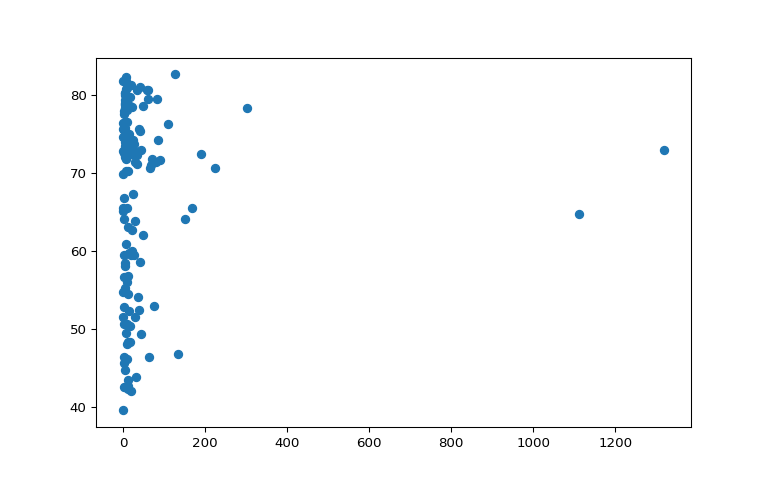
</div>

<p class="">Nice! There's no clear relationship between population and life expectancy, which makes perfect sense.</p>

## Histogram


### Build a histogram (1)


<div class>
<p><code>life_exp</code>, the list containing data on the life expectancy for different countries in 2007, is available in your Python shell.</p>
<p>To see how life expectancy in different countries is distributed, let's create a histogram of <code>life_exp</code>.</p>
<p><code>matplotlib.pyplot</code> is already available as <code>plt</code>.</p>
</div>

<li>Use <a href="https://matplotlib.org/stable/api/_as_gen/matplotlib.pyplot.hist.html"><code>plt.hist()</code></a> to create a histogram of the values in <code>life_exp</code>. Do not specify the number of bins; Python will set the number of bins to 10 by default for you.</li>
<li>Add <code>plt.show()</code> to actually display the histogram. Can you tell which bin contains the most observations?</li>
<div>

```python
# Create histogram of life_exp data
plt.hist(life_exp)
```

```
## (array([ 8.,  7., 10., 10., 10.,  8.,  5., 33., 23., 28.]), array([39.613, 43.912, 48.211, 52.51 , 56.809, 61.108, 65.407, 69.706,
##        74.005, 78.304, 82.603]), <BarContainer object of 10 artists>)
```
</div>
<div>

```python
# Display histogram
plt.show()
```

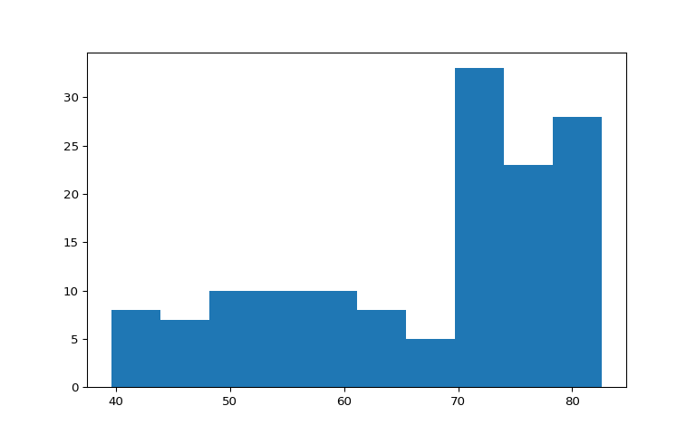
</div>

<p class="">Great job!</p>

### Build a histogram (2): bins


<div class>
<p>In the previous exercise, you didn't specify the number of bins. By default, Python sets the number of bins to 10 in that case. The number of bins is pretty important. Too few bins will oversimplify reality and won't show you the details. Too many bins will overcomplicate reality and won't show the bigger picture.</p>
<p>To control the number of bins to divide your data in, you can set the <code>bins</code> argument.</p>
<p>That's exactly what you'll do in this exercise. You'll be making two plots here. The code in the script already includes <code>plt.show()</code> and <code>plt.clf()</code> calls; <code>plt.show()</code> displays a plot; <code>plt.clf()</code> cleans it up again so you can start afresh.</p>
<p>As before, <code>life_exp</code> is available and <code>matplotlib.pyplot</code> is imported as <code>plt</code>.</p>
</div>

<li>Build a histogram of <code>life_exp</code>, with <code>5</code> bins. Can you tell which bin contains the most observations?</li>

<li>Build another histogram of <code>life_exp</code>, this time with <code>20</code> bins. Is this better?</li>
<div>

```python
# Build histogram with 5 bins
plt.hist(life_exp, bins = 5)
```

```
## (array([15., 20., 18., 38., 51.]), array([39.613, 48.211, 56.809, 65.407, 74.005, 82.603]), <BarContainer object of 5 artists>)
```
</div>
<div>

```python
# Show and clear plot
plt.show()
```

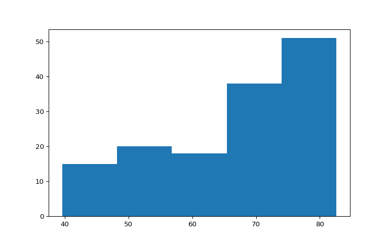

```python
plt.clf()
```
</div>
<div>

```python
# Build histogram with 20 bins
plt.hist(life_exp, bins = 20)
```

```
## (array([ 1.,  7.,  2.,  5.,  4.,  6.,  5.,  5.,  4.,  6.,  3.,  5.,  5.,
##         0., 12., 21., 13., 10., 17., 11.]), array([39.613 , 41.7625, 43.912 , 46.0615, 48.211 , 50.3605, 52.51  ,
##        54.6595, 56.809 , 58.9585, 61.108 , 63.2575, 65.407 , 67.5565,
##        69.706 , 71.8555, 74.005 , 76.1545, 78.304 , 80.4535, 82.603 ]), <BarContainer object of 20 artists>)
```
</div>
<div>

```python
# Show and clear plot again
plt.show()
```

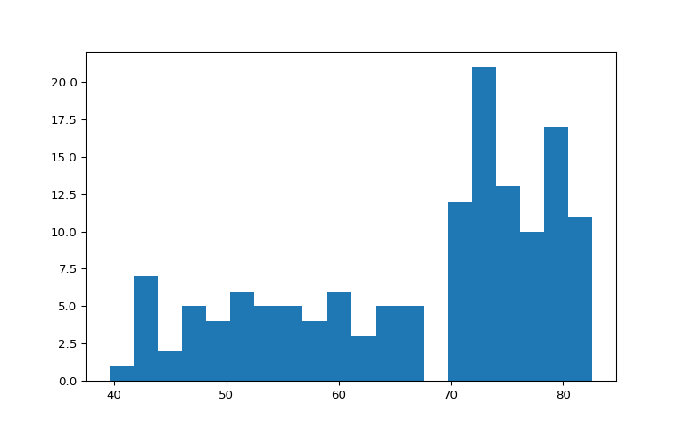

```python
plt.clf()
```
</div>

<p class="">Nice! You can use the buttons to browse through the different plots you've created.</p>

### Build a histogram (3): compare


<div class>
<p>In the video, you saw population pyramids for the present day and for the future. Because we were using a histogram, it was very easy to make a comparison.</p>
<p>Let's do a similar comparison. <code>life_exp</code> contains life expectancy data for different countries in 2007. You also have access to a second list now, <code>life_exp1950</code>, containing similar data for 1950. Can you make a histogram for both datasets?</p>
<p>You'll again be making two plots. The <code>plt.show()</code> and <code>plt.clf()</code> commands to render everything nicely are already included. Also <code>matplotlib.pyplot</code> is imported for you, as <code>plt</code>.</p>
</div>

<li>Build a histogram of <code>life_exp</code> with <code>15</code> bins.</li>

<li>Build a histogram of <code>life_exp1950</code>, also with <code>15</code> bins. Is there a big difference with the histogram for the 2007 data?</li>
<div>

```python
# edited/added
life_exp1950=list(np.loadtxt('datasets/Intermediate-Python/life_exp1950.txt', dtype=float))

# Histogram of life_exp, 15 bins
plt.hist(life_exp, bins = 15)
```

```
## (array([ 3.,  6.,  6.,  7.,  6.,  7.,  7.,  4.,  7.,  5.,  6., 27., 18.,
##        17., 16.]), array([39.613, 42.479, 45.345, 48.211, 51.077, 53.943, 56.809, 59.675,
##        62.541, 65.407, 68.273, 71.139, 74.005, 76.871, 79.737, 82.603]), <BarContainer object of 15 artists>)
```
</div>
<div>

```python
# Show and clear plot
plt.show()
```

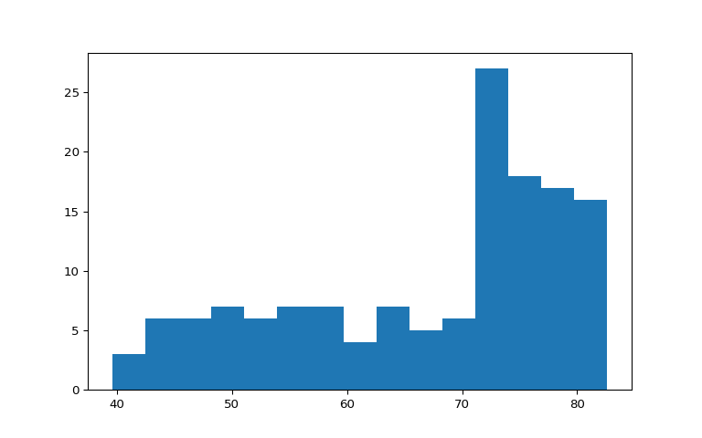

```python
plt.clf()
```
</div>
<div>

```python
# Histogram of life_exp1950, 15 bins
plt.hist(life_exp1950, bins = 15)
```

```
## (array([ 5.,  8., 14., 17., 20., 11.,  7.,  7.,  4.,  7.,  9.,  6., 11.,
##        11.,  5.]), array([28.8       , 31.72466667, 34.64933333, 37.574     , 40.49866667,
##        43.42333333, 46.348     , 49.27266667, 52.19733333, 55.122     ,
##        58.04666667, 60.97133333, 63.896     , 66.82066667, 69.74533333,
##        72.67      ]), <BarContainer object of 15 artists>)
```
</div>
<div>

```python
# Show and clear plot again
plt.show()
```

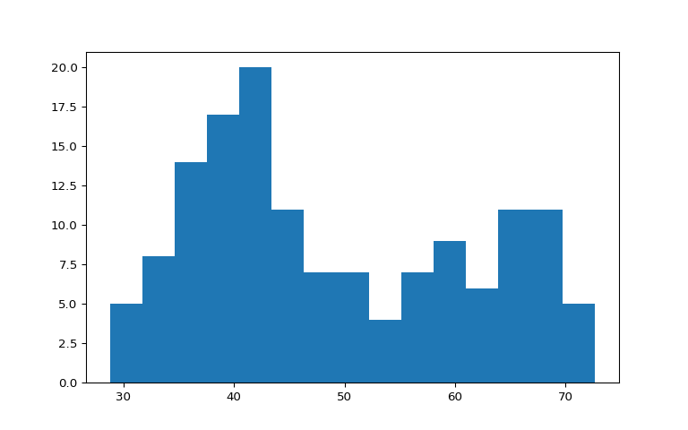

```python
plt.clf()
```
</div>

<p class="">Great! Toggle between the created plots - do you notice anything interesting?</p>

### Choose the right plot (1)


<div class><p>You're a professor teaching Data Science with Python, and you want to visually assess if the grades on your exam follow a particular distribution. Which plot do you use?</p></div>

- [ ] Line plot
- [ ] Scatter plot
- [x] Histogram

<p class="">Excellent choice!</p>

### Choose the right plot (2)


<div class><p>You're a professor in Data Analytics with Python, and you want to visually assess if longer answers on exam questions lead to higher grades. Which plot do you use?</p></div>

- [x] Line plot
- [ ] Scatter plot
- [ ] Histogram

<p class="">Excellent choice!</p>

## Customization


### Labels


<div class>
<p>It's time to customize your own plot. This is the fun part, you will see your plot come to life! </p>
<p>You're going to work on the scatter plot with world development data: GDP per capita on the x-axis (logarithmic scale), life expectancy on the y-axis. The code for this plot is available in the script. </p>
<p>As a first step, let's add axis labels and a title to the plot. You can do this with the <a href="https://matplotlib.org/stable/api/_as_gen/matplotlib.pyplot.xlabel.html"><code>xlabel()</code></a>, <a href="https://matplotlib.org/stable/api/_as_gen/matplotlib.pyplot.ylabel.html"><code>ylabel()</code></a> and <a href="https://matplotlib.org/stable/api/_as_gen/matplotlib.pyplot.title.html"><code>title()</code></a> functions, available in <code>matplotlib.pyplot</code>. This sub-package is already imported as <code>plt</code>.</p>
</div>

<li>The strings <code>xlab</code> and <code>ylab</code> are already set for you. Use these variables to set the label of the x- and y-axis.</li>
<li>The string <code>title</code> is also coded for you. Use it to add a title to the plot.</li>
<li>After these customizations, finish the script with <code>plt.show()</code> to actually display the plot.</li>
<div>

```python
# Basic scatter plot, log scale
plt.scatter(gdp_cap, life_exp)
plt.xscale('log') 

# Strings
xlab = 'GDP per Capita [in USD]'
ylab = 'Life Expectancy [in years]'
title = 'World Development in 2007'

# Add axis labels
plt.xlabel(xlab)
plt.ylabel(ylab)

# Add title
plt.title(title)
# After customizing, display the plot
plt.show()
```

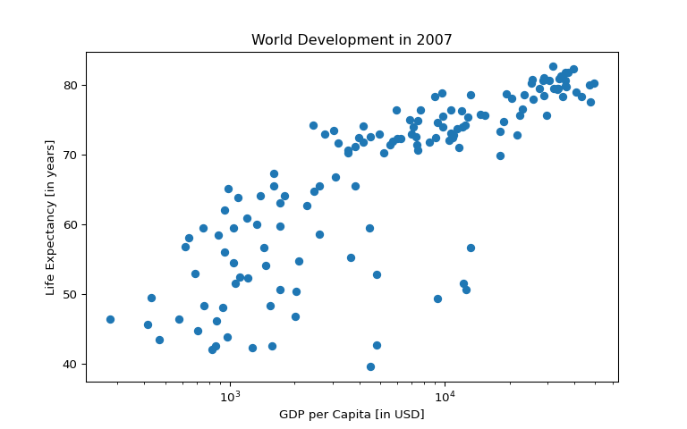
</div>

<p class="">This looks much better already!</p>

### Ticks


<div class>
<p>The customizations you've coded up to now are available in the script, in a more concise form.</p>
<p>In the video, Hugo has demonstrated how you could control the y-ticks by specifying two arguments:</p>
<pre><code>plt.yticks([0,1,2], ["one","two","three"])
</code></pre>
<p>In this example, the ticks corresponding to the numbers 0, 1 and 2 will be replaced by <em>one</em>, <em>two</em> and <em>three</em>, respectively.</p>
<p>Let's do a similar thing for the x-axis of your world development chart, with the <a href="https://matplotlib.org/stable/api/_as_gen/matplotlib.pyplot.xticks.html"><code>xticks()</code></a> function. The tick values <code>1000</code>, <code>10000</code> and <code>100000</code> should be replaced by <code>1k</code>, <code>10k</code> and <code>100k</code>. To this end, two lists have already been created for you: <code>tick_val</code> and <code>tick_lab</code>.</p>
</div>

<li>Use <code>tick_val</code> and <code>tick_lab</code> as inputs to the <a href="https://matplotlib.org/stable/api/_as_gen/matplotlib.pyplot.xticks.html"><code>xticks()</code></a> function to make the the plot more readable.</li>
<li>As usual, display the plot with <code>plt.show()</code> after you've added the customizations.</li>
<div>

```python
# Scatter plot
plt.scatter(gdp_cap, life_exp)

# Previous customizations
plt.xscale('log') 
plt.xlabel('GDP per Capita [in USD]')
plt.ylabel('Life Expectancy [in years]')
plt.title('World Development in 2007')

# Definition of tick_val and tick_lab
tick_val = [1000, 10000, 100000]
tick_lab = ['1k', '10k', '100k']

# Adapt the ticks on the x-axis
plt.xticks(tick_val, tick_lab)
```

```
## ([<matplotlib.axis.XTick object at 0x7fb21f527c10>, <matplotlib.axis.XTick object at 0x7fb21f527580>, <matplotlib.axis.XTick object at 0x7fb21f4d3490>], [Text(1000, 0, '1k'), Text(10000, 0, '10k'), Text(100000, 0, '100k')])
```
</div>
<div>

```python
# After customizing, display the plot
plt.show()
```

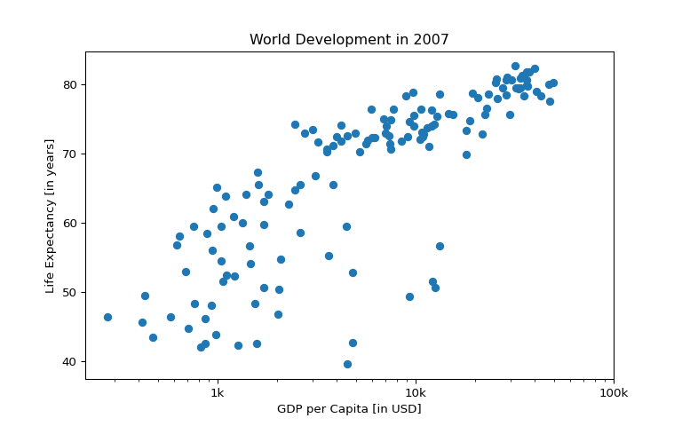
</div>

<p class="">Great! Your plot is shaping up nicely!</p>

### Sizes


<div class>
<p>Right now, the scatter plot is just a cloud of blue dots, indistinguishable from each other. Let's change this. Wouldn't it be nice if the size of the dots corresponds to the population?</p>
<p>To accomplish this, there is a list <code>pop</code> loaded in your workspace. It contains population numbers for each country expressed in millions. You can see that this list is added to the scatter method, as the argument <code>s</code>, for size.</p>
</div>

<li>Run the script to see how the plot changes.</li>
<div>

```python
# Import numpy as np


# Store pop as a numpy array: np_pop


# Double np_pop


# Update: set s argument to np_pop
plt.scatter(gdp_cap, life_exp, s = pop)

# Previous customizations
plt.xscale('log') 
plt.xlabel('GDP per Capita [in USD]')
plt.ylabel('Life Expectancy [in years]')
plt.title('World Development in 2007')
plt.xticks([1000, 10000, 100000],['1k', '10k', '100k'])
```

```
## ([<matplotlib.axis.XTick object at 0x7fb21f6682b0>, <matplotlib.axis.XTick object at 0x7fb21f6689a0>, <matplotlib.axis.XTick object at 0x7fb21f6c95e0>], [Text(1000, 0, '1k'), Text(10000, 0, '10k'), Text(100000, 0, '100k')])
```
</div>
<div>

```python
# Display the plot
plt.show()
```

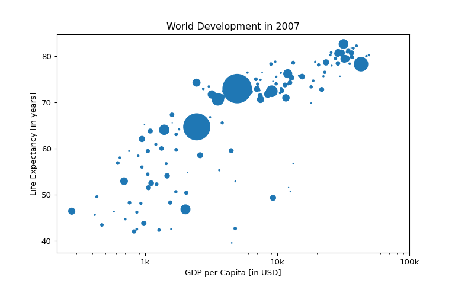
</div>
<li>Looks good, but increasing the size of the bubbles will make things stand out more.
<li>Import the <code>numpy</code> package as <code>np</code>.</li>

<li>Use <code>np.array()</code> to create a numpy array from the list <code>pop</code>. Call this NumPy array <code>np_pop</code>.</li>

<li>Double the values in <code>np_pop</code> setting the value of <code>np_pop</code> equal to <code>np_pop * 2</code>. Because <code>np_pop</code> is a NumPy array, each array element will be doubled.</li>

<li>Change the <code>s</code> argument inside <a href="https://matplotlib.org/stable/api/_as_gen/matplotlib.pyplot.scatter.html"><code>plt.scatter()</code></a> to be <code>np_pop</code> instead of <code>pop</code>.</li>
<div>

```python
# Import numpy as np
import numpy as np

# Store pop as a numpy array: np_pop
np_pop = np.array(pop)

# Double np_pop
np_pop = np_pop * 2

# Update: set s argument to np_pop
plt.scatter(gdp_cap, life_exp, s = np_pop)

# Previous customizations
plt.xscale('log') 
plt.xlabel('GDP per Capita [in USD]')
plt.ylabel('Life Expectancy [in years]')
plt.title('World Development in 2007')
plt.xticks([1000, 10000, 100000],['1k', '10k', '100k'])
```

```
## ([<matplotlib.axis.XTick object at 0x7fb21f6154c0>, <matplotlib.axis.XTick object at 0x7fb21f6150d0>, <matplotlib.axis.XTick object at 0x7fb21f615070>], [Text(1000, 0, '1k'), Text(10000, 0, '10k'), Text(100000, 0, '100k')])
```
</div>
<div>

```python
# Display the plot
plt.show()
```

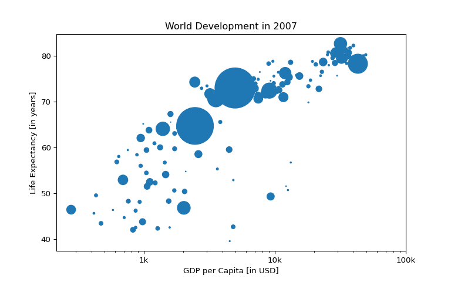
</div>
</li>

<p class="">Bellissimo! Can you already tell which bubbles correspond to which countries?</p>

### Colors


<div class>
<p>The code you've written up to now is available in the script.</p>
<p>The next step is making the plot more colorful! To do this, a list <code>col</code> has been created for you. It's a list with a color for each corresponding country, depending on the continent the country is part of.</p>
<p>How did we make the list <code>col</code> you ask? The Gapminder data contains a list <code>continent</code> with the continent each country belongs to. A dictionary is constructed that maps continents onto colors:</p>
<pre><code>dict = {
    'Asia':'red',
    'Europe':'green',
    'Africa':'blue',
    'Americas':'yellow',
    'Oceania':'black'
}
</code></pre>
<p>Nothing to worry about now; you will learn about dictionaries in the next chapter.</p>
</div>

<li>Add <code>c = col</code> to the arguments of the <a href="https://matplotlib.org/stable/api/_as_gen/matplotlib.pyplot.scatter.html"><code>plt.scatter()</code></a> function.</li>
<li>Change the opacity of the bubbles by setting the <code>alpha</code> argument to <code>0.8</code> inside <a href="https://matplotlib.org/stable/api/_as_gen/matplotlib.pyplot.scatter.html"><code>plt.scatter()</code></a>. Alpha can be set from zero to one, where zero is totally transparent, and one is not at all transparent.</li>
<div>

```python
# edited/added
col=list(np.loadtxt('datasets/Intermediate-Python/col.txt', dtype=str))

# Specify c and alpha inside plt.scatter()
plt.scatter(x = gdp_cap, y = life_exp, s = np.array(pop) * 2, c = col, alpha = 0.8)

# Previous customizations
plt.xscale('log') 
plt.xlabel('GDP per Capita [in USD]')
plt.ylabel('Life Expectancy [in years]')
plt.title('World Development in 2007')
plt.xticks([1000,10000,100000], ['1k','10k','100k'])
```

```
## ([<matplotlib.axis.XTick object at 0x7fb21f813bb0>, <matplotlib.axis.XTick object at 0x7fb21f813730>, <matplotlib.axis.XTick object at 0x7fb21f894940>], [Text(1000, 0, '1k'), Text(10000, 0, '10k'), Text(100000, 0, '100k')])
```
</div>
<div>

```python
# Show the plot
plt.show()
```

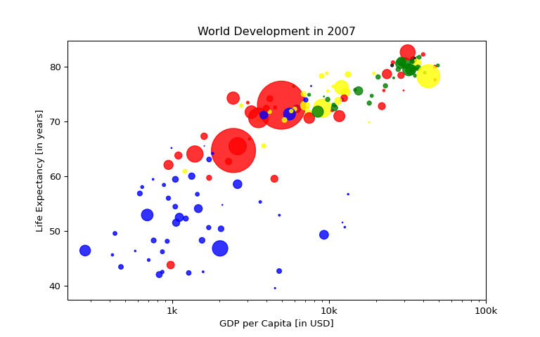
</div>

<p class="">Nice! This is looking more and more like Hans Rosling's plot!</p>

### Additional Customizations


<div class><p>If you have another look at the script, under <code># Additional Customizations</code>, you'll see that there are two <a href="https://matplotlib.org/stable/api/_as_gen/matplotlib.pyplot.text.html"><code>plt.text()</code></a> functions now. They add the words <code>"India"</code> and <code>"China"</code> in the plot.</p></div>

<li>Add <a href="https://matplotlib.org/stable/api/_as_gen/matplotlib.pyplot.grid.html"><code>plt.grid(True)</code></a> after the <a href="https://matplotlib.org/stable/api/_as_gen/matplotlib.pyplot.text.html"><code>plt.text()</code></a> calls so that gridlines are drawn on the plot.</li>
<div>

```python
# Scatter plot
plt.scatter(x = gdp_cap, y = life_exp, s = np.array(pop) * 2, c = col, alpha = 0.8)

# Previous customizations
plt.xscale('log') 
plt.xlabel('GDP per Capita [in USD]')
plt.ylabel('Life Expectancy [in years]')
plt.title('World Development in 2007')
plt.xticks([1000,10000,100000], ['1k','10k','100k'])
```

```
## ([<matplotlib.axis.XTick object at 0x7fb21f904ac0>, <matplotlib.axis.XTick object at 0x7fb21f904a90>, <matplotlib.axis.XTick object at 0x7fb21f904550>], [Text(1000, 0, '1k'), Text(10000, 0, '10k'), Text(100000, 0, '100k')])
```
</div>
<div>

```python
# Additional customizations
plt.text(1550, 71, 'India')
plt.text(5700, 80, 'China')

# Add grid() call
plt.grid(True)

# Show the plot
plt.show()
```

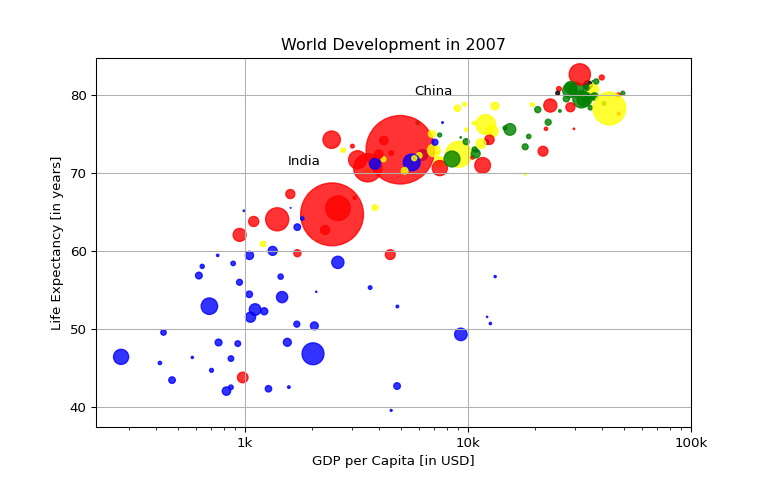
</div>

<p class="">Beautiful! A visualization only makes sense if you can interpret it properly. Let's do that in the next exercise.</p>

### Interpretation


<div class>
<p>If you have a look at your colorful plot, it's clear that people live longer in countries with a higher GDP per capita. No high income countries have really short life expectancy, and no low income countries have very long life expectancy. Still, there is a huge difference in life expectancy between countries on the same income level. Most people live in middle income countries where difference in lifespan is huge between countries; depending on how income is distributed and how it is used.</p>
<p>What can you say about the plot?</p>
</div>

<center>

</center>

- [x] The countries in blue, corresponding to Africa, have both low life expectancy and a low GDP per capita.
- [ ] There is a negative correlation between GDP per capita and life expectancy.
- [ ] China has both a lower GDP per capita and lower life expectancy compared to India.

<p class="">Correct! Up to the next chapter, on dictionaries!</p>

# Dictionaries & Pandas

<p class="chapter__description">
    Learn about the dictionary, an alternative to the Python list, and the pandas DataFrame, the de facto standard to work with tabular data in Python. You will get hands-on practice with creating and manipulating datasets, and you’ll learn how to access the information you need from these data structures.
  </p>
  
## Dictionaries, Part 1


### Motivation for dictionaries


<div class><p>To see why dictionaries are useful, have a look at the two lists defined in the script. <code>countries</code> contains the names of some European countries. <code>capitals</code> lists the corresponding names of their capital.</p></div>

<li>Use the <a href="https://docs.python.org/3/library/stdtypes.html#common-sequence-operations"><code>index()</code></a> method on <code>countries</code> to find the index of <code>'germany'</code>. Store this index as <code>ind_ger</code>.</li>

<li>Use <code>ind_ger</code> to access the capital of Germany from the <code>capitals</code> list. Print it out.</li>
<div>

```python
# Definition of countries and capital
countries = ['spain', 'france', 'germany', 'norway']
capitals = ['madrid', 'paris', 'berlin', 'oslo']

# Get index of 'germany': ind_ger
ind_ger = countries.index('germany')

# Use ind_ger to print out capital of Germany
print(capitals[ind_ger])
```

```
## berlin
```
</div>

<p class="">As Hugo already told you: this works, but it's not very convenient. Head over to the next exercise to create a dictionary of this data.</p>

### Create dictionary


<div class>
<p>The <code>countries</code> and <code>capitals</code> lists are again available in the script. It's your job to convert this data to a dictionary where the country names are the keys and the capitals are the corresponding values. As a refresher, here is a recipe for creating a dictionary:</p>
<pre><code>my_dict = {
   "key1":"value1",
   "key2":"value2",
}
</code></pre>
<p>In this recipe, both the keys and the values are strings. This will also be the case for this exercise.</p>
</div>

<li>With the strings in <code>countries</code> and <code>capitals</code>, create a dictionary called <code>europe</code> with 4 key:value pairs. Beware of capitalization! Make sure you use lowercase characters everywhere.</li>

<li>Print out <code>europe</code> to see if the result is what you expected.</li>
<div>

```python
# Definition of countries and capital
countries = ['spain', 'france', 'germany', 'norway']
capitals = ['madrid', 'paris', 'berlin', 'oslo']

# From string in countries and capitals, create dictionary europe
europe = {'spain':'madrid', 'france':'paris', 'germany':'berlin', 'norway':'oslo'}

# Print europe
print(europe)
```

```
## {'spain': 'madrid', 'france': 'paris', 'germany': 'berlin', 'norway': 'oslo'}
```
</div>

<p class="">Great! Now that you've built your first dictionaries, let's get serious!</p>

### Access dictionary


<div class>
<p>If the keys of a dictionary are chosen wisely, accessing the values in a dictionary is easy and intuitive. For example, to get the capital for France from <code>europe</code> you can use:</p>
<pre><code>europe['france']
</code></pre>
<p>Here, <code>'france'</code> is the key and <code>'paris'</code> the value is returned.</p>
</div>

<li>Check out which keys are in <code>europe</code> by calling the <a href="https://docs.python.org/3/library/stdtypes.html#dict.keys"><code>keys()</code></a> method on <code>europe</code>. Print out the result.</li>

<li>Print out the value that belongs to the key <code>'norway'</code>.</li>
<div>

```python
# Definition of dictionary
europe = {'spain':'madrid', 'france':'paris', 'germany':'berlin', 'norway':'oslo' }

# Print out the keys in europe
print(europe.keys())
```

```
## dict_keys(['spain', 'france', 'germany', 'norway'])
```
</div>
<div>

```python
# Print out value that belongs to key 'norway'
print(europe['norway'])
```

```
## oslo
```
</div>

<p class="">Good job, now you're warmed up for some more.</p>

## Dictionaries, Part 2


### Dictionary Manipulation (1)


<div class>
<p>If you know how to access a dictionary, you can also assign a new value to it. To add a new key-value pair to <code>europe</code> you can use something like this:</p>
<pre><code>europe['iceland'] = 'reykjavik'
</code></pre>
</div>

<li>Add the key <code>'italy'</code> with the value <code>'rome'</code> to <code>europe</code>.</li>

<li>To assert that <code>'italy'</code> is now a key in <code>europe</code>, print out <code>'italy' in europe</code>.</li>

<li>Add another key:value pair to <code>europe</code>: <code>'poland'</code> is the key, <code>'warsaw'</code> is the corresponding value.</li>

<li>Print out <code>europe</code>.</li>
<div>

```python
# Definition of dictionary
europe = {'spain':'madrid', 'france':'paris', 'germany':'berlin', 'norway':'oslo' }

# Add italy to europe
europe['italy'] = 'rome'

# Print out italy in europe
print('italy' in europe)
```

```
## True
```
</div>
<div>

```python
# Add poland to europe
europe['poland'] = 'warsaw'

# Print europe
print(europe)
```

```
## {'spain': 'madrid', 'france': 'paris', 'germany': 'berlin', 'norway': 'oslo', 'italy': 'rome', 'poland': 'warsaw'}
```
</div>

<p class="">Well done! Europe is growing by the minute! Did you notice that the order of the printout is not the same as the order in the dictionary's definition? That's because dictionaries are inherently unordered.</p>

### Dictionary Manipulation (2)


<div class>
<p>Somebody thought it would be funny to mess with your accurately generated dictionary. An adapted version of the <code>europe</code> dictionary is available in the script.</p>
<p>Can you clean up? Do not do this by adapting the definition of <code>europe</code>, but by adding Python commands to the script to update and remove key:value pairs.</p>
</div>

<li>The capital of Germany is not <code>'bonn'</code>; it's <code>'berlin'</code>. Update its value.</li>

<li>Australia is not in Europe, Austria is! Remove the key <code>'australia'</code> from <code>europe</code>.</li>

<li>Print out <code>europe</code> to see if your cleaning work paid off.</li>
<div>

```python
# Definition of dictionary
europe = {'spain':'madrid', 'france':'paris', 'germany':'bonn',
          'norway':'oslo', 'italy':'rome', 'poland':'warsaw',
          'australia':'vienna' }

# Update capital of germany
europe['germany'] = 'berlin'

# Remove australia
del(europe['australia'])

# Print europe
print(europe)
```

```
## {'spain': 'madrid', 'france': 'paris', 'germany': 'berlin', 'norway': 'oslo', 'italy': 'rome', 'poland': 'warsaw'}
```
</div>

<p class="">Great job! That's much better!</p>

### Dictionariception


<div class>
<p>Remember lists? They could contain anything, even other lists. Well, for dictionaries the same holds. Dictionaries can contain key:value pairs where the values are again dictionaries.</p>
<p>As an example, have a look at the script where another version of <code>europe</code> - the dictionary you've been working with all along - is coded. The keys are still the country names, but the values are dictionaries that contain more information than just the capital.</p>
<p>It's perfectly possible to chain square brackets to select elements. To fetch the population for Spain from <code>europe</code>, for example, you need:</p>
<pre><code>europe['spain']['population']
</code></pre>
</div>

<li>Use chained square brackets to select and print out the capital of France.</li>

<li>Create a dictionary, named <code>data</code>, with the keys <code>'capital'</code> and <code>'population'</code>. Set them to <code>'rome'</code> and <code>59.83</code>, respectively.</li>

<li>Add a new key-value pair to <code>europe</code>; the key is <code>'italy'</code> and the value is <code>data</code>, the dictionary you just built.</li>
<div>

```python
# Dictionary of dictionaries
europe = { 'spain': { 'capital':'madrid', 'population':46.77 },
           'france': { 'capital':'paris', 'population':66.03 },
           'germany': { 'capital':'berlin', 'population':80.62 },
           'norway': { 'capital':'oslo', 'population':5.084 } }


# Print out the capital of France
print(europe['france']['capital'])
```

```
## paris
```
</div>
<div>

```python
# Create sub-dictionary data
data = { 'capital':'rome', 'population':59.83 }

# Add data to europe under key 'italy'
europe['italy'] = data

# Print europe
print(europe)
```

```
## {'spain': {'capital': 'madrid', 'population': 46.77}, 'france': {'capital': 'paris', 'population': 66.03}, 'germany': {'capital': 'berlin', 'population': 80.62}, 'norway': {'capital': 'oslo', 'population': 5.084}, 'italy': {'capital': 'rome', 'population': 59.83}}
```
</div>

<p class="">Great! It's time to learn about a new data structure!</p>

## Pandas, Part 1


### Dictionary to DataFrame (1)


<div class>
<p>Pandas is an open source library, providing high-performance, easy-to-use data structures and data analysis tools for Python. Sounds promising!</p>
<p>The DataFrame is one of Pandas' most important data structures. It's basically a way to store tabular data where you can label the rows and the columns. One way to build a DataFrame is from a dictionary.</p>
<p>In the exercises that follow you will be working with vehicle data from different countries. Each observation corresponds to a country and the columns give information about the number of vehicles per capita, whether people drive left or right, and so on.</p>
<p>Three lists are defined in the script:</p>
<ul>
<li>
<code>names</code>, containing the country names for which data is available.</li>

<li>
<code>dr</code>, a list with booleans that tells whether people drive left or right in the corresponding country.</li>
<li>
<code>cpc</code>, the number of motor vehicles per 1000 people in the corresponding country.</li>
</ul>
<p>Each dictionary key is a column label and each value is a list which contains the column elements.</p>
</div>

<li>Import <code>pandas</code> as <code>pd</code>.</li>

<li>Use the pre-defined lists to create a dictionary called <code>my_dict</code>. There should be three key value pairs:<ul>
<li>key <code>'country'</code> and value <code>names</code>.</li>
<li>key <code>'drives_right'</code> and value <code>dr</code>.</li>
<li>key <code>'cars_per_cap'</code> and value <code>cpc</code>.</li>

</ul>
</li>

<li>Use <a href="https://pandas.pydata.org/pandas-docs/stable/generated/pandas.DataFrame.html"><code>pd.DataFrame()</code></a> to turn your dict into a DataFrame called <code>cars</code>.</li>

<li>Print out <code>cars</code> and see how beautiful it is.</li>
<div>

```python
# Pre-defined lists
names = ['United States', 'Australia', 'Japan', 'India', 'Russia', 'Morocco', 'Egypt']
dr =  [True, False, False, False, True, True, True]
cpc = [809, 731, 588, 18, 200, 70, 45]

# Import pandas as pd
import pandas as pd

# Create dictionary my_dict with three key:value pairs: my_dict
my_dict = { 'country':names, 'drives_right':dr, 'cars_per_cap':cpc }

# Build a DataFrame cars from my_dict: cars
cars = pd.DataFrame(my_dict)

# Print cars
print(cars)
```

```
##          country  drives_right  cars_per_cap
## 0  United States          True           809
## 1      Australia         False           731
## 2          Japan         False           588
## 3          India         False            18
## 4         Russia          True           200
## 5        Morocco          True            70
## 6          Egypt          True            45
```
</div>

<p class="">Good job! Notice that the columns of <code>cars</code> can be of different types. This was not possible with 2D NumPy arrays!</p>

### Dictionary to DataFrame (2)


<div class>
<p>The Python code that solves the previous exercise is included in the script. Have you noticed that the row labels (i.e. the labels for the different observations) were automatically set to integers from 0 up to 6?</p>
<p>To solve this a list <code>row_labels</code> has been created. You can use it to specify the row labels of the <code>cars</code> DataFrame. You do this by setting the <code>index</code> attribute of <code>cars</code>, that you can access as <code>cars.index</code>.</p>
</div>

<li>Hit <em>Run Code</em> to see that, indeed, the row labels are not correctly set.</li>
<div>

</div>

<div>

</div>

<li>Specify the row labels by setting <code>cars.index</code> equal to <code>row_labels</code>.</li>

<li>Print out <code>cars</code> again and check if the row labels are correct this time.</li>
<div>

```python
import pandas as pd

# Build cars DataFrame
names = ['United States', 'Australia', 'Japan', 'India', 'Russia', 'Morocco', 'Egypt']
dr =  [True, False, False, False, True, True, True]
cpc = [809, 731, 588, 18, 200, 70, 45]
cars_dict = { 'country':names, 'drives_right':dr, 'cars_per_cap':cpc }
cars = pd.DataFrame(cars_dict)
print(cars)
```

```
##          country  drives_right  cars_per_cap
## 0  United States          True           809
## 1      Australia         False           731
## 2          Japan         False           588
## 3          India         False            18
## 4         Russia          True           200
## 5        Morocco          True            70
## 6          Egypt          True            45
```
</div>
<div>

```python
# Definition of row_labels
row_labels = ['US', 'AUS', 'JPN', 'IN', 'RU', 'MOR', 'EG']

# Specify row labels of cars
cars.index = row_labels

# Print cars again
print(cars)
```

```
##            country  drives_right  cars_per_cap
## US   United States          True           809
## AUS      Australia         False           731
## JPN          Japan         False           588
## IN           India         False            18
## RU          Russia          True           200
## MOR        Morocco          True            70
## EG           Egypt          True            45
```
</div>

<p class="">Nice! That looks much better already!</p>

### CSV to DataFrame (1)


<div class>
<p>Putting data in a dictionary and then building a DataFrame works, but it's not very efficient. What if you're dealing with millions of observations? In those cases, the data is typically available as files with a regular structure. One of those file types is the CSV file, which is short for "comma-separated values".</p>
<p>To import CSV data into Python as a Pandas DataFrame you can use <a href="https://pandas.pydata.org/pandas-docs/stable/generated/pandas.read_csv.html"><code>read_csv()</code></a>.</p>
<p>Let's explore this function with the same cars data from the previous exercises. This time, however, the data is available in a CSV file, named <code>cars.csv</code>. It is available in your current working directory, so the path to the file is simply <code>'cars.csv'</code>.</p>
</div>

<li>To import CSV files you still need the <code>pandas</code> package: import it as <code>pd</code>.</li>

<li>Use <a href="http://pandas.pydata.org/pandas-docs/stable/generated/pandas.read_csv.html"><code>pd.read_csv()</code></a> to import <code>cars.csv</code> data as a DataFrame. Store this DataFrame as <code>cars</code>.</li>

<li>Print out <code>cars</code>. Does everything look OK?</li>
<div>

```python
# Import pandas as pd
import pandas as pd

# Import the cars.csv data: cars
cars = pd.read_csv('datasets/Intermediate-Python/cars.csv') # edited/added

# Print out cars
print(cars)
```

```
##   Unnamed: 0  cars_per_cap        country  drives_right
## 0         US           809  United States          True
## 1        AUS           731      Australia         False
## 2        JAP           588          Japan         False
## 3         IN            18          India         False
## 4         RU           200         Russia          True
## 5        MOR            70        Morocco          True
## 6         EG            45          Egypt          True
```
</div>

<p class="">Nice job! Looks nice, but not exactly what we expected. Let's fix this in the next exercise.</p>

### CSV to DataFrame (2)


<div class>
<p>Your <a href="https://pandas.pydata.org/pandas-docs/stable/generated/pandas.read_csv.html"><code>read_csv()</code></a> call to import the CSV data didn't generate an error, but the output is not entirely what we wanted. The row labels were imported as another column without a name.</p>
<p>Remember <code>index_col</code>, an argument of <a href="https://pandas.pydata.org/pandas-docs/stable/generated/pandas.read_csv.html"><code>read_csv()</code></a>, that you can use to specify which column in the CSV file should be used as a row label? Well, that's exactly what you need here!</p>
<p>Python code that solves the previous exercise is already included; can you make the appropriate changes to fix the data import?</p>
</div>

<li>Run the code with <em>Run Code</em> and assert that the first column should actually be used as row labels.</li>

<li>Specify the <code>index_col</code> argument inside <a href="https://pandas.pydata.org/pandas-docs/stable/generated/pandas.read_csv.html"><code>pd.read_csv()</code></a>: set it to <code>0</code>, so that the first column is used as row labels.</li>

<li>Has the printout of <code>cars</code> improved now?</li>
<div>

```python
# Import pandas as pd
import pandas as pd

# Fix import by including index_col
cars = pd.read_csv('datasets/Intermediate-Python/cars.csv')

# Print out cars
print(cars)
```

```
##   Unnamed: 0  cars_per_cap        country  drives_right
## 0         US           809  United States          True
## 1        AUS           731      Australia         False
## 2        JAP           588          Japan         False
## 3         IN            18          India         False
## 4         RU           200         Russia          True
## 5        MOR            70        Morocco          True
## 6         EG            45          Egypt          True
```
</div>
<div>

```python
# Import pandas as pd
import pandas as pd

# Fix import by including index_col
cars = pd.read_csv('datasets/Intermediate-Python/cars.csv', index_col = 0)

# Print out cars
print(cars)
```

```
##      cars_per_cap        country  drives_right
## US            809  United States          True
## AUS           731      Australia         False
## JAP           588          Japan         False
## IN             18          India         False
## RU            200         Russia          True
## MOR            70        Morocco          True
## EG             45          Egypt          True
```
</div>

<p class="">That's much better!</p>

## Pandas, Part 2


### Square Brackets (1)


<div class>
<p>In the video, you saw that you can index and select Pandas DataFrames in many different ways. The simplest, but not the most powerful way, is to use square brackets.</p>
<p>In the sample code, the same cars data is imported from a CSV files as a Pandas DataFrame. To select only the <code>cars_per_cap</code> column from <code>cars</code>, you can use:</p>
<pre><code>cars['cars_per_cap']
cars[['cars_per_cap']]
</code></pre>
<p>The single bracket version gives a Pandas Series, the double bracket version gives a Pandas DataFrame.</p>
</div>

<li>Use single square brackets to print out the <code>country</code> column of <code>cars</code> as a Pandas Series.</li>

<li>Use double square brackets to print out the <code>country</code> column of <code>cars</code> as a Pandas DataFrame.</li>

<li>Use double square brackets to print out a DataFrame with both the <code>country</code> and <code>drives_right</code> columns of <code>cars</code>, in this order.</li>
<div>

```python
# Import cars data
import pandas as pd
cars = pd.read_csv('datasets/Intermediate-Python/cars.csv', index_col = 0)

# Print out country column as Pandas Series
print(cars['country'])
```

```
## US     United States
## AUS        Australia
## JAP            Japan
## IN             India
## RU            Russia
## MOR          Morocco
## EG             Egypt
## Name: country, dtype: object
```
</div>
<div>

```python
# Print out country column as Pandas DataFrame
print(cars[['country']])
```

```
##            country
## US   United States
## AUS      Australia
## JAP          Japan
## IN           India
## RU          Russia
## MOR        Morocco
## EG           Egypt
```
</div>
<div>

```python
# Print out DataFrame with country and drives_right columns
print(cars[['country', 'drives_right']])
```

```
##            country  drives_right
## US   United States          True
## AUS      Australia         False
## JAP          Japan         False
## IN           India         False
## RU          Russia          True
## MOR        Morocco          True
## EG           Egypt          True
```
</div>

<p class="">Nice!</p>

### Square Brackets (2)


<div class>
<p>Square brackets can do more than just selecting columns. You can also use them to get rows, or observations, from a DataFrame. The following call selects the first five rows from the <code>cars</code> DataFrame:</p>
<pre><code>cars[0:5]
</code></pre>
<p>The result is another DataFrame containing only the rows you specified.</p>
<p>Pay attention: You can only select rows using square brackets if you specify a slice, like <code>0:4</code>. Also, you're using the integer indexes of the rows here, not the row labels!</p>
</div>

<li>Select the first 3 observations from <code>cars</code> and print them out.</li>

<li>Select the fourth, fifth and sixth observation, corresponding to row indexes 3, 4 and 5, and print them out.</li>
<div>

```python
# Import cars data
import pandas as pd
cars = pd.read_csv('datasets/Intermediate-Python/cars.csv', index_col = 0)

# Print out first 3 observations
print(cars[0:3])
```

```
##      cars_per_cap        country  drives_right
## US            809  United States          True
## AUS           731      Australia         False
## JAP           588          Japan         False
```
</div>
<div>

```python
# Print out fourth, fifth and sixth observation
print(cars[3:6])
```

```
##      cars_per_cap  country  drives_right
## IN             18    India         False
## RU            200   Russia          True
## MOR            70  Morocco          True
```
</div>

<p class="">Good job. You can get interesting information, but using square brackets to do indexing is rather limited. Experiment with more advanced techniques in the following exercises.</p>

### loc and iloc (1)


<div class>
<p>With <a href="https://pandas.pydata.org/pandas-docs/stable/indexing.html#different-choices-for-indexing"><code>loc</code></a> and <a href="https://pandas.pydata.org/pandas-docs/stable/indexing.html#different-choices-for-indexing"><code>iloc</code></a> you can do practically any data selection operation on DataFrames you can think of. <a href="https://pandas.pydata.org/pandas-docs/stable/indexing.html#different-choices-for-indexing"><code>loc</code></a> is label-based, which means that you have to specify rows and columns based on their row and column labels. <a href="https://pandas.pydata.org/pandas-docs/stable/indexing.html#different-choices-for-indexing"><code>iloc</code></a> is integer index based, so you have to specify rows and columns by their integer index like you did in the previous exercise.</p>
<p>Try out the following commands in the IPython Shell to experiment with <a href="https://pandas.pydata.org/pandas-docs/stable/indexing.html#different-choices-for-indexing"><code>loc</code></a> and <a href="https://pandas.pydata.org/pandas-docs/stable/indexing.html#different-choices-for-indexing"><code>iloc</code></a> to select observations. Each pair of commands here gives the same result.</p>
<pre><code>cars.loc['RU']
cars.iloc[4]

cars.loc[['RU']]
cars.iloc[[4]]

cars.loc[['RU', 'AUS']]
cars.iloc[[4, 1]]
</code></pre>
<p>As before, code is included that imports the cars data as a Pandas DataFrame.</p>
</div>

<li>Use <a href="https://pandas.pydata.org/pandas-docs/stable/indexing.html#different-choices-for-indexing"><code>loc</code></a> or <a href="https://pandas.pydata.org/pandas-docs/stable/indexing.html#different-choices-for-indexing"><code>iloc</code></a> to select the observation corresponding to Japan as a Series. The label of this row is <code>JPN</code>, the index is <code>2</code>. Make sure to print the resulting Series.</li>

<li>Use <a href="https://pandas.pydata.org/pandas-docs/stable/indexing.html#different-choices-for-indexing"><code>loc</code></a> or <a href="https://pandas.pydata.org/pandas-docs/stable/indexing.html#different-choices-for-indexing"><code>iloc</code></a> to select the observations for Australia and Egypt as a DataFrame. You can find out about the labels/indexes of these rows by inspecting <code>cars</code> in the IPython Shell. Make sure to print the resulting DataFrame.</li>
<div>

```python
# Import cars data
import pandas as pd
cars = pd.read_csv('datasets/Intermediate-Python/cars.csv', index_col = 0)

# Print out observation for Japan
print(cars.iloc[2])
```

```
## cars_per_cap      588
## country         Japan
## drives_right    False
## Name: JAP, dtype: object
```
</div>
<div>

```python
# Print out observations for Australia and Egypt
print(cars.loc[['AUS', 'EG']])
```

```
##      cars_per_cap    country  drives_right
## AUS           731  Australia         False
## EG             45      Egypt          True
```
</div>

<p class="">You aced selecting observations from DataFrames; over to selecting both rows and columns!</p>

### loc and iloc (2)


<div class>
<p><code>loc</code> and <a href="https://pandas.pydata.org/pandas-docs/stable/indexing.html#different-choices-for-indexing"><code>iloc</code></a> also allow you to select both rows and columns from a DataFrame. To experiment, try out the following commands in the IPython Shell. Again, paired commands produce the same result.</p>
<pre><code>cars.loc['IN', 'cars_per_cap']
cars.iloc[3, 0]

cars.loc[['IN', 'RU'], 'cars_per_cap']
cars.iloc[[3, 4], 0]

cars.loc[['IN', 'RU'], ['cars_per_cap', 'country']]
cars.iloc[[3, 4], [0, 1]]
</code></pre>
</div>

<li>Print out the <code>drives_right</code> value of the row corresponding to Morocco (its row label is <code>MOR</code>)</li>

<li>Print out a sub-DataFrame, containing the observations for Russia and Morocco and the columns <code>country</code> and <code>drives_right</code>.</li>
<div>

```python
# Import cars data
import pandas as pd
cars = pd.read_csv('datasets/Intermediate-Python/cars.csv', index_col = 0)

# Print out drives_right value of Morocco
print(cars.iloc[5, 2])
```

```
## True
```
</div>
<div>

```python
# Print sub-DataFrame
print(cars.loc[['RU', 'MOR'], ['country', 'drives_right']])
```

```
##      country  drives_right
## RU    Russia          True
## MOR  Morocco          True
```
</div>

<p class="">Great work! <code>.loc[]</code> and <code>.iloc[]</code> are excellent tools for selecting DataFrame values by label and index. In the next exercise, you'll select entire columns using them!</p>

### loc and iloc (3)


<div class>
<p>It's also possible to select only columns with <a href="https://pandas.pydata.org/pandas-docs/stable/indexing.html#different-choices-for-indexing"><code>loc</code></a> and <a href="https://pandas.pydata.org/pandas-docs/stable/indexing.html#different-choices-for-indexing"><code>iloc</code></a>. In both cases, you simply put a slice going from beginning to end in front of the comma:</p>
<pre><code>cars.loc[:, 'country']
cars.iloc[:, 1]

cars.loc[:, ['country','drives_right']]
cars.iloc[:, [1, 2]]
</code></pre>
</div>

<li>Print out the <code>drives_right</code> column as a Series using <a href="https://pandas.pydata.org/pandas-docs/stable/indexing.html#different-choices-for-indexing"><code>loc</code></a> or <a href="https://pandas.pydata.org/pandas-docs/stable/indexing.html#different-choices-for-indexing"><code>iloc</code></a>.</li>

<li>Print out the <code>drives_right</code> column as a DataFrame using <a href="https://pandas.pydata.org/pandas-docs/stable/indexing.html#different-choices-for-indexing"><code>loc</code></a> or <a href="https://pandas.pydata.org/pandas-docs/stable/indexing.html#different-choices-for-indexing"><code>iloc</code></a>.</li>

<li>Print out both the <code>cars_per_cap</code> and <code>drives_right</code> column as a DataFrame using <a href="https://pandas.pydata.org/pandas-docs/stable/indexing.html#different-choices-for-indexing"><code>loc</code></a> or <a href="https://pandas.pydata.org/pandas-docs/stable/indexing.html#different-choices-for-indexing"><code>iloc</code></a>.</li>
<div>

```python
# Import cars data
import pandas as pd
cars = pd.read_csv('datasets/Intermediate-Python/cars.csv', index_col = 0)

# Print out drives_right column as Series
print(cars.iloc[:, 2])
```

```
## US      True
## AUS    False
## JAP    False
## IN     False
## RU      True
## MOR     True
## EG      True
## Name: drives_right, dtype: bool
```
</div>
<div>

```python
# Print out drives_right column as DataFrame
print(cars.iloc[:, [2]])
```

```
##      drives_right
## US           True
## AUS         False
## JAP         False
## IN          False
## RU           True
## MOR          True
## EG           True
```
</div>
<div>

```python
# Print out cars_per_cap and drives_right as DataFrame
print(cars.loc[:, ['cars_per_cap', 'drives_right']])
```

```
##      cars_per_cap  drives_right
## US            809          True
## AUS           731         False
## JAP           588         False
## IN             18         False
## RU            200          True
## MOR            70          True
## EG             45          True
```
</div>

<p class="">What a drill on indexing and selecting data from Pandas DataFrames! You've done great! It's time to head over to Chapter 3 to learn all about logic, control flow, and filtering!</p>

# Logic, Control Flow and Filtering

<p class="chapter__description">
    Boolean logic is the foundation of decision-making in Python programs. Learn about different comparison operators, how to combine them with Boolean operators, and how to use the Boolean outcomes in control structures. You'll also learn to filter data in pandas DataFrames using logic.
  </p>
  
## Comparison Operators


### Equality


<div class>
<p>To check if two Python values, or variables, are equal you can use <code>==</code>. To check for inequality, you need <code>!=</code>. As a refresher, have a look at the following examples that all result in <code>True</code>. Feel free to try them out in the IPython Shell.</p>
<pre><code>2 == (1 + 1)
"intermediate" != "python"
True != False
"Python" != "python"
</code></pre>
<p>When you write these comparisons in a script, you will need to wrap a <a href="https://docs.python.org/3/library/functions.html#print"><code>print()</code></a> function around them to see the output.</p>
</div>

<li>In the editor on the right, write code to see if <code>True</code> equals <code>False</code>.</li>

<li>Write Python code to check if <code>-5 * 15</code> is <em>not</em> equal to <code>75</code>.</li>

<li>Ask Python whether the strings <code>"pyscript"</code> and <code>"PyScript"</code> are equal.</li>

<li>What happens if you compare booleans and integers? Write code to see if <code>True</code> and <code>1</code> are equal.</li>
<div>

```python
# Comparison of booleans
print(True == False)
```

```
## False
```
</div>
<div>

```python
# Comparison of integers
print(-5 * 15 != 75)
```

```
## True
```
</div>
<div>

```python
# Comparison of strings
print("pyscript" == "PyScript")
```

```
## False
```
</div>
<div>

```python
# Compare a boolean with a numeric
print(True == 1)
```

```
## True
```
</div>

<p class="">The last comparison worked fine because actually, a boolean is a special kind of integer: <code>True</code> corresponds to 1, <code>False</code> corresponds to 0.</p>

### Greater and less than


<div class>
<p>In the video, Hugo also talked about the less than and greater than signs, <code>&lt;</code> and <code>&gt;</code> in Python. You can combine them with an equals sign: <code>&lt;=</code> and <code>&gt;=</code>. Pay attention: <code>&lt;=</code> is valid syntax, but <code>=&lt;</code> is not.</p>
<p>All Python expressions in the following code chunk evaluate to <code>True</code>:</p>
<pre><code>3 &lt; 4
3 &lt;= 4
"alpha" &lt;= "beta"
</code></pre>
<p>Remember that for string comparison, Python determines the relationship based on alphabetical order.</p>
</div>

<li>Write Python expressions, wrapped in a <a href="https://docs.python.org/3/library/functions.html#print"><code>print()</code></a> function, to check whether:
<li>
<code>x</code> is greater than or equal to <code>-10</code>. <code>x</code> has already been defined for you.</li>

<li>
<code>"test"</code> is less than or equal to <code>y</code>. <code>y</code> has already been defined for you.</li>

<li>
<code>True</code> is greater than <code>False</code>.</li>
<div>

```python
# Comparison of integers
x = -3 * 6
print(x >= -10)
```

```
## False
```
</div>
<div>

```python
# Comparison of strings
y = "test"
print("test" <= y)
```

```
## True
```
</div>
<div>

```python
# Comparison of booleans
print(True > False)
```

```
## True
```
</div>
</li>


<p class="">Great job!</p>

### Compare arrays


<div class>
<p>Out of the box, you can also use comparison operators with NumPy arrays.</p>
<p>Remember <code>areas</code>, the list of area measurements for different rooms in your house from <em>Introduction to Python</em>? This time there's two NumPy arrays: <code>my_house</code> and <code>your_house</code>. They both contain the areas for the kitchen, living room, bedroom and bathroom in the same order, so you can compare them.</p>
</div>
<div class="exercise--instructions__content">
<p>Using comparison operators, generate boolean arrays that answer the following questions:</p>

<li>Which areas in <code>my_house</code> are greater than or equal to <code>18</code>?</li>

<li>You can also compare two NumPy arrays element-wise. Which areas in <code>my_house</code> are smaller than the ones in <code>your_house</code>?</li>

<li>Make sure to wrap both commands in a <a href="https://docs.python.org/3/library/functions.html#print"><code>print()</code></a> statement so that you can inspect the output!</li>
<div>

```python
# Create arrays
import numpy as np
my_house = np.array([18.0, 20.0, 10.75, 9.50])
your_house = np.array([14.0, 24.0, 14.25, 9.0])

# my_house greater than or equal to 18
print(my_house >= 18)
```

```
## [ True  True False False]
```
</div>
<div>

```python
# my_house less than your_house
print(my_house < your_house)
```

```
## [False  True  True False]
```
</div>

</div>

<p class="">Good job. It appears that the living room and bedroom in <code>my_house</code> are smaller than the corresponding areas in <code>your_house</code>.</p>

## Boolean Operators


### and, or, not (1)


<div class>
<p>A boolean is either <code>1</code> or <code>0</code>, <code>True</code> or <code>False</code>. With boolean operators such as <code>and</code>, <code>or</code> and <code>not</code>, you can combine these booleans to perform more advanced queries on your data.</p>
<p>In the sample code, two variables are defined: <code>my_kitchen</code> and <code>your_kitchen</code>, representing areas.</p>
</div>

<li>Write Python expressions, wrapped in a <a href="https://docs.python.org/3/library/functions.html#print"><code>print()</code></a> function, to check whether:
<li>
<code>my_kitchen</code> is bigger than 10 and smaller than 18.</li>

<li>
<code>my_kitchen</code> is smaller than 14 or bigger than 17.</li>

<li>double the area of <code>my_kitchen</code> is smaller than triple the area of <code>your_kitchen</code>.</li>
<div>

```python
# Define variables
my_kitchen = 18.0
your_kitchen = 14.0

# my_kitchen bigger than 10 and smaller than 18?
print(my_kitchen > 10 and my_kitchen < 18)
```

```
## False
```
</div>
<div>

```python
# my_kitchen smaller than 14 or bigger than 17?
print(my_kitchen < 14 or my_kitchen > 17)
```

```
## True
```
</div>
<div>

```python
# Double my_kitchen smaller than triple your_kitchen?
print(my_kitchen * 2 < your_kitchen * 3)
```

```
## True
```
</div>

<p class="">Good job!</p>

### and, or, not (2)


<div class>
<p>To see if you completely understood the boolean operators, have a look at the following piece of Python code:</p>
<pre><code>x = 8
y = 9
not(not(x &lt; 3) and not(y &gt; 14 or y &gt; 10))
</code></pre>
<p>What will the result be if you execute these three commands in the IPython Shell?</p>
<p><em>NB: Notice that <code>not</code> has a higher priority than <code>and</code> and <code>or</code>, it is executed first.</em></p>
</div>

- [ ] True
- [x] False
- [ ] Running these commands will result in an error.

<p class="">Correct! <code>x &lt; 3</code> is <code>False</code>. <code>y &gt; 14 or y &gt; 10</code> is <code>False</code> as well. If you continue working like this, simplifying from inside outwards, you'll end up with <code>False</code>.</p>

### Boolean operators with NumPy


<div class>
<p>Before, the operational operators like <code>&lt;</code> and <code>&gt;=</code> worked with NumPy arrays out of the box. Unfortunately, this is not true for the boolean operators <code>and</code>, <code>or</code>, and <code>not</code>.</p>
<p>To use these operators with NumPy, you will need <a href="http://docs.scipy.org/doc/numpy-1.10.0/reference/generated/numpy.logical_and.html"><code>np.logical_and()</code></a>, <a href="http://docs.scipy.org/doc/numpy-1.10.0/reference/generated/numpy.logical_or.html"><code>np.logical_or()</code></a> and <a href="http://docs.scipy.org/doc/numpy-1.10.0/reference/generated/numpy.logical_not.html"><code>np.logical_not()</code></a>. Here's an example on the <code>my_house</code> and <code>your_house</code> arrays from before to give you an idea:</p>
<pre><code>np.logical_and(my_house &gt; 13, 
               your_house &lt; 15)
</code></pre>
</div>

<li>Generate boolean arrays that answer the following questions:</li>

<li>Which areas in <code>my_house</code> are greater than <code>18.5</code> or smaller than <code>10</code>?</li>

<li>Which areas are smaller than <code>11</code> in both <code>my_house</code> and <code>your_house</code>? Make sure to wrap both commands in <a href="https://docs.python.org/3/library/functions.html#print"><code>print()</code></a> statement, so that you can inspect the output.</li>
<div>

```python
# Create arrays
import numpy as np
my_house = np.array([18.0, 20.0, 10.75, 9.50])
your_house = np.array([14.0, 24.0, 14.25, 9.0])

# my_house greater than 18.5 or smaller than 10
print(np.logical_or(my_house > 18.5, my_house < 10))
```

```
## [False  True False  True]
```
</div>
<div>

```python
# Both my_house and your_house smaller than 11
print(np.logical_and(my_house < 11, your_house < 11))
```

```
## [False False False  True]
```
</div>

<p class="">Correcto perfecto!</p>

## if, elif, else


### Warmup


<div class>
<p>To experiment with <code>if</code> and <code>else</code> a bit, have a look at this code sample:</p>
<pre><code>area = 10.0
if(area &lt; 9) :
    print("small")
elif(area &lt; 12) :
    print("medium")
else :
    print("large")
</code></pre>
<p>What will the output be if you run this piece of code in the IPython Shell?</p>
</div>

- [ ] <code>small</code>
- [x] <code>medium</code>
- [ ] <code>large</code>
- [ ] The syntax is incorrect; this code will produce an error.

<p class="">Exactly!</p>

### if


<div class>
<p>It's time to take a closer look around in your house.</p>
<p>Two variables are defined in the sample code: <code>room</code>, a string that tells you which room of the house we're looking at, and <code>area</code>, the area of that room.</p>
</div>

<li>Examine the <code>if</code> statement that prints out <code>"looking around in the kitchen."</code> if <code>room</code> equals <code>"kit"</code>.</li>

<li>Write another <code>if</code> statement that prints out "big place!" if <code>area</code> is greater than 15.</li>
<div>

```python
# Define variables
room = "kit"
area = 14.0
```
</div>
<div>

```python
# if statement for room
if room == "kit" :
    print("looking around in the kitchen.")
    
# if statement for area
```

```
## looking around in the kitchen.
```

```python
if area > 15 :
    print("big place!")
```
</div>

<p class="">Great! <code>big place!</code> wasn't printed, because <code>area &gt; 15</code> is not <code>True</code>. Experiment with other values of <code>room</code> and <code>area</code> to see how the printouts change.</p>

### Add else


<div class>
<p>In the script, the <code>if</code> construct for <code>room</code> has been extended with an <code>else</code> statement so that "looking around elsewhere." is printed if the condition <code>room == "kit"</code> evaluates to <code>False</code>.</p>
<p>Can you do a similar thing to add more functionality to the <code>if</code> construct for <code>area</code>?</p>
</div>
<div class="exercise--instructions__content"><p>Add an <code>else</code> statement to the second control structure so that "pretty small." is printed out if <code>area &gt; 15</code> evaluates to <code>False</code>.</p></div>


<div>

```python
# Define variables
room = "kit"
area = 14.0
```
</div>
<div>

```python
# if-else construct for room
if room == "kit" :
    print("looking around in the kitchen.")
else :
    print("looking around elsewhere.")
```

```
## looking around in the kitchen.
```
</div>
<div>

```python
# if-else construct for area :
if area > 15 :
    print("big place!")
else :
    print("pretty small.")
```

```
## pretty small.
```
</div>

<p class="">Nice! Again, feel free to play around with different values of <code>room</code> and <code>area</code> some more. After, head over to the next exercise where you'll take this customization one step further!</p>

### Customize further: elif


<div class>
<p>It's also possible to have a look around in the bedroom. The sample code contains an <code>elif</code> part that checks if <code>room</code> equals "bed". In that case, "looking around in the bedroom." is printed out.</p>
<p>It's up to you now! Make a similar addition to the second control structure to further customize the messages for different values of <code>area</code>.</p>
</div>
<div class="exercise--instructions__content"><p>Add an <code>elif</code> to the second control structure such that "medium size, nice!" is printed out if <code>area</code> is greater than <code>10</code>.</p></div>


<div>

```python
# Define variables
room = "bed"
area = 14.0

# if-elif-else construct for room
if room == "kit" :
    print("looking around in the kitchen.")
elif room == "bed":
    print("looking around in the bedroom.")
else :
    print("looking around elsewhere.")
```

```
## looking around in the bedroom.
```
</div>
<div>

```python
# if-elif-else construct for area
if area > 15 :
    print("big place!")
elif area > 10 :
    print("medium size, nice!")
else :
    print("pretty small.")
```

```
## medium size, nice!
```
</div>

<p class="">Well done!</p>

## Filtering pandas DataFrames


### Driving right (1)


<div class>
<p>Remember that <code>cars</code> dataset, containing the cars per 1000 people (<code>cars_per_cap</code>) and whether people drive right (<code>drives_right</code>) for different countries (<code>country</code>)? The code that imports this data in CSV format into Python as a DataFrame is included in the script.</p>
<p>In the video, you saw a step-by-step approach to filter observations from a DataFrame based on boolean arrays. Let's start simple and try to find all observations in <code>cars</code> where <code>drives_right</code> is <code>True</code>.</p>
<p><code>drives_right</code> is a boolean column, so you'll have to extract it as a Series and then use this boolean Series to select observations from <code>cars</code>.</p>
</div>

<li>Extract the <code>drives_right</code> column <em>as a Pandas Series</em> and store it as <code>dr</code>.</li>

<li>Use <code>dr</code>, a boolean Series, to subset the <code>cars</code> DataFrame. Store the resulting selection in <code>sel</code>.</li>

<li>Print <code>sel</code>, and assert that <code>drives_right</code> is <code>True</code> for all observations.</li>
<div>

```python
# Import cars data
import pandas as pd
cars = pd.read_csv('datasets/Intermediate-Python/cars.csv', index_col = 0)

# Extract drives_right column as Series: dr
dr = cars['drives_right']

# Use dr to subset cars: sel
sel = cars[dr]

# Print sel
print(sel)
```

```
##      cars_per_cap        country  drives_right
## US            809  United States          True
## RU            200         Russia          True
## MOR            70        Morocco          True
## EG             45          Egypt          True
```
</div>

<p class="">Great job!</p>

### Driving right (2)


<div class><p>The code in the previous example worked fine, but you actually unnecessarily created a new variable <code>dr</code>. You can achieve the same result without this intermediate variable. Put the code that computes <code>dr</code> straight into the square brackets that select observations from <code>cars</code>.</p></div>
<div class="exercise--instructions__content"><p>Convert the code to a one-liner that calculates the variable <code>sel</code> as before.</p></div>
<div>

```python
# Import cars data
import pandas as pd
cars = pd.read_csv('datasets/Intermediate-Python/cars.csv', index_col = 0)

# Convert code to a one-liner
sel = cars[cars['drives_right']]

# Print sel
print(sel)
```

```
##      cars_per_cap        country  drives_right
## US            809  United States          True
## RU            200         Russia          True
## MOR            70        Morocco          True
## EG             45          Egypt          True
```
</div>

<p class="">Nice one! <code>cars</code> contains 7 rows or observations, <code>sel</code> contains 4; so in the majority of the countries in your dataset, people drive on the right side of the road.</p>

### Cars per capita (1)


<div class>
<p>Let's stick to the <code>cars</code> data some more. This time you want to find out which countries have a high <em>cars per capita</em> figure. In other words, in which countries do many people have a car, or maybe multiple cars.</p>
<p>Similar to the previous example, you'll want to build up a boolean Series, that you can then use to subset the <code>cars</code> DataFrame to select certain observations. If you want to do this in a one-liner, that's perfectly fine!</p>
</div>

<li>Select the <code>cars_per_cap</code> column from <code>cars</code> as a Pandas Series and store it as <code>cpc</code>.</li>

<li>Use <code>cpc</code> in combination with a comparison operator and <code>500</code>. You want to end up with a boolean Series that's <code>True</code> if the corresponding country has a <code>cars_per_cap</code> of more than <code>500</code> and <code>False</code> otherwise. Store this boolean Series as <code>many_cars</code>.</li>

<li>Use <code>many_cars</code> to subset <code>cars</code>, similar to what you did before. Store the result as <code>car_maniac</code>.</li>

<li>Print out <code>car_maniac</code> to see if you got it right.</li>
<div>

```python
# Import cars data
import pandas as pd
cars = pd.read_csv('datasets/Intermediate-Python/cars.csv', index_col = 0)

# Create car_maniac: observations that have a cars_per_cap over 500
cpc = cars['cars_per_cap']
many_cars = cpc > 500
car_maniac = cars[many_cars]

# Print car_maniac
print(car_maniac)
```

```
##      cars_per_cap        country  drives_right
## US            809  United States          True
## AUS           731      Australia         False
## JAP           588          Japan         False
```
</div>

<p class="">Good job! The output shows that the US, Australia and Japan have a <code>cars_per_cap</code> of over 500.</p>

### Cars per capita (2)


<div class>
<p>Remember about <a href="http://docs.scipy.org/doc/numpy-1.10.0/reference/generated/numpy.logical_and.html"><code>np.logical_and()</code></a>, <a href="http://docs.scipy.org/doc/numpy-1.10.0/reference/generated/numpy.logical_or.html"><code>np.logical_or()</code></a> and <a href="http://docs.scipy.org/doc/numpy-1.10.0/reference/generated/numpy.logical_not.html"><code>np.logical_not()</code></a>, the NumPy variants of the <code>and</code>, <code>or</code> and <code>not</code> operators? You can also use them on Pandas Series to do more advanced filtering operations.</p>
<p>Take this example that selects the observations that have a <code>cars_per_cap</code> between 10 and 80. Try out these lines of code step by step to see what's happening.</p>
<pre><code>cpc = cars['cars_per_cap']
between = np.logical_and(cpc &gt; 10, cpc &lt; 80)
medium = cars[between]
</code></pre>
</div>

<li>Use the code sample provided to create a DataFrame <code>medium</code>, that includes all the observations of <code>cars</code> that have a <code>cars_per_cap</code> between <code>100</code> and <code>500</code>.</li>

<li>Print out <code>medium</code>.</li>
<div>

```python
# Import cars data
import pandas as pd
cars = pd.read_csv('datasets/Intermediate-Python/cars.csv', index_col = 0)

# Import numpy, you'll need this
import numpy as np

# Create medium: observations with cars_per_cap between 100 and 500
cpc = cars['cars_per_cap']
between = np.logical_and(cpc > 100, cpc < 500)
medium = cars[between]

# Print medium
print(medium)
```

```
##     cars_per_cap country  drives_right
## RU           200  Russia          True
```
</div>

<p class="">Great work!</p>

# Loops

<p class="chapter__description">
    There are several techniques you can use to repeatedly execute Python code. While loops are like repeated if statements, the for loop iterates over all kinds of data structures. Learn all about them in this chapter.
  </p>

## while loop


### while: warming up


<div class>
<p>The while loop is like a repeated if statement. The code is executed over and over again, as long as the condition is <code>True</code>. Have another look at its recipe.</p>
<pre><code>while condition :
    expression
</code></pre>
<p>Can you tell how many printouts the following <code>while</code> loop will do?</p>
<pre><code>x = 1
while x &lt; 4 :
    print(x)
    x = x + 1
</code></pre>
</div>

- [ ] 0
- [ ] 1
- [ ] 2
- [x] 3
- [ ] 4

<p class="">Correct! After 3 runs, <code>x</code> will be equal to 4, causing <code>x &lt; 4</code> to evaluate to <code>False</code>. This means that the <code>while</code> loop is executed 3 times, giving three printouts.</p>

### Basic while loop


<div class>
<p>Below you can find the example from the video where the <code>error</code> variable, initially equal to <code>50.0</code>, is divided by 4 and printed out on every run:</p>
<pre><code>error = 50.0
while error &gt; 1 :
    error = error / 4
    print(error)
</code></pre>
<p>This example will come in handy, because it's time to build a <code>while</code> loop yourself! We're going to code a <code>while</code> loop that implements a very basic control system for an <a href="https://en.wikipedia.org/wiki/Inverted_pendulum">inverted pendulum</a>. If there's an offset from standing perfectly straight, the <code>while</code> loop will incrementally fix this offset.</p>
<p>Note that if your <code>while</code> loop takes too long to run, you might have made a mistake. In particular, remember to <strong>indent</strong> the contents of the loop using four spaces or auto-indentation!</p>
</div>

<li>Create the variable <code>offset</code> with an initial value of <code>8</code>.</li>

<li>Code a <code>while</code> loop that keeps running as long as <code>offset</code> is not equal to <code>0</code>. Inside the <code>while</code> loop:<ul>
<li>Print out the sentence <code>"correcting..."</code>.</li>

<li>Next, decrease the value of <code>offset</code> by 1. You can do this with <code>offset = offset - 1</code>.</li>

<li>Finally, still within your loop, print out <code>offset</code> so you can see how it changes.</li>

</ul>
</li>
<div>

```python
# Initialize offset
offset = 8

# Code the while loop
while offset != 0 :
    print("correcting...")
    offset = offset - 1
    print(offset)
```

```
## correcting...
## 7
## correcting...
## 6
## correcting...
## 5
## correcting...
## 4
## correcting...
## 3
## correcting...
## 2
## correcting...
## 1
## correcting...
## 0
```
</div>

<p class="">Well done!</p>

### Add conditionals


<div class>
<p>The <code>while</code> loop that corrects the <code>offset</code> is a good start, but what if <code>offset</code> is negative? You can try to run the following code where <code>offset</code> is initialized to <code>-6</code>: </p>
<pre><code># Initialize offset
offset = -6</code>

<code># Code the while loop
while offset != 0 :
    print("correcting...")
    offset = offset - 1
    print(offset)
</code></pre>
<p>but your session will be disconnected. The <code>while</code> loop will never stop running, because <code>offset</code> will be further decreased on every run. <code>offset != 0</code> will never become <code>False</code> and the <code>while</code> loop continues forever.</p>
<p>Fix things by putting an <code>if</code>-<code>else</code> statement inside the <code>while</code> loop. If your code is still taking too long to run, you probably made a mistake!</p>
</div>
<div class="exercise--instructions__content">
<ul>
<li>
<strong>Inside</strong> the <code>while</code> loop, complete the <code>if</code>-<code>else</code> statement:
<li>If <code>offset</code> is greater than zero, you should decrease <code>offset</code> by 1.</li>
<li>Else, you should increase <code>offset</code> by 1.</li>
</ul>
</li>

<li>If you've coded things correctly, hitting <em>Submit Answer</em> should work this time. </li>
<p><em>If your code is still taking too long to run (or your session is expiring), you probably made a mistake. Check your code and make sure that the statement <code>offset != 0</code> will eventually evaluate to <code>FALSE</code>!</em></p>
</div>

<div>

```python
# Initialize offset
offset = -6

# Code the while loop
while offset != 0 :
    print("correcting...")
    if offset > 0 :
        offset = offset - 1
    else :
        offset = offset + 1
    print(offset)
```

```
## correcting...
## -5
## correcting...
## -4
## correcting...
## -3
## correcting...
## -2
## correcting...
## -1
## correcting...
## 0
```
</div>

<p class="">Good work! The <code>while</code> loop is not that often used in Data Science, so let's head over to the <code>for</code> loop.</p>

## for loop


### Loop over a list


<div class>
<p>Have another look at the <code>for</code> loop that Hugo showed in the video:</p>
<pre><code>fam = [1.73, 1.68, 1.71, 1.89]
for height in fam : 
    print(height)
</code></pre>
<p>As usual, you simply have to indent the code with 4 spaces to tell Python which code should be executed in the <code>for</code> loop.</p>
<p>The <code>areas</code> variable, containing the area of different rooms in your house, is already defined.</p>
</div>
<div class="exercise--instructions__content"><p>Write a <code>for</code> loop that iterates over all elements of the <code>areas</code> list and prints out every element separately.</p></div>
<div>

```python
# areas list
areas = [11.25, 18.0, 20.0, 10.75, 9.50]

# Code the for loop
for area in areas :
    print(area)
```

```
## 11.25
## 18.0
## 20.0
## 10.75
## 9.5
```
</div>

<p class="">Great! That wasn't too hard, was it?</p>

### Indexes and values (1)


<div class>
<p>Using a <code>for</code> loop to iterate over a list only gives you access to every list element in each run, one after the other. If you also want to access the index information, so where the list element you're iterating over is located, you can use <a href="https://docs.python.org/3/library/functions.html#enumerate"><code>enumerate()</code></a>.</p>
<p>As an example, have a look at how the <code>for</code> loop from the video was converted:</p>
<pre><code>fam = [1.73, 1.68, 1.71, 1.89]
for index, height in enumerate(fam) :
    print("person " + str(index) + ": " + str(height))
</code></pre>
</div>

<li>Adapt the <code>for</code> loop in the sample code to use <a href="https://docs.python.org/3/library/functions.html#enumerate"><code>enumerate()</code></a> and use two iterator variables.</li>
<li>Update the <code>print()</code> statement so that on each run, a line of the form <code>"room x: y"</code> should be printed, where x is the index of the list element and y is the actual list element, i.e. the area. Make sure to print out this exact string, with the correct spacing.</li>
<div>

```python
# areas list
areas = [11.25, 18.0, 20.0, 10.75, 9.50]

# Change for loop to use enumerate() and update print()
for index, area in enumerate(areas) :
    print("room " + str(index) + ": " + str(area))
```

```
## room 0: 11.25
## room 1: 18.0
## room 2: 20.0
## room 3: 10.75
## room 4: 9.5
```
</div>

<p class="">Well done!</p>

### Indexes and values (2)


<div class><p>For non-programmer folks, <code>room 0: 11.25</code> is strange. Wouldn't it be better if the count started at 1?</p></div>
<div class="exercise--instructions__content"><p>Adapt the <a href="https://docs.python.org/3/library/functions.html#print"><code>print()</code></a> function in the <code>for</code> loop so that the first printout becomes <code>"room 1: 11.25"</code>, the second one <code>"room 2: 18.0"</code> and so on.</p></div>
<div>

```python
# areas list
areas = [11.25, 18.0, 20.0, 10.75, 9.50]

# Adapt the printout
for index, area in enumerate(areas) :
    print("room " + str(index + 1) + ": " + str(area))
```

```
## room 1: 11.25
## room 2: 18.0
## room 3: 20.0
## room 4: 10.75
## room 5: 9.5
```
</div>

<p class="">Much better!</p>

### Loop over list of lists


<div class>
<p>Remember the <code>house</code> variable from the Intro to Python course? Have a look at its definition in the script. It's basically a list of lists, where each sublist contains the name and area of a room in your house.</p>
<p>It's up to you to build a <code>for</code> loop from scratch this time!</p>
</div>
<div class="exercise--instructions__content"><p>Write a <code>for</code> loop that goes through each sublist of <code>house</code> and prints out <code>the x is y sqm</code>, where x is the name of the room and y is the area of the room.</p></div>
<div>

```python
# house list of lists
house = [["hallway", 11.25], 
         ["kitchen", 18.0], 
         ["living room", 20.0], 
         ["bedroom", 10.75], 
         ["bathroom", 9.50]]
         
# Build a for loop from scratch
for x in house :
    print("the " + x[0] + " is " + str(x[1]) + " sqm")
```

```
## the hallway is 11.25 sqm
## the kitchen is 18.0 sqm
## the living room is 20.0 sqm
## the bedroom is 10.75 sqm
## the bathroom is 9.5 sqm
```
</div>

<p class="">Off to next video!</p>

## Loop Data Structures Part 1


### Loop over dictionary


<div class>
<p>In Python 3, you need the <a href="https://docs.python.org/3/library/stdtypes.html#dict.items"><code>items()</code></a> method to loop over a dictionary:</p>
<pre><code>world = { "afghanistan":30.55, 
          "albania":2.77,
          "algeria":39.21 }

for key, value in world.items() :
    print(key + " -- " + str(value))
</code></pre>
<p>Remember the <code>europe</code> dictionary that contained the names of some European countries as key and their capitals as corresponding value? Go ahead and write a loop to iterate over it!</p>
</div>
<div class="exercise--instructions__content"><p>Write a <code>for</code> loop that goes through each key:value pair of <code>europe</code>. On each iteration, <code>"the capital of x is y"</code> should be printed out, where x is the key and y is the value of the pair.</p></div>
<div>

```python
# Definition of dictionary
europe = {'spain':'madrid', 'france':'paris', 'germany':'berlin',
          'norway':'oslo', 'italy':'rome', 'poland':'warsaw', 'austria':'vienna' }
          
# Iterate over europe
for key, value in europe.items() :
     print("the capital of " + str(key) + " is " + str(value))
```

```
## the capital of spain is madrid
## the capital of france is paris
## the capital of germany is berlin
## the capital of norway is oslo
## the capital of italy is rome
## the capital of poland is warsaw
## the capital of austria is vienna
```
</div>

<p class="">Great! Notice that the order of the printouts doesn't necessarily correspond with the order used when defining <code>europe</code>. Remember: dictionaries are inherently unordered!</p>

### Loop over NumPy array


<div class>
<p>If you're dealing with a 1D NumPy array, looping over all elements can be as simple as:</p>
<pre><code>for x in my_array :
    ...
</code></pre>
<p>If you're dealing with a 2D NumPy array, it's more complicated. A 2D array is built up of multiple 1D arrays. To explicitly iterate over all separate elements of a multi-dimensional array, you'll need this syntax:</p>
<pre><code>for x in np.nditer(my_array) :
    ...
</code></pre>
<p>Two NumPy arrays that you might recognize from the intro course are available in your Python session: <code>np_height</code>, a NumPy array containing the heights of Major League Baseball players, and <code>np_baseball</code>, a 2D NumPy array that contains both the heights (first column) and weights (second column) of those players.</p>
</div>


<li>Import the <code>numpy</code> package under the local alias <code>np</code>.</li>

<li>Write a <code>for</code> loop that iterates over all elements in <code>np_height</code> and prints out <code>"x inches"</code> for each element, where x is the value in the array.</li>

<li>Write a <code>for</code> loop that visits every element of the <code>np_baseball</code> array and prints it out.</li>
<div>

```python
# edited/added
import pandas as pd
mlb = pd.read_csv('datasets/Intermediate-Python/baseball.csv')
np_height = np.array(mlb['Height'])
np_weight = np.array(mlb['Weight'])
baseball = [[180, 78.4],
            [215, 102.7],
            [210, 98.5],
            [188, 75.2]]
np_baseball = np.array(baseball)

# Import numpy as np
import numpy as np

# For loop over np_height
for x in np_height :
    print(str(x) + " inches")
```

```
## 74 inches
## 74 inches
## 72 inches
## 72 inches
## 73 inches
## 69 inches
## 69 inches
## 71 inches
## 76 inches
## 71 inches
## 73 inches
## 73 inches
## 74 inches
## 74 inches
## 69 inches
## 70 inches
## 73 inches
## 75 inches
## 78 inches
## 79 inches
## 76 inches
## 74 inches
## 76 inches
## 72 inches
## 71 inches
## 75 inches
## 77 inches
## 74 inches
## 73 inches
## 74 inches
## 78 inches
## 73 inches
## 75 inches
## 73 inches
## 75 inches
## 75 inches
## 74 inches
## 69 inches
## 71 inches
## 74 inches
## 73 inches
## 73 inches
## 76 inches
## 74 inches
## 74 inches
## 70 inches
## 72 inches
## 77 inches
## 74 inches
## 70 inches
## 73 inches
## 75 inches
## 76 inches
## 76 inches
## 78 inches
## 74 inches
## 74 inches
## 76 inches
## 77 inches
## 81 inches
## 78 inches
## 75 inches
## 77 inches
## 75 inches
## 76 inches
## 74 inches
## 72 inches
## 72 inches
## 75 inches
## 73 inches
## 73 inches
## 73 inches
## 70 inches
## 70 inches
## 70 inches
## 76 inches
## 68 inches
## 71 inches
## 72 inches
## 75 inches
## 75 inches
## 75 inches
## 75 inches
## 68 inches
## 74 inches
## 78 inches
## 71 inches
## 73 inches
## 76 inches
## 74 inches
## 74 inches
## 79 inches
## 75 inches
## 73 inches
## 76 inches
## 74 inches
## 74 inches
## 73 inches
## 72 inches
## 74 inches
## 73 inches
## 74 inches
## 72 inches
## 73 inches
## 69 inches
## 72 inches
## 73 inches
## 75 inches
## 75 inches
## 73 inches
## 72 inches
## 72 inches
## 76 inches
## 74 inches
## 72 inches
## 77 inches
## 74 inches
## 77 inches
## 75 inches
## 76 inches
## 80 inches
## 74 inches
## 74 inches
## 75 inches
## 78 inches
## 73 inches
## 73 inches
## 74 inches
## 75 inches
## 76 inches
## 71 inches
## 73 inches
## 74 inches
## 76 inches
## 76 inches
## 74 inches
## 73 inches
## 74 inches
## 70 inches
## 72 inches
## 73 inches
## 73 inches
## 73 inches
## 73 inches
## 71 inches
## 74 inches
## 74 inches
## 72 inches
## 74 inches
## 71 inches
## 74 inches
## 73 inches
## 75 inches
## 75 inches
## 79 inches
## 73 inches
## 75 inches
## 76 inches
## 74 inches
## 76 inches
## 78 inches
## 74 inches
## 76 inches
## 72 inches
## 74 inches
## 76 inches
## 74 inches
## 75 inches
## 78 inches
## 75 inches
## 72 inches
## 74 inches
## 72 inches
## 74 inches
## 70 inches
## 71 inches
## 70 inches
## 75 inches
## 71 inches
## 71 inches
## 73 inches
## 72 inches
## 71 inches
## 73 inches
## 72 inches
## 75 inches
## 74 inches
## 74 inches
## 75 inches
## 73 inches
## 77 inches
## 73 inches
## 76 inches
## 75 inches
## 74 inches
## 76 inches
## 75 inches
## 73 inches
## 71 inches
## 76 inches
## 75 inches
## 72 inches
## 71 inches
## 77 inches
## 73 inches
## 74 inches
## 71 inches
## 72 inches
## 74 inches
## 75 inches
## 73 inches
## 72 inches
## 75 inches
## 75 inches
## 74 inches
## 72 inches
## 74 inches
## 71 inches
## 70 inches
## 74 inches
## 77 inches
## 77 inches
## 75 inches
## 75 inches
## 78 inches
## 75 inches
## 76 inches
## 73 inches
## 75 inches
## 75 inches
## 79 inches
## 77 inches
## 76 inches
## 71 inches
## 75 inches
## 74 inches
## 69 inches
## 71 inches
## 76 inches
## 72 inches
## 72 inches
## 70 inches
## 72 inches
## 73 inches
## 71 inches
## 72 inches
## 71 inches
## 73 inches
## 72 inches
## 73 inches
## 74 inches
## 74 inches
## 72 inches
## 75 inches
## 74 inches
## 74 inches
## 77 inches
## 75 inches
## 73 inches
## 72 inches
## 71 inches
## 74 inches
## 77 inches
## 75 inches
## 75 inches
## 75 inches
## 78 inches
## 78 inches
## 74 inches
## 76 inches
## 78 inches
## 76 inches
## 70 inches
## 72 inches
## 80 inches
## 74 inches
## 74 inches
## 71 inches
## 70 inches
## 72 inches
## 71 inches
## 74 inches
## 71 inches
## 72 inches
## 71 inches
## 74 inches
## 69 inches
## 76 inches
## 75 inches
## 75 inches
## 76 inches
## 73 inches
## 76 inches
## 73 inches
## 77 inches
## 73 inches
## 72 inches
## 72 inches
## 77 inches
## 77 inches
## 71 inches
## 74 inches
## 74 inches
## 73 inches
## 78 inches
## 75 inches
## 73 inches
## 70 inches
## 74 inches
## 72 inches
## 73 inches
## 73 inches
## 75 inches
## 75 inches
## 74 inches
## 76 inches
## 73 inches
## 74 inches
## 75 inches
## 75 inches
## 72 inches
## 73 inches
## 73 inches
## 72 inches
## 74 inches
## 78 inches
## 76 inches
## 73 inches
## 74 inches
## 75 inches
## 70 inches
## 75 inches
## 71 inches
## 72 inches
## 78 inches
## 75 inches
## 73 inches
## 73 inches
## 71 inches
## 75 inches
## 77 inches
## 72 inches
## 69 inches
## 73 inches
## 74 inches
## 72 inches
## 70 inches
## 75 inches
## 70 inches
## 72 inches
## 72 inches
## 74 inches
## 73 inches
## 74 inches
## 76 inches
## 75 inches
## 80 inches
## 72 inches
## 75 inches
## 73 inches
## 74 inches
## 74 inches
## 73 inches
## 75 inches
## 75 inches
## 71 inches
## 73 inches
## 75 inches
## 74 inches
## 74 inches
## 72 inches
## 74 inches
## 74 inches
## 74 inches
## 73 inches
## 76 inches
## 75 inches
## 72 inches
## 73 inches
## 73 inches
## 73 inches
## 72 inches
## 72 inches
## 72 inches
## 72 inches
## 71 inches
## 75 inches
## 75 inches
## 74 inches
## 73 inches
## 75 inches
## 79 inches
## 74 inches
## 76 inches
## 73 inches
## 74 inches
## 74 inches
## 72 inches
## 74 inches
## 74 inches
## 75 inches
## 78 inches
## 74 inches
## 74 inches
## 74 inches
## 77 inches
## 70 inches
## 73 inches
## 74 inches
## 73 inches
## 71 inches
## 75 inches
## 71 inches
## 72 inches
## 77 inches
## 74 inches
## 70 inches
## 77 inches
## 73 inches
## 72 inches
## 76 inches
## 71 inches
## 76 inches
## 78 inches
## 75 inches
## 73 inches
## 78 inches
## 74 inches
## 79 inches
## 75 inches
## 76 inches
## 72 inches
## 75 inches
## 75 inches
## 70 inches
## 72 inches
## 70 inches
## 74 inches
## 71 inches
## 76 inches
## 73 inches
## 76 inches
## 71 inches
## 69 inches
## 72 inches
## 72 inches
## 69 inches
## 73 inches
## 69 inches
## 73 inches
## 74 inches
## 74 inches
## 72 inches
## 71 inches
## 72 inches
## 72 inches
## 76 inches
## 76 inches
## 76 inches
## 74 inches
## 76 inches
## 75 inches
## 71 inches
## 72 inches
## 71 inches
## 73 inches
## 75 inches
## 76 inches
## 75 inches
## 71 inches
## 75 inches
## 74 inches
## 72 inches
## 73 inches
## 73 inches
## 73 inches
## 73 inches
## 76 inches
## 72 inches
## 76 inches
## 73 inches
## 73 inches
## 73 inches
## 75 inches
## 75 inches
## 77 inches
## 73 inches
## 72 inches
## 75 inches
## 70 inches
## 74 inches
## 72 inches
## 80 inches
## 71 inches
## 71 inches
## 74 inches
## 74 inches
## 73 inches
## 75 inches
## 76 inches
## 73 inches
## 77 inches
## 72 inches
## 73 inches
## 77 inches
## 76 inches
## 71 inches
## 75 inches
## 73 inches
## 74 inches
## 77 inches
## 71 inches
## 72 inches
## 73 inches
## 69 inches
## 73 inches
## 70 inches
## 74 inches
## 76 inches
## 73 inches
## 73 inches
## 75 inches
## 73 inches
## 79 inches
## 74 inches
## 73 inches
## 74 inches
## 77 inches
## 75 inches
## 74 inches
## 73 inches
## 77 inches
## 73 inches
## 77 inches
## 74 inches
## 74 inches
## 73 inches
## 77 inches
## 74 inches
## 77 inches
## 75 inches
## 77 inches
## 75 inches
## 71 inches
## 74 inches
## 70 inches
## 79 inches
## 72 inches
## 72 inches
## 70 inches
## 74 inches
## 74 inches
## 72 inches
## 73 inches
## 72 inches
## 74 inches
## 74 inches
## 76 inches
## 82 inches
## 74 inches
## 74 inches
## 70 inches
## 73 inches
## 73 inches
## 74 inches
## 77 inches
## 72 inches
## 76 inches
## 73 inches
## 73 inches
## 72 inches
## 74 inches
## 74 inches
## 71 inches
## 72 inches
## 75 inches
## 74 inches
## 74 inches
## 77 inches
## 70 inches
## 71 inches
## 73 inches
## 76 inches
## 71 inches
## 75 inches
## 74 inches
## 72 inches
## 76 inches
## 79 inches
## 76 inches
## 73 inches
## 76 inches
## 78 inches
## 75 inches
## 76 inches
## 72 inches
## 72 inches
## 73 inches
## 73 inches
## 75 inches
## 71 inches
## 76 inches
## 70 inches
## 75 inches
## 74 inches
## 75 inches
## 73 inches
## 71 inches
## 71 inches
## 72 inches
## 73 inches
## 73 inches
## 72 inches
## 69 inches
## 73 inches
## 78 inches
## 71 inches
## 73 inches
## 75 inches
## 76 inches
## 70 inches
## 74 inches
## 77 inches
## 75 inches
## 79 inches
## 72 inches
## 77 inches
## 73 inches
## 75 inches
## 75 inches
## 75 inches
## 73 inches
## 73 inches
## 76 inches
## 77 inches
## 75 inches
## 70 inches
## 71 inches
## 71 inches
## 75 inches
## 74 inches
## 69 inches
## 70 inches
## 75 inches
## 72 inches
## 75 inches
## 73 inches
## 72 inches
## 72 inches
## 72 inches
## 76 inches
## 75 inches
## 74 inches
## 69 inches
## 73 inches
## 72 inches
## 72 inches
## 75 inches
## 77 inches
## 76 inches
## 80 inches
## 77 inches
## 76 inches
## 79 inches
## 71 inches
## 75 inches
## 73 inches
## 76 inches
## 77 inches
## 73 inches
## 76 inches
## 70 inches
## 75 inches
## 73 inches
## 75 inches
## 70 inches
## 69 inches
## 71 inches
## 72 inches
## 72 inches
## 73 inches
## 70 inches
## 70 inches
## 73 inches
## 76 inches
## 75 inches
## 72 inches
## 73 inches
## 79 inches
## 71 inches
## 72 inches
## 74 inches
## 74 inches
## 74 inches
## 72 inches
## 76 inches
## 76 inches
## 72 inches
## 72 inches
## 71 inches
## 72 inches
## 72 inches
## 70 inches
## 77 inches
## 74 inches
## 72 inches
## 76 inches
## 71 inches
## 76 inches
## 71 inches
## 73 inches
## 70 inches
## 73 inches
## 73 inches
## 72 inches
## 71 inches
## 71 inches
## 71 inches
## 72 inches
## 72 inches
## 74 inches
## 74 inches
## 74 inches
## 71 inches
## 72 inches
## 75 inches
## 72 inches
## 71 inches
## 72 inches
## 72 inches
## 72 inches
## 72 inches
## 74 inches
## 74 inches
## 77 inches
## 75 inches
## 73 inches
## 75 inches
## 73 inches
## 76 inches
## 72 inches
## 77 inches
## 75 inches
## 72 inches
## 71 inches
## 71 inches
## 75 inches
## 72 inches
## 73 inches
## 73 inches
## 71 inches
## 70 inches
## 75 inches
## 71 inches
## 76 inches
## 73 inches
## 68 inches
## 71 inches
## 72 inches
## 74 inches
## 77 inches
## 72 inches
## 76 inches
## 78 inches
## 81 inches
## 72 inches
## 73 inches
## 76 inches
## 72 inches
## 72 inches
## 74 inches
## 76 inches
## 73 inches
## 76 inches
## 75 inches
## 70 inches
## 71 inches
## 74 inches
## 72 inches
## 73 inches
## 76 inches
## 76 inches
## 73 inches
## 71 inches
## 68 inches
## 71 inches
## 71 inches
## 74 inches
## 77 inches
## 69 inches
## 72 inches
## 76 inches
## 75 inches
## 76 inches
## 75 inches
## 76 inches
## 72 inches
## 74 inches
## 76 inches
## 74 inches
## 72 inches
## 75 inches
## 78 inches
## 77 inches
## 70 inches
## 72 inches
## 79 inches
## 74 inches
## 71 inches
## 68 inches
## 77 inches
## 75 inches
## 71 inches
## 72 inches
## 70 inches
## 72 inches
## 72 inches
## 73 inches
## 72 inches
## 74 inches
## 72 inches
## 72 inches
## 75 inches
## 72 inches
## 73 inches
## 74 inches
## 72 inches
## 78 inches
## 75 inches
## 72 inches
## 74 inches
## 75 inches
## 75 inches
## 76 inches
## 74 inches
## 74 inches
## 73 inches
## 74 inches
## 71 inches
## 74 inches
## 75 inches
## 76 inches
## 74 inches
## 76 inches
## 76 inches
## 73 inches
## 75 inches
## 75 inches
## 74 inches
## 68 inches
## 72 inches
## 75 inches
## 71 inches
## 70 inches
## 72 inches
## 73 inches
## 72 inches
## 75 inches
## 74 inches
## 70 inches
## 76 inches
## 71 inches
## 82 inches
## 72 inches
## 73 inches
## 74 inches
## 71 inches
## 75 inches
## 77 inches
## 72 inches
## 74 inches
## 72 inches
## 73 inches
## 78 inches
## 77 inches
## 73 inches
## 73 inches
## 73 inches
## 73 inches
## 73 inches
## 76 inches
## 75 inches
## 70 inches
## 73 inches
## 72 inches
## 73 inches
## 75 inches
## 74 inches
## 73 inches
## 73 inches
## 76 inches
## 73 inches
## 75 inches
## 70 inches
## 77 inches
## 72 inches
## 77 inches
## 74 inches
## 75 inches
## 75 inches
## 75 inches
## 75 inches
## 72 inches
## 74 inches
## 71 inches
## 76 inches
## 71 inches
## 75 inches
## 76 inches
## 83 inches
## 75 inches
## 74 inches
## 76 inches
## 72 inches
## 72 inches
## 75 inches
## 75 inches
## 72 inches
## 77 inches
## 73 inches
## 72 inches
## 70 inches
## 74 inches
## 72 inches
## 74 inches
## 72 inches
## 71 inches
## 70 inches
## 71 inches
## 76 inches
## 74 inches
## 76 inches
## 74 inches
## 74 inches
## 74 inches
## 75 inches
## 75 inches
## 71 inches
## 71 inches
## 74 inches
## 77 inches
## 71 inches
## 74 inches
## 75 inches
## 77 inches
## 76 inches
## 74 inches
## 76 inches
## 72 inches
## 71 inches
## 72 inches
## 75 inches
## 73 inches
## 68 inches
## 72 inches
## 69 inches
## 73 inches
## 73 inches
## 75 inches
## 70 inches
## 70 inches
## 74 inches
## 75 inches
## 74 inches
## 74 inches
## 73 inches
## 74 inches
## 75 inches
## 77 inches
## 73 inches
## 74 inches
## 76 inches
## 74 inches
## 75 inches
## 73 inches
## 76 inches
## 78 inches
## 75 inches
## 73 inches
## 77 inches
## 74 inches
## 72 inches
## 74 inches
## 72 inches
## 71 inches
## 73 inches
## 75 inches
## 73 inches
## 67 inches
## 67 inches
## 76 inches
## 74 inches
## 73 inches
## 70 inches
## 75 inches
## 70 inches
## 72 inches
## 77 inches
## 79 inches
## 78 inches
## 74 inches
## 75 inches
## 75 inches
## 78 inches
## 76 inches
## 75 inches
## 69 inches
## 75 inches
## 72 inches
## 75 inches
## 73 inches
## 74 inches
## 75 inches
## 75 inches
## 73 inches
```
</div>
<div>

```python
# For loop over np_baseball
for x in np.nditer(np_baseball) :
    print(x)
```

```
## 180.0
## 78.4
## 215.0
## 102.7
## 210.0
## 98.5
## 188.0
## 75.2
```
</div>

<p class="">Wow, that's a lot of output! Try to add an additional argument <code>end =</code> to the <code>print()</code> call - the output will be mesmerizing!</p>

## Loop Data Structures Part 2


### Loop over DataFrame (1)


<div class>
<p>Iterating over a Pandas DataFrame is typically done with the <a href="https://pandas.pydata.org/pandas-docs/stable/generated/pandas.DataFrame.iterrows.html"><code>iterrows()</code></a> method. Used in a <code>for</code> loop, every observation is iterated over and on every iteration the row label and actual row contents are available:</p>
<pre><code>for lab, row in brics.iterrows() :
    ...
</code></pre>
<p>In this and the following exercises you will be working on the <code>cars</code> DataFrame. It contains information on the cars per capita and whether people drive right or left for seven countries in the world.</p>
</div>
<div class="exercise--instructions__content"><p>Write a <code>for</code> loop that iterates over the rows of <code>cars</code> and on each iteration perform two <a href="https://docs.python.org/3/library/functions.html#print"><code>print()</code></a> calls: one to print out the row label and one to print out all of the rows contents.</p></div>
<div>

```python
# Import cars data
import pandas as pd
cars = pd.read_csv('datasets/Intermediate-Python/cars.csv', index_col = 0)

# Iterate over rows of cars
for lab, row in cars.iterrows() :
    print(lab)
    print(row)
```

```
## US
## cars_per_cap              809
## country         United States
## drives_right             True
## Name: US, dtype: object
## AUS
## cars_per_cap          731
## country         Australia
## drives_right        False
## Name: AUS, dtype: object
## JAP
## cars_per_cap      588
## country         Japan
## drives_right    False
## Name: JAP, dtype: object
## IN
## cars_per_cap       18
## country         India
## drives_right    False
## Name: IN, dtype: object
## RU
## cars_per_cap       200
## country         Russia
## drives_right      True
## Name: RU, dtype: object
## MOR
## cars_per_cap         70
## country         Morocco
## drives_right       True
## Name: MOR, dtype: object
## EG
## cars_per_cap       45
## country         Egypt
## drives_right     True
## Name: EG, dtype: object
```
</div>

<p class="">Well done!</p>

### Loop over DataFrame (2)


<div class>
<p>The row data that's generated by <a href="https://pandas.pydata.org/docs/reference/api/pandas.DataFrame.iterrows.html"><code>iterrows()</code></a> on every run is a Pandas Series. This format is not very convenient to print out. Luckily, you can easily select variables from the Pandas Series using square brackets:</p>
<pre><code>for lab, row in brics.iterrows() :
    print(row['country'])
</code></pre>
</div>

<li>Using the iterators <code>lab</code> and <code>row</code>, adapt the code in the for loop such that the first iteration prints out <code>"US: 809"</code>, the second iteration <code>"AUS: 731"</code>, and so on. </li>
<li>The output should be in the form <code>"country: cars_per_cap"</code>. Make sure to print out this exact string (with the correct spacing).</li>
<li><em>You can use <code>str()</code> to convert your integer data to a string so that you can print it in conjunction with the country label.</em></li>

<div>

```python
# Import cars data
import pandas as pd
cars = pd.read_csv('datasets/Intermediate-Python/cars.csv', index_col = 0)

# Adapt for loop
for lab, row in cars.iterrows() :
    print(lab + ": " + str(row['cars_per_cap']))
```

```
## US: 809
## AUS: 731
## JAP: 588
## IN: 18
## RU: 200
## MOR: 70
## EG: 45
```
</div>

<p class="">Solid!</p>

### Add column (1)


<div class>
<p>In the video, Hugo showed you how to add the length of the country names of the <code>brics</code> DataFrame in a new column:</p>
<pre><code>for lab, row in brics.iterrows() :
    brics.loc[lab, "name_length"] = len(row["country"])
</code></pre>
<p>You can do similar things on the <code>cars</code> DataFrame.</p>
</div>

<li>Use a <code>for</code> loop to add a new column, named <code>COUNTRY</code>, that contains a uppercase version of the country names in the <code>"country"</code> column. You can use the string method <a href="https://docs.python.org/3/library/stdtypes.html#str.upper"><code>upper()</code></a> for this.</li>

<li>To see if your code worked, print out <code>cars</code>. Don't indent this code, so that it's not part of the <code>for</code> loop.</li>
<div>

```python
# Import cars data
import pandas as pd
cars = pd.read_csv('datasets/Intermediate-Python/cars.csv', index_col = 0)

# Code for loop that adds COUNTRY column
for lab, row in cars.iterrows() :
    cars.loc[lab, "COUNTRY"] = row["country"].upper()

# Print cars
print(cars)
```

```
##      cars_per_cap        country  drives_right        COUNTRY
## US            809  United States          True  UNITED STATES
## AUS           731      Australia         False      AUSTRALIA
## JAP           588          Japan         False          JAPAN
## IN             18          India         False          INDIA
## RU            200         Russia          True         RUSSIA
## MOR            70        Morocco          True        MOROCCO
## EG             45          Egypt          True          EGYPT
```
</div>

<p class="">Great, but you might remember that there is also an easier way to do this.</p>

### Add column (2)


<div class>
<p>Using <a href="https://pandas.pydata.org/pandas-docs/stable/generated/pandas.DataFrame.iterrows.html"><code>iterrows()</code></a> to iterate over every observation of a Pandas DataFrame is easy to understand, but not very efficient. On every iteration, you're creating a new Pandas Series.</p>
<p>If you want to add a column to a DataFrame by calling a function on another column, the <a href="https://pandas.pydata.org/pandas-docs/stable/generated/pandas.DataFrame.iterrows.html"><code>iterrows()</code></a> method in combination with a <code>for</code> loop is not the preferred way to go. Instead, you'll want to use <a href="https://pandas.pydata.org/docs/reference/api/pandas.DataFrame.apply.html"><code>apply()</code></a>.</p>
<p>Compare the <a href="https://pandas.pydata.org/pandas-docs/stable/generated/pandas.DataFrame.iterrows.html"><code>iterrows()</code></a> version with the <a href="https://pandas.pydata.org/docs/reference/api/pandas.DataFrame.apply.html"><code>apply()</code></a> version to get the same result in the <code>brics</code> DataFrame:</p>
<pre><code>for lab, row in brics.iterrows() :
    brics.loc[lab, "name_length"] = len(row["country"])

brics["name_length"] = brics["country"].apply(len)
</code></pre>
<p>We can do a similar thing to call the <a href="https://docs.python.org/3/library/stdtypes.html#str.upper"><code>upper()</code></a> method on every name in the <code>country</code> column. However, <a href="https://docs.python.org/3/library/stdtypes.html#str.upper"><code>upper()</code></a> is a <strong>method</strong>, so we'll need a slightly different approach:</p>
</div>

<li>Replace the <code>for</code> loop with a one-liner that uses <code>.apply(str.upper)</code>. The call should give the same result: a column <code>COUNTRY</code> should be added to <code>cars</code>, containing an uppercase version of the country names.</li>

<li>As usual, print out <code>cars</code> to see the fruits of your hard labor</li>
<div>

```python
# Import cars data
import pandas as pd
cars = pd.read_csv('datasets/Intermediate-Python/cars.csv', index_col = 0)

# Use .apply(str.upper)
cars["COUNTRY"] = cars["country"].apply(str.upper)

# Print cars
print(cars)
```

```
##      cars_per_cap        country  drives_right        COUNTRY
## US            809  United States          True  UNITED STATES
## AUS           731      Australia         False      AUSTRALIA
## JAP           588          Japan         False          JAPAN
## IN             18          India         False          INDIA
## RU            200         Russia          True         RUSSIA
## MOR            70        Morocco          True        MOROCCO
## EG             45          Egypt          True          EGYPT
```
</div>

<p class="">Great job! It's time to blend everything you've learned together in a case-study. Head over to the next chapter!</p>

# Case Study: Hacker Statistics

<p class="chapter__description">
    This chapter will allow you to apply all the concepts you've learned in this course. You will use hacker statistics to calculate your chances of winning a bet. Use random number generators, loops, and Matplotlib to gain a competitive edge!
  </p>

## Random Numbers


### Random float


<div class>
<p>Randomness has many uses in science, art, statistics, cryptography, gaming, gambling, and other fields. You're going to use randomness to simulate a game.</p>
<p>All the functionality you need is contained in the <code>random</code> package, a sub-package of <code>numpy</code>. In this exercise, you'll be using two functions from this package:</p>

<li>
<a href="https://docs.scipy.org/doc/numpy-1.10.1/reference/generated/numpy.random.seed.html"><code>seed()</code></a>: sets the random seed, so that your results are reproducible between simulations. As an argument, it takes an integer of your choosing. If you call the function, no output will be generated.</li>
<li>
<a href="https://docs.scipy.org/doc/numpy-1.10.1/reference/generated/numpy.random.rand.html"><code>rand()</code></a>: if you don't specify any arguments, it generates a random float between zero and one.</li>
</ul>
</div>

<li>Import <code>numpy</code> as <code>np</code>.</li>

<li>Use <a href="https://docs.scipy.org/doc/numpy-1.10.1/reference/generated/numpy.random.seed.html"><code>seed()</code></a> to set the seed; as an argument, pass <code>123</code>.</li>

<li>Generate your first random float with <a href="https://docs.scipy.org/doc/numpy-1.10.1/reference/generated/numpy.random.rand.html"><code>rand()</code></a> and print it out.</li>
<div>

```python
# Import numpy as np
import numpy as np

# Set the seed
np.random.seed(123)

# Generate and print random float
print(np.random.rand())
```

```
## 0.6964691855978616
```
</div>

<p class="">Great! Now let's simulate a dice.</p>

### Roll the dice


<div class>
<p>In the previous exercise, you used <a href="https://docs.scipy.org/doc/numpy-1.10.1/reference/generated/numpy.random.rand.html"><code>rand()</code></a>, that generates a random float between 0 and 1.</p>
<p>As Hugo explained in the video you can just as well use <a href="https://docs.scipy.org/doc/numpy-1.10.1/reference/generated/numpy.random.randint.html"><code>randint()</code></a>, also a function of the <code>random</code> package, to generate integers randomly. The following call generates the integer 4, 5, 6 or 7 randomly. <strong>8 is not included</strong>.</p>
<pre><code>import numpy as np
np.random.randint(4, 8)
</code></pre>
<p>NumPy has already been imported as <code>np</code> and a seed has been set. Can you roll some dice?</p>
</div>

<li>Use <a href="https://docs.scipy.org/doc/numpy-1.10.1/reference/generated/numpy.random.randint.html"><code>randint()</code></a> with the appropriate arguments to randomly generate the integer 1, 2, 3, 4, 5 or 6. This simulates a dice. Print it out.</li>

<li>Repeat the outcome to see if the second throw is different. Again, print out the result.</li>
<div>

```python
# Import numpy and set seed
import numpy as np
np.random.seed(123)

# Use randint() to simulate a dice
print(np.random.randint(1,7))
```

```
## 6
```
</div>
<div>

```python
# Use randint() again
print(np.random.randint(1,7))
```

```
## 3
```
</div>

<p class="">Alright! Time to actually start coding things up!</p>

### Determine your next move


<div class>
<p>In the Empire State Building bet, your next move depends on the number of eyes you throw with the dice. We can perfectly code this with an <code>if</code>-<code>elif</code>-<code>else</code> construct!</p>
<p>The sample code assumes that you're currently at step 50. Can you fill in the missing pieces to finish the script? <code>numpy</code> is already imported as <code>np</code> and the seed has been set to <code>123</code>, so you don't have to worry about that anymore.</p>
</div>

<li>Roll the dice. Use <a href="https://docs.scipy.org/doc/numpy-1.10.1/reference/generated/numpy.random.randint.html"><code>randint()</code></a> to create the variable <code>dice</code>.</li>

<li>Finish the <code>if</code>-<code>elif</code>-<code>else</code> construct by replacing <code>___</code>:</li>
<li>If <code>dice</code> is 1 or 2, you go one step down.</li>
<li>If <code>dice</code> is 3, 4 or 5, you go one step up.</li>
<li>Else, you throw the dice again. The number of eyes is the number of steps you go up.</li>

<li>Print out <code>dice</code> and <code>step</code>. Given the value of <code>dice</code>, was <code>step</code> updated correctly?</li>
<div>

```python
# NumPy is imported, seed is set

# Starting step
step = 50

# Roll the dice
dice = np.random.randint(1,7)

# Finish the control construct
if dice <= 2 :
    step = step - 1
elif dice <= 5 :
    step = step + 1
else :
    step = step + np.random.randint(1,7)
    
# Print out dice and step
print(dice)
```

```
## 5
```

```python
print(step)
```

```
## 51
```
</div>

<p class="">Cool! You threw a 6, so the code for the <code>else</code> statement was executed. You threw again, and apparently you threw 3, causing you to take three steps up: you're currently at step 53.</p>

## Random Walk


### The next step


<div class>
<p>Before, you have already written Python code that determines the next step based on the previous step. Now it's time to put this code inside a <code>for</code> loop so that we can simulate a random walk.</p>
<p><code>numpy</code> has been imported as <code>np</code>.</p>
</div>

<li>Make a list <code>random_walk</code> that contains the first step, which is the integer 0.</li>

<li>Finish the <code>for</code> loop:</li>
<li>The loop should run <code>100</code> times.</li>
<li>On each iteration, set <code>step</code> equal to the last element in the <code>random_walk</code> list. You can use the index <code>-1</code> for this.</li>
<li>Next, let the <code>if</code>-<code>elif</code>-<code>else</code> construct update <code>step</code> for you.</li>
<li>The code that appends <code>step</code> to <code>random_walk</code> is already coded.</li>

<li>Print out <code>random_walk</code>.</li>
<div>

```python
# NumPy is imported, seed is set

# Initialize random_walk
random_walk = [0]

# Complete the ___
for x in range(100) :
    # Set step: last element in random_walk
    step = random_walk[-1]

    # Roll the dice
    dice = np.random.randint(1,7)

    # Determine next step
    if dice <= 2:
        step = step - 1
    elif dice <= 5:
        step = step + 1
    else:
        step = step + np.random.randint(1,7)

    # append next_step to random_walk
    random_walk.append(step)
    
# Print random_walk
print(random_walk)
```

```
## [0, 1, 0, 1, 2, 3, 2, 1, 0, -1, -2, -3, -4, -5, -4, 1, 0, -1, 0, -1, 0, 1, 2, 3, 4, 3, 4, 3, 4, 5, 6, 7, 6, 10, 11, 10, 11, 10, 11, 12, 13, 14, 15, 16, 17, 20, 21, 22, 23, 28, 29, 33, 34, 33, 34, 35, 34, 35, 36, 38, 39, 40, 39, 38, 39, 40, 39, 38, 39, 40, 42, 41, 40, 41, 40, 41, 42, 43, 45, 44, 45, 46, 47, 48, 49, 48, 47, 48, 47, 48, 49, 48, 51, 52, 53, 54, 53, 54, 55, 59, 58]
```
</div>

<p class="">Good job! There's still something wrong: the level at index 15 is negative!</p>

### How low can you go?


<div class>
<p>Things are shaping up nicely! You already have code that calculates your location in the Empire State Building after 100 dice throws. However, there's something we haven't thought about - you can't go below 0!</p>
<p>A typical way to solve problems like this is by using <a href="https://docs.python.org/3/library/functions.html#max"><code>max()</code></a>. If you pass <a href="https://docs.python.org/3/library/functions.html#max"><code>max()</code></a> two arguments, the biggest one gets returned. For example, to make sure that a variable <code>x</code> never goes below <code>10</code> when you decrease it, you can use:</p>
<pre><code>x = max(10, x - 1)
</code></pre>
</div>

<li>Use <a href="https://docs.python.org/3/library/functions.html#max"><code>max()</code></a> in a similar way to make sure that <code>step</code> doesn't go below zero if <code>dice &lt;= 2</code>.</li>

<li>Hit <em>Submit Answer</em> and check the contents of <code>random_walk</code>.</li>
<div>

```python
# NumPy is imported, seed is set

# Initialize random_walk
random_walk = [0]

for x in range(100) :
    step = random_walk[-1]
    dice = np.random.randint(1,7)

    if dice <= 2:
        # Replace below: use max to make sure step can't go below 0
        step = max(0, step - 1)
    elif dice <= 5:
        step = step + 1
    else:
        step = step + np.random.randint(1,7)

    random_walk.append(step)
    
print(random_walk)
```

```
## [0, 0, 2, 1, 2, 4, 5, 6, 11, 10, 11, 12, 13, 14, 15, 14, 19, 20, 21, 22, 21, 20, 19, 18, 17, 18, 19, 20, 26, 25, 24, 23, 24, 25, 26, 25, 26, 27, 26, 31, 32, 31, 30, 29, 28, 29, 28, 27, 29, 30, 33, 34, 36, 37, 38, 39, 38, 37, 38, 39, 40, 41, 40, 41, 42, 43, 46, 47, 48, 47, 48, 47, 48, 49, 50, 54, 53, 52, 53, 54, 55, 54, 55, 54, 55, 57, 62, 61, 62, 63, 64, 65, 66, 67, 66, 67, 68, 69, 71, 73, 72]
```
</div>

<p class="">If you look closely at the output, you'll see that around index 15 the step stays at 0. You're not going below zero anymore. Great!</p>

### Visualize the walk


<div class>
<p>Let's visualize this random walk! Remember how you could use <code>matplotlib</code> to build a line plot?</p>
<pre><code>import matplotlib.pyplot as plt
plt.plot(x, y)
plt.show()
</code></pre>
<p>The first list you pass is mapped onto the <code>x</code> axis and the second list is mapped onto the <code>y</code> axis.</p>
<p>If you pass only one argument, Python will know what to do and will use the index of the list to map onto the <code>x</code> axis, and the values in the list onto the <code>y</code> axis.</p>
</div>
<div class="exercise--instructions__content">
<p>Add some lines of code after the <code>for</code> loop:</p>

<li>Import <code>matplotlib.pyplot</code> as <code>plt</code>.</li>

<li>Use <a href="https://matplotlib.org/stable/api/_as_gen/matplotlib.pyplot.plot.html"><code>plt.plot()</code></a> to plot <code>random_walk</code>.</li>
<li>Finish off with <a href="https://matplotlib.org/stable/api/_as_gen/matplotlib.pyplot.show.html"><code>plt.show()</code></a> to actually display the plot.</li>
<div>

```python
# Import matplotlib.pyplot as plt
import matplotlib.pyplot as plt

# NumPy is imported, seed is set

# Initialization
random_walk = [0]

for x in range(100) :
    step = random_walk[-1]
    dice = np.random.randint(1,7)

    if dice <= 2:
        step = max(0, step - 1)
    elif dice <= 5:
        step = step + 1
    else:
        step = step + np.random.randint(1,7)

    random_walk.append(step)
    
# Plot random_walk
plt.plot(random_walk)
# Show the plot
plt.show()
```

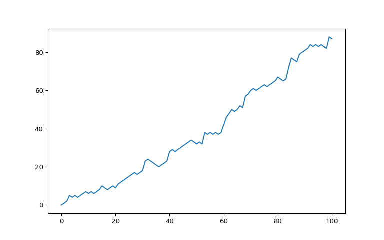
</div>

</div>

<p class="">This is pretty cool! You can clearly see how your random walk progressed.</p>

## Distribution


### Simulate multiple walks


<div class>
<p>A single random walk is one thing, but that doesn't tell you if you have a good chance at winning the bet.</p>
<p>To get an idea about how big your chances are of reaching 60 steps, you can repeatedly simulate the random walk and collect the results. That's exactly what you'll do in this exercise.</p>
<p>The sample code already sets you off in the right direction. Another <code>for</code> loop is wrapped around the code you already wrote. It's up to you to add some bits and pieces to make sure all of the results are recorded correctly.</p>
<p><strong>Note: Don't change anything about the initialization of <code>all_walks</code> that is given. Setting any number inside the list will cause the exercise to crash!</strong></p>
</div>

<li>Fill in the specification of the <code>for</code> loop so that the random walk is simulated 10 times.</li>
<li>After the <code>random_walk</code> array is entirely populated, append the array to the <code>all_walks</code> list.</li>

<li>Finally, after the top-level <code>for</code> loop, print out <code>all_walks</code>.</li>
<div>

```python
# NumPy is imported; seed is set

# Initialize all_walks (don't change this line)
all_walks = []

# Simulate random walk 10 times
for i in range(10) :

    # Code from before
    random_walk = [0]
    for x in range(100) :
        step = random_walk[-1]
        dice = np.random.randint(1,7)

        if dice <= 2:
            step = max(0, step - 1)
        elif dice <= 5:
            step = step + 1
        else:
            step = step + np.random.randint(1,7)
        random_walk.append(step)

    # Append random_walk to all_walks
    all_walks.append(random_walk)
    
# Print all_walks
print(all_walks)
```

```
## [[0, 1, 2, 3, 4, 5, 6, 7, 8, 7, 8, 7, 6, 7, 6, 7, 6, 7, 8, 12, 13, 12, 18, 17, 16, 17, 16, 15, 16, 15, 19, 18, 19, 18, 19, 18, 19, 21, 20, 19, 18, 19, 18, 23, 24, 25, 24, 23, 24, 23, 24, 23, 28, 29, 28, 27, 26, 25, 26, 27, 31, 37, 38, 39, 40, 41, 40, 41, 43, 44, 45, 46, 45, 44, 45, 44, 45, 46, 47, 46, 47, 48, 49, 48, 47, 48, 49, 54, 55, 56, 61, 60, 61, 60, 61, 62, 63, 64, 63, 69, 68], [0, 1, 0, 0, 1, 5, 6, 7, 8, 9, 8, 7, 6, 5, 4, 5, 6, 7, 8, 9, 10, 9, 10, 11, 10, 11, 12, 15, 14, 15, 14, 15, 18, 19, 20, 21, 20, 19, 22, 23, 24, 25, 24, 23, 24, 27, 28, 33, 34, 33, 34, 33, 34, 33, 39, 38, 37, 38, 40, 39, 38, 37, 38, 39, 40, 41, 45, 50, 51, 52, 53, 56, 57, 58, 59, 60, 61, 62, 61, 60, 61, 62, 61, 67, 66, 67, 68, 67, 66, 67, 66, 65, 71, 70, 69, 70, 71, 70, 69, 68, 67], [0, 1, 7, 8, 11, 12, 18, 19, 20, 26, 25, 31, 30, 31, 32, 33, 32, 38, 39, 38, 39, 38, 39, 38, 39, 38, 39, 43, 44, 46, 45, 46, 45, 44, 45, 44, 45, 44, 48, 52, 51, 50, 49, 50, 51, 55, 56, 57, 61, 60, 59, 58, 59, 60, 62, 61, 60, 61, 62, 64, 67, 72, 73, 72, 73, 74, 75, 76, 77, 76, 77, 78, 84, 83, 88, 87, 91, 90, 94, 93, 96, 97, 96, 97, 103, 102, 101, 100, 104, 103, 102, 103, 104, 103, 104, 105, 106, 107, 106, 105, 104], [0, 1, 0, 0, 4, 5, 7, 11, 17, 16, 15, 16, 17, 18, 17, 18, 17, 18, 19, 18, 17, 18, 19, 20, 21, 22, 23, 24, 25, 26, 27, 33, 32, 35, 36, 35, 34, 35, 36, 37, 36, 35, 34, 33, 34, 35, 36, 37, 38, 39, 40, 39, 40, 41, 43, 42, 43, 44, 47, 49, 50, 49, 48, 47, 46, 45, 46, 45, 46, 48, 49, 50, 49, 50, 49, 48, 49, 48, 47, 46, 47, 46, 45, 46, 47, 48, 50, 51, 52, 51, 50, 51, 57, 56, 57, 58, 63, 62, 63, 62, 63], [0, 1, 0, 1, 2, 8, 9, 10, 11, 10, 12, 13, 14, 15, 14, 15, 16, 17, 18, 17, 18, 17, 18, 19, 18, 19, 23, 24, 27, 28, 32, 33, 32, 33, 34, 33, 32, 37, 38, 39, 38, 37, 38, 39, 40, 39, 43, 42, 43, 44, 45, 46, 47, 48, 49, 48, 47, 46, 47, 48, 52, 53, 52, 53, 54, 53, 59, 60, 61, 62, 61, 62, 63, 66, 65, 66, 65, 64, 63, 64, 65, 67, 68, 69, 73, 74, 73, 72, 73, 74, 73, 72, 73, 74, 75, 74, 73, 74, 75, 76, 75], [0, 1, 2, 1, 0, 0, 1, 2, 3, 4, 5, 10, 14, 13, 14, 13, 12, 11, 12, 11, 12, 13, 12, 16, 17, 16, 17, 16, 15, 16, 15, 19, 20, 21, 22, 23, 24, 23, 24, 25, 26, 27, 28, 27, 32, 33, 34, 33, 34, 33, 34, 35, 34, 35, 40, 41, 42, 41, 42, 43, 44, 43, 44, 43, 44, 45, 44, 43, 42, 43, 44, 43, 42, 41, 42, 46, 47, 48, 49, 50, 51, 50, 51, 52, 51, 52, 57, 58, 57, 56, 57, 56, 55, 54, 58, 59, 60, 61, 60, 61, 62], [0, 1, 2, 3, 2, 1, 4, 3, 2, 1, 0, 1, 7, 8, 7, 8, 9, 8, 7, 8, 9, 10, 9, 13, 14, 13, 15, 16, 15, 16, 17, 18, 19, 20, 21, 20, 19, 20, 21, 20, 21, 22, 21, 20, 19, 23, 24, 25, 26, 27, 28, 29, 30, 31, 32, 31, 32, 33, 34, 35, 36, 35, 34, 40, 41, 42, 41, 40, 39, 43, 44, 48, 47, 53, 54, 55, 59, 60, 59, 58, 59, 60, 61, 62, 61, 67, 68, 67, 71, 72, 71, 72, 71, 77, 83, 84, 83, 84, 85, 86, 87], [0, 1, 0, 3, 2, 4, 5, 11, 10, 11, 12, 11, 10, 11, 10, 11, 12, 13, 14, 15, 16, 17, 18, 19, 20, 21, 22, 23, 24, 23, 24, 25, 26, 25, 24, 23, 24, 23, 27, 26, 25, 26, 28, 29, 34, 33, 34, 35, 39, 38, 39, 40, 39, 38, 39, 40, 41, 40, 39, 38, 39, 38, 37, 38, 37, 36, 35, 36, 37, 36, 35, 34, 35, 36, 37, 36, 35, 36, 37, 38, 39, 38, 39, 38, 39, 40, 41, 42, 43, 48, 53, 52, 53, 54, 53, 54, 60, 59, 60, 59, 60], [0, 0, 1, 2, 3, 2, 1, 2, 3, 4, 3, 2, 1, 3, 4, 5, 4, 3, 2, 3, 4, 5, 4, 3, 4, 7, 12, 15, 16, 17, 23, 24, 25, 26, 25, 27, 32, 33, 34, 35, 36, 37, 38, 37, 38, 39, 40, 41, 42, 44, 48, 49, 50, 51, 52, 56, 61, 60, 59, 58, 57, 60, 61, 62, 63, 62, 61, 64, 65, 64, 63, 62, 63, 64, 65, 66, 65, 66, 65, 66, 67, 66, 67, 68, 69, 70, 71, 72, 73, 72, 71, 72, 73, 76, 77, 76, 75, 76, 77, 78, 83], [0, 0, 0, 0, 0, 0, 0, 1, 0, 0, 1, 4, 3, 2, 3, 4, 5, 4, 5, 6, 7, 8, 9, 10, 11, 12, 15, 21, 22, 23, 24, 25, 26, 25, 24, 23, 24, 25, 26, 27, 29, 30, 31, 32, 34, 38, 37, 36, 35, 34, 35, 36, 37, 36, 35, 34, 33, 32, 31, 32, 36, 40, 41, 42, 41, 40, 41, 42, 43, 49, 50, 49, 48, 49, 48, 49, 48, 49, 50, 49, 50, 49, 48, 49, 50, 49, 50, 49, 50, 53, 54, 55, 56, 57, 56, 57, 58, 63, 62, 63, 64]]
```
</div>

<p class="">Well done!</p>

### Visualize all walks


<div class>
<p><code>all_walks</code> is a list of lists: every sub-list represents a single random walk. If you convert this list of lists to a NumPy array, you can start making interesting plots! <code>matplotlib.pyplot</code> is already imported as <code>plt</code>.</p>
<p>The nested <code>for</code> loop is already coded for you - don't worry about it. For now, focus on the code that comes after this <code>for</code> loop.</p>
</div>

<li>Use <a href="http://docs.scipy.org/doc/numpy-1.10.1/reference/generated/numpy.array.html"><code>np.array()</code></a> to convert <code>all_walks</code> to a NumPy array, <code>np_aw</code>.</li>

<li>Try to use <a href="https://matplotlib.org/stable/api/_as_gen/matplotlib.pyplot.plot.html"><code>plt.plot()</code></a> on <code>np_aw</code>. Also include <a href="https://matplotlib.org/stable/api/_as_gen/matplotlib.pyplot.show.html"><code>plt.show()</code></a>. Does it work out of the box?</li>
<div>

```python
# numpy and matplotlib imported, seed set.

# initialize and populate all_walks
all_walks = []
for i in range(10) :
    random_walk = [0]
    for x in range(100) :
        step = random_walk[-1]
        dice = np.random.randint(1,7)
        if dice <= 2:
            step = max(0, step - 1)
        elif dice <= 5:
            step = step + 1
        else:
            step = step + np.random.randint(1,7)
        random_walk.append(step)
    all_walks.append(random_walk)

# Convert all_walks to NumPy array: np_aw
np_aw = np.array(all_walks)

# Plot np_aw and show
plt.plot(np_aw)
plt.show()
```

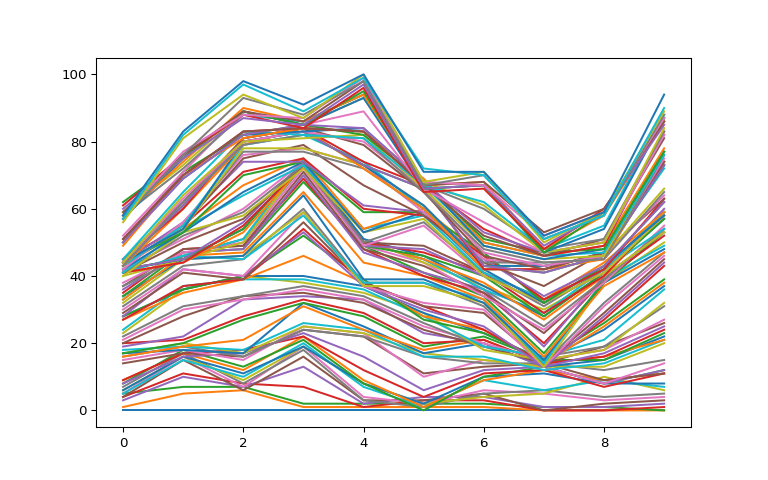
</div>
<div>

```python
# Clear the figure
plt.clf()
```
</div>
<li>Transpose <code>np_aw</code> by calling <a href="http://docs.scipy.org/doc/numpy-1.10.1/reference/generated/numpy.transpose.html"><code>np.transpose()</code></a> on <code>np_aw</code>. Call the result <code>np_aw_t</code>. Now every row in <code>np_all_walks</code> represents the position after 1 throw for the 10 random walks.</li>

<li>Use <a href="https://matplotlib.org/stable/api/_as_gen/matplotlib.pyplot.plot.html"><code>plt.plot()</code></a> to plot <code>np_aw_t</code>; also include a <a href="https://matplotlib.org/stable/api/_as_gen/matplotlib.pyplot.show.html"><code>plt.show()</code></a>. Does it look better this time?</li>
<div>

```python
# Transpose np_aw: np_aw_t
np_aw_t = np.transpose(np_aw)

# Plot np_aw_t and show
plt.plot(np_aw_t)
plt.show()
```

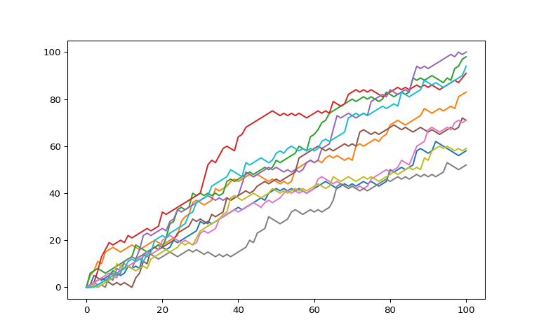
</div>

<p class="">Good job! You can clearly see how the different simulations of the random walk went. Transposing the 2D NumPy array was crucial; otherwise Python misunderstood.</p>

### Implement clumsiness


<div class>
<p>With this neatly written code of yours, changing the number of times the random walk should be simulated is super-easy. You simply update the <a href="https://docs.python.org/3/library/functions.html#func-range"><code>range()</code></a> function in the top-level <code>for</code> loop.</p>
<p>There's still something we forgot! You're a bit clumsy and you have a 0.1% chance of falling down. That calls for another random number generation. Basically, you can generate a random float between <code>0</code> and <code>1</code>. If this value is less than or equal to 0.001, you should reset step to 0.</p>
</div>

<li>Change the <a href="https://docs.python.org/3/library/functions.html#func-range"><code>range()</code></a> function so that the simulation is performed 250 times.</li>
<li>Finish the <code>if</code> condition so that <code>step</code> is set to 0 if a random float is less or equal to 0.001. Use <a href="https://docs.scipy.org/doc/numpy-1.10.1/reference/generated/numpy.random.rand.html"><code>np.random.rand()</code></a>.</li>
<div>

```python
# numpy and matplotlib imported, seed set

# Simulate random walk 250 times
all_walks = []
for i in range(250) :
    random_walk = [0]
    for x in range(100) :
        step = random_walk[-1]
        dice = np.random.randint(1,7)
        if dice <= 2:
            step = max(0, step - 1)
        elif dice <= 5:
            step = step + 1
        else:
            step = step + np.random.randint(1,7)

        # Implement clumsiness
        if np.random.rand() <= 0.001 :
            step = 0

        random_walk.append(step)
    all_walks.append(random_walk)

# Create and plot np_aw_t
np_aw_t = np.transpose(np.array(all_walks))
plt.plot(np_aw_t)
plt.show()
```

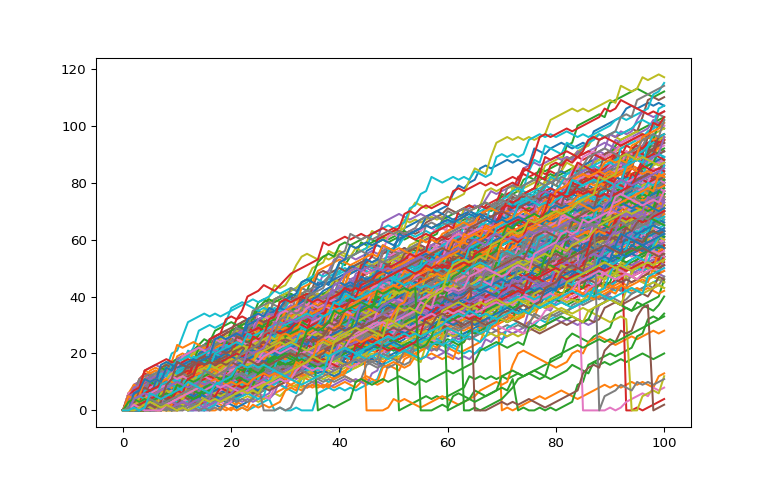
</div>

<p class="">Superb! Look at the plot. In some of the 250 simulations you're indeed taking a deep dive down!</p>

### Plot the distribution


<div class>
<p>All these fancy visualizations have put us on a sidetrack. We still have to solve the million-dollar problem: <em>What are the odds that you'll reach 60 steps high on the Empire State Building?</em></p>
<p>Basically, you want to know about the end points of all the random walks you've simulated. These end points have a certain distribution that you can visualize with a histogram.</p>
<p>Note that if your code is taking too long to run, you might be plotting a histogram of the wrong data!</p>
</div>

<li>To make sure we've got enough simulations, go crazy. Simulate the random walk 500 times.</li>

<li>From <code>np_aw_t</code>, select the last row. This contains the endpoint of all 500 random walks you've simulated. Store this NumPy array as <code>ends</code>.</li>

<li>Use <a href="https://matplotlib.org/stable/api/_as_gen/matplotlib.pyplot.hist.html"><code>plt.hist()</code></a> to build a histogram of <code>ends</code>. Don't forget <a href="https://matplotlib.org/stable/api/_as_gen/matplotlib.pyplot.show.html"><code>plt.show()</code></a> to display the plot.</li>
<div>

```python
# numpy and matplotlib imported, seed set

# Simulate random walk 500 times
all_walks = []
for i in range(500) :
    random_walk = [0]
    for x in range(100) :
        step = random_walk[-1]
        dice = np.random.randint(1,7)
        if dice <= 2:
            step = max(0, step - 1)
        elif dice <= 5:
            step = step + 1
        else:
            step = step + np.random.randint(1,7)
        if np.random.rand() <= 0.001 :
            step = 0
        random_walk.append(step)
    all_walks.append(random_walk)

# Create and plot np_aw_t
np_aw_t = np.transpose(np.array(all_walks))

# Select last row from np_aw_t: ends
ends = np_aw_t[-1,:]

# Plot histogram of ends, display plot
plt.hist(ends)
```

```
## (array([ 14.,  13.,  13.,  28.,  97., 151., 103.,  61.,  19.,   1.]), array([  2. ,  14.8,  27.6,  40.4,  53.2,  66. ,  78.8,  91.6, 104.4,
##        117.2, 130. ]), <BarContainer object of 10 artists>)
```

```python
plt.show()
```

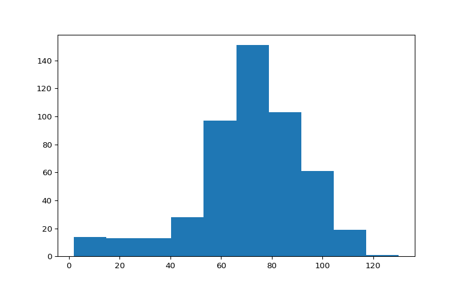
</div>

<p class="">Great job! Have a look at a histogram; what do you think your chances are?</p>

### Calculate the odds


<div class>
<p>The histogram of the previous exercise was created from a NumPy array <code>ends</code>, that contains 500 integers. Each integer represents the end point of a random walk. To calculate the chance that this end point is greater than or equal to 60, you can count the number of integers in <code>ends</code> that are greater than or equal to 60 and divide that number by 500, the total number of simulations.</p>
<p>Well then, what's the estimated chance that you'll reach 60 steps high if you play this Empire State Building game? The <code>ends</code> array is everything you need; it's available in your Python session so you can make calculations in the IPython Shell.</p>
</div>
<div>

```python
# edited/added
sum(ends>60)/len(ends)
```

```
## 0.76
```
</div>

- [ ] 48.8%
- [ ] 76.6%
- [x] 78.4%
- [ ] 95.9%

<p class="">Correct! Seems like you have a pretty high chance of winning the bet!</p>
