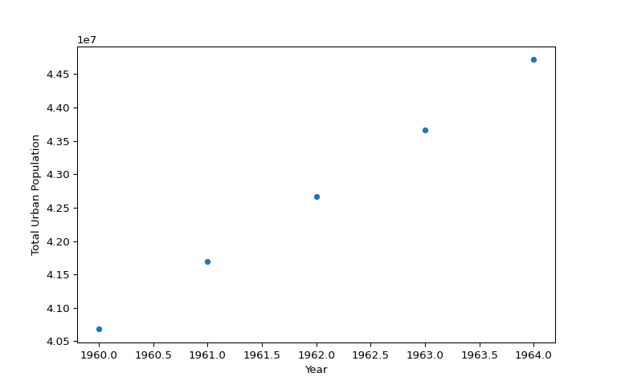
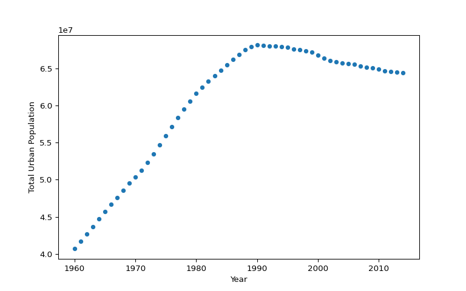
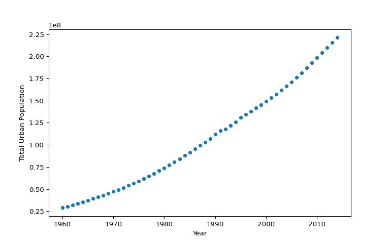

<h3><a href="https://github.com/mclix85/datacamp" target="_blank">View Source Code</a></h3>

<h3>Course Description</h3>

<p class="course__description">In the second Python Data Science Toolbox course, you'll continue to build your Python data science skills. First, you'll learn about iterators, objects you have already encountered in the context of for loops. You'll then learn about list comprehensions, which are extremely handy tools for all data scientists working in Python. You'll end the course by working through a case study in which you'll apply all the techniques you learned in both parts of this course.</p>

# Using iterators in PythonLand {.unnumbered}

<p class="chapter__description">
    You'll learn all about iterators and iterables, which you have already worked with when writing for loops. You'll learn some handy functions that will allow you to effectively work with iterators. And you’ll finish the chapter with a use case that is pertinent to the world of data science and dealing with large amounts of data—in this case, data from Twitter that you will load in chunks using iterators.
  </p>
  
## Introduction to iterators {.unnumbered}


### Iterators vs. Iterables {.unnumbered}


<div class>
<p>Let's do a quick recall of what you've learned about <strong>iterables</strong> and <strong>iterators</strong>. Recall from the video that an <em>iterable</em> is an object that can return an <em>iterator</em>, while an <em>iterator</em> is an object that keeps state and produces the next value when you call <code>next()</code> on it. In this exercise, you will identify which object is an <em>iterable</em> and which is an <em>iterator</em>.</p>
<p>The environment has been pre-loaded with the variables <code>flash1</code> and <code>flash2</code>. Try printing out their values with <code>print()</code> and <code>next()</code> to figure out which is an <em>iterable</em> and which is an <em>iterator</em>.</p>
</div>

<div>

```python
# edited/added
flash1 = ['jay garrick', 'barry allen', 'wally west', 'bart allen']
flash2 = iter(flash1)
```
</div>

- [ ] Both <code>flash1</code> and <code>flash2</code> are iterators.
- [ ] Both <code>flash1</code> and <code>flash2</code> are iterables.
- [x] <code>flash1</code> is an iterable and <code>flash2</code> is an iterator.

<p class="">Correct!</p>

### Iterating over iterables (1) {.unnumbered}


<div class>
<p>Great, you're familiar with what iterables and iterators are! In this exercise, you will reinforce your knowledge about these by iterating over and printing from iterables and iterators.</p>
<p>You are provided with a list of strings <code>flash</code>. You will practice iterating over the list by using a <code>for</code> loop. You will also create an iterator for the list and access the values from the iterator.</p>
</div>

<li>Create a <code>for</code> loop to loop over <code>flash</code> and print the values in the list. Use <code>person</code> as the loop variable.</li>

<li>Create an <em>iterator</em> for the list <code>flash</code> and assign the result to <code>superhero</code>.</li>

<li>Print each of the items from <code>superhero</code> using <code>next()</code> 4 times.</li>
<div>

```python
# Create a list of strings: flash
flash = ['jay garrick', 'barry allen', 'wally west', 'bart allen']

# Print each list item in flash using a for loop
for person in flash:
    print(person)
```

```
## jay garrick
## barry allen
## wally west
## bart allen
```
</div>
<div>

```python
# Create an iterator for flash: superhero
superhero = iter(flash)

# Print each item from the iterator
print(next(superhero))
```

```
## jay garrick
```

```python
print(next(superhero))
```

```
## barry allen
```

```python
print(next(superhero))
```

```
## wally west
```

```python
print(next(superhero))
```

```
## bart allen
```
</div>

<p class="">Great work!</p>

### Iterating over iterables (2) {.unnumbered}


<div class>
<p>One of the things you learned about in this chapter is that not all iterables are <em>actual</em> lists. A couple of examples that we looked at are <em>strings</em> and the use of the <code>range()</code> function. In this exercise, we will focus on the <code>range()</code> function.</p>
<p>You can use <code>range()</code> in a <code>for</code> loop <em>as if</em> it's a list to be iterated over:</p>
<pre><code>for i in range(5):
    print(i)
</code></pre>
<p>Recall that <code>range()</code> doesn't actually create the list; instead, it creates a range object with an iterator that produces the values until it reaches the limit (in the example, until the value 4). If <code>range()</code> created the actual list, calling it with a value of \(10^{100}\) may not work, especially since a number as big as that may go over a regular computer's memory. The value \(10^{100}\) is actually what's called a <strong>Googol</strong> which is a 1 followed by a hundred 0s. That's a huge number!</p>
<p>Your task for this exercise is to show that calling <code>range()</code> with \(10^{100}\) won't actually pre-create the list.</p>
</div>

<li>Create an <strong>iterator</strong> object <code>small_value</code> over <code>range(3)</code> using the function <code>iter()</code>.</li>

<li>Using a <code>for</code> loop, iterate over <code>range(3)</code>, printing the value for every iteration. Use <code>num</code> as the loop variable.</li>

<li>Create an <strong>iterator</strong> object <code>googol</code> over <code>range(10 ** 100)</code>.</li>
<div>

```python
# Create an iterator for range(3): small_value
small_value = iter(range(3))

# Print the values in small_value
print(next(small_value))
```

```
## 0
```

```python
print(next(small_value))
```

```
## 1
```

```python
print(next(small_value))
```

```
## 2
```
</div>
<div>

```python
# Loop over range(3) and print the values
for num in range(3):
    print(num)
```

```
## 0
## 1
## 2
```
</div>
<div>

```python
# Create an iterator for range(10 ** 100): googol
googol = iter(range(10 ** 100))

# Print the first 5 values from googol
print(next(googol))
```

```
## 0
```

```python
print(next(googol))
```

```
## 1
```

```python
print(next(googol))
```

```
## 2
```

```python
print(next(googol))
```

```
## 3
```

```python
print(next(googol))
```

```
## 4
```
</div>

<p class="">Great work!</p>

### Iterators as function arguments {.unnumbered}


<div class>
<p>You've been using the <code>iter()</code> function to get an iterator object, as well as the <code>next()</code> function to retrieve the values one by one from the iterator object. </p>
<p>There are also functions that take iterators and iterables as arguments. For example, the <code>list()</code> and <code>sum()</code> functions return a list and the sum of elements, respectively. </p>
<p>In this exercise, you will use these functions by passing an iterable from <code>range()</code> and then printing the results of the function calls.</p>
</div>

<li>Create a <code>range</code> object that would produce the values from 10 to 20 using <code>range()</code>. Assign the result to <code>values</code>.</li>

<li>Use the <code>list()</code> function to create a list of values from the range object <code>values</code>. Assign the result to <code>values_list</code>.</li>

<li>Use the <code>sum()</code> function to get the sum of the values from 10 to 20 from the range object <code>values</code>. Assign the result to <code>values_sum</code>.</li>
<div>

```python
# Create a range object: values
values = range(10, 21)

# Print the range object
print(values)
```

```
## range(10, 21)
```
</div>
<div>

```python
# Create a list of integers: values_list
values_list = list(values)

# Print values_list
print(values_list)
```

```
## [10, 11, 12, 13, 14, 15, 16, 17, 18, 19, 20]
```
</div>
<div>

```python
# Get the sum of values: values_sum
values_sum = sum(values)

# Print values_sum
print(values_sum)
```

```
## 165
```
</div>

<p class="">Great work!</p>

## Playing with iterators {.unnumbered}


### Using enumerate {.unnumbered}


<div class>
<p>You're really getting the hang of using iterators, great job! </p>
<p>You've just gained several new ideas on iterators from the last video and one of them is the <code>enumerate()</code> function. Recall that <code>enumerate()</code> returns an <code>enumerate</code> object that produces a sequence of tuples, and each of the tuples is an <em>index-value</em> pair.</p>
<p>In this exercise, you are given a list of strings <code>mutants</code> and you will practice using <code>enumerate()</code> on it by printing out a list of tuples and unpacking the tuples using a <code>for</code> loop.</p>
</div>

<li>Create a list of tuples from <code>mutants</code> and assign the result to <code>mutant_list</code>. Make sure you generate the tuples using <code>enumerate()</code> and turn the result from it into a list using <code>list()</code>.</li>

<li>Complete the first <code>for</code> loop by unpacking the tuples generated by calling <code>enumerate()</code> on <code>mutants</code>. Use <code>index1</code> for the index and <code>value1</code> for the value when unpacking the tuple.</li>

<li>Complete the second <code>for</code> loop similarly as with the first, but this time change the starting index to start from <code>1</code> by passing it in as an argument to the <code>start</code> parameter of <code>enumerate()</code>. Use <code>index2</code> for the index and <code>value2</code> for the value when unpacking the tuple.</li>
<div>

```python
# Create a list of strings: mutants
mutants = ['charles xavier', 
            'bobby drake', 
            'kurt wagner', 
            'max eisenhardt', 
            'kitty pryde']

# Create a list of tuples: mutant_list
mutant_list = list(enumerate(mutants))

# Print the list of tuples
print(mutant_list)
```

```
## [(0, 'charles xavier'), (1, 'bobby drake'), (2, 'kurt wagner'), (3, 'max eisenhardt'), (4, 'kitty pryde')]
```
</div>
<div>

```python
# Unpack and print the tuple pairs
for index1, value1 in enumerate(mutants):
    print(index1, value1)
```

```
## 0 charles xavier
## 1 bobby drake
## 2 kurt wagner
## 3 max eisenhardt
## 4 kitty pryde
```
</div>
<div>

```python
# Change the start index
for index2, value2 in enumerate(mutants, start=1):
    print(index2, value2)
```

```
## 1 charles xavier
## 2 bobby drake
## 3 kurt wagner
## 4 max eisenhardt
## 5 kitty pryde
```
</div>

<p class="">Great work!</p>

### Using zip {.unnumbered}


<div class>
<p>Another interesting function that you've learned is <code>zip()</code>, which takes any number of iterables and returns a <code>zip</code> object that is an iterator of tuples. If you wanted to print the values of a <code>zip</code> object, you can convert it into a list and then print it. Printing just a <code>zip</code> object will not return the values unless you unpack it first. In this exercise, you will explore this for yourself.</p>
<p>Three lists of strings are pre-loaded: <code>mutants</code>, <code>aliases</code>, and <code>powers</code>. First, you will use <code>list()</code> and <code>zip()</code> on these lists to generate a list of tuples. Then, you will create a <code>zip</code> object using <code>zip()</code>. Finally, you will unpack this <code>zip</code> object in a <code>for</code> loop to print the values in each tuple. Observe the different output generated by printing the list of tuples, then the <code>zip</code> object, and finally, the tuple values in the <code>for</code> loop.</p>
</div>

<li>Using <code>zip()</code> with <code>list()</code>, create a <em>list</em> of <em>tuples</em> from the three lists <code>mutants</code>, <code>aliases</code>, and <code>powers</code> (in that order) and assign the result to <code>mutant_data</code>. </li>


<li>Using <code>zip()</code>, create a <em>zip object</em> called <code>mutant_zip</code> from the three lists <code>mutants</code>, <code>aliases</code>, and <code>powers</code>.</li>

<li>Complete the <code>for</code> loop by unpacking the <code>zip</code> object you created and printing the tuple values. Use <code>value1</code>, <code>value2</code>, <code>value3</code> for the values from each of <code>mutants</code>, <code>aliases</code>, and <code>powers</code>, in that order.</li>
<div>

```python
# edited/added
aliases = ['prof x', 'iceman', 'nightcrawler', 'magneto', 'shadowcat']
powers = ['telepathy', 'thermokinesis', 'teleportation', 'magnetokinesis', 'intangibility']

# Create a list of tuples: mutant_data
mutant_data = list(zip(mutants, aliases, powers))

# Print the list of tuples
print(mutant_data)
```

```
## [('charles xavier', 'prof x', 'telepathy'), ('bobby drake', 'iceman', 'thermokinesis'), ('kurt wagner', 'nightcrawler', 'teleportation'), ('max eisenhardt', 'magneto', 'magnetokinesis'), ('kitty pryde', 'shadowcat', 'intangibility')]
```
</div>
<div>

```python
# Create a zip object using the three lists: mutant_zip
mutant_zip = zip(mutants, aliases, powers)

# Print the zip object
print(mutant_zip)
```

```
## <zip object at 0x7f87f08519c0>
```
</div>
<div>

```python
# Unpack the zip object and print the tuple values
for value1, value2, value3 in mutant_zip:
    print(value1, value2, value3)
```

```
## charles xavier prof x telepathy
## bobby drake iceman thermokinesis
## kurt wagner nightcrawler teleportation
## max eisenhardt magneto magnetokinesis
## kitty pryde shadowcat intangibility
```
</div>

<p class="">Great work!</p>

### Using * and zip to 'unzip' {.unnumbered}


<div class>
<p>You know how to use <code>zip()</code> as well as how to print out values from a <code>zip</code> object. Excellent!</p>
<p>Let's play around with <code>zip()</code> a little more. There is no <em>unzip</em> function for doing the reverse of what <code>zip()</code> does. We can, however, reverse what has been <code>zip</code>ped together by using <code>zip()</code> with a little help from <code>*</code>! <code>*</code> unpacks an <em>iterable</em> such as a list or a tuple into <em>positional arguments</em> in a function call.</p>
<p>In this exercise, you will use <code>*</code> in a call to <code>zip()</code> to unpack the tuples produced by <code>zip()</code>. </p>
<p>Two tuples of strings, <code>mutants</code> and <code>powers</code> have been pre-loaded.</p>
</div>

<li>Create a <code>zip</code> object by using <code>zip()</code> on <code>mutants</code> and <code>powers</code>, in that order. Assign the result to <code>z1</code>.</li>

<li>Print the tuples in <code>z1</code> by unpacking them into positional arguments using the <code>*</code> operator in a <code>print()</code> call.</li>

<li>Because the previous <code>print()</code> call would have exhausted the elements in <code>z1</code>, recreate the <code>zip</code> object you defined earlier and assign the result again to <code>z1</code>.</li>

<li>'Unzip' the tuples in <code>z1</code> by unpacking them into positional arguments using the <code>*</code> operator in a <code>zip()</code> call. Assign the results to <code>result1</code> and <code>result2</code>, in that order.</li>

<li>The last <code>print()</code> statements prints the output of comparing <code>result1</code> to <code>mutants</code> and <code>result2</code> to <code>powers</code>. Click <code>Submit Answer</code> to see if the unpacked <code>result1</code> and <code>result2</code> are equivalent to <code>mutants</code> and <code>powers</code>, respectively.</li>
<div>

```python
# Create a zip object from mutants and powers: z1
z1 = zip(mutants, powers)

# Print the tuples in z1 by unpacking with *
print(*z1)
```

```
## ('charles xavier', 'telepathy') ('bobby drake', 'thermokinesis') ('kurt wagner', 'teleportation') ('max eisenhardt', 'magnetokinesis') ('kitty pryde', 'intangibility')
```
</div>
<div>

```python
# Re-create a zip object from mutants and powers: z1
z1 = zip(mutants, powers)

# 'Unzip' the tuples in z1 by unpacking with * and zip(): result1, result2
result1, result2 = zip(*z1)

# Check if unpacked tuples are equivalent to original tuples
print(result1 == mutants)
```

```
## False
```

```python
print(result2 == powers)
```

```
## False
```
</div>

<p class="">Great work!</p>

## Using iterators to load large files into memory {.unnumbered}


### Processing large amounts of Twitter data {.unnumbered}


<div class>
<p>Sometimes, the data we have to process reaches a size that is too much for a computer's memory to handle. This is a common problem faced by data scientists. A solution to this is to process an entire data source chunk by chunk, instead of a single go all at once.</p>
<p>In this exercise, you will do just that. You will process a large csv file of Twitter data in the same way that you processed <code>'tweets.csv'</code> in <a href="https://campus.datacamp.com/courses/python-data-science-toolbox-part-1/writing-your-own-functions?ex=12"><em>Bringing it all together</em></a> exercises of the prequel course, but this time, working on it in chunks of 10 entries at a time. </p>
<p>If you are interested in learning how to access Twitter data so you can work with it on your own system, refer to <a href="https://www.datacamp.com/courses/importing-data-in-python-part-2">Part 2</a> of the DataCamp course on Importing Data in Python. </p>
<p>The pandas package has been imported as <code>pd</code> and the file <code>'tweets.csv'</code> is in your current directory for your use.</p>
<p><em>Be aware that this is real data from Twitter and as such there is always a risk that it may contain profanity or other offensive content (in this exercise, and any following exercises that also use real Twitter data).</em></p>
</div>

<li>Initialize an empty dictionary <code>counts_dict</code> for storing the results of processing the Twitter data.</li>

<li>Iterate over the <code>'tweets.csv'</code> file by using a <code>for</code> loop. Use the loop variable <code>chunk</code> and iterate over the call to <code>pd.read_csv()</code> with a <code>chunksize</code> of 10.</li>
<li>In the inner loop, iterate over the column <code>'lang'</code> in <code>chunk</code> by using a <code>for</code> loop. Use the loop variable <code>entry</code>.</li>
<div>

```python
# edited/added
import pandas as pd

# Initialize an empty dictionary: counts_dict
counts_dict = {}

# Iterate over the file chunk by chunk
for chunk in pd.read_csv('datasets/Python-Data-Science-Toolbox-Part-2/tweets.csv', chunksize=10): # edited/added

    # Iterate over the column in DataFrame
    for entry in chunk['lang']:
        if entry in counts_dict.keys():
            counts_dict[entry] += 1
        else:
            counts_dict[entry] = 1
            
# Print the populated dictionary
print(counts_dict)
```

```
## {'en': 97, 'et': 1, 'und': 2}
```
</div>

<p class="">Great work!</p>

### Extracting information for large amounts of Twitter data {.unnumbered}


<div class>
<p>Great job chunking out that file in the previous exercise. You now know how to deal with situations where you need to process a very large file and that's a very useful skill to have!</p>
<p>It's good to know how to process a file in smaller, more manageable chunks, but it can become very tedious having to write and rewrite the same code for the same task each time. In this exercise, you will be making your code more <em>reusable</em> by putting your work in the last exercise in a <em>function definition</em>.</p>
<p>The pandas package has been imported as <code>pd</code> and the file <code>'tweets.csv'</code> is in your current directory for your use.</p>
</div>

<li>Define the function <code>count_entries()</code>, which has 3 parameters. The first parameter is <code>csv_file</code> for the filename, the second is <code>c_size</code> for the chunk size, and the last is <code>colname</code> for the column name.</li>
<li>Iterate over the file in <code>csv_file</code> file by using a <code>for</code> loop. Use the loop variable <code>chunk</code> and iterate over the call to <code>pd.read_csv()</code>, passing <code>c_size</code> to <code>chunksize</code>.</li>
<li>In the inner loop, iterate over the column given by <code>colname</code> in <code>chunk</code> by using a <code>for</code> loop. Use the loop variable <code>entry</code>.</li>

<li>Call the <code>count_entries()</code> function by passing to it the filename <code>'tweets.csv'</code>, the size of chunks <code>10</code>, and the name of the column to count, <code>'lang'</code>. Assign the result of the call to the variable <code>result_counts</code>.</li>
<div>

```python
# Define count_entries()
def count_entries(csv_file, c_size, colname):
    """Return a dictionary with counts of
    occurrences as value for each key."""
    
    # Initialize an empty dictionary: counts_dict
    counts_dict = {}

    # Iterate over the file chunk by chunk
    for chunk in pd.read_csv(csv_file, chunksize=c_size):

        # Iterate over the column in DataFrame
        for entry in chunk[colname]:
            if entry in counts_dict.keys():
                counts_dict[entry] += 1
            else:
                counts_dict[entry] = 1

    # Return counts_dict
    return counts_dict

# Call count_entries(): result_counts
result_counts = count_entries('datasets/Python-Data-Science-Toolbox-Part-2/tweets.csv', 10, 'lang') # edited/added

# Print result_counts
print(result_counts)
```

```
## {'en': 97, 'et': 1, 'und': 2}
```
</div>

<p class="">Great work!</p>

# List comprehensions and generators {.unnumbered}

<p class="chapter__description">
    In this chapter, you'll build on your knowledge of iterators and be introduced to list comprehensions, which allow you to create complicated lists—and lists of lists—in one line of code! List comprehensions can dramatically simplify your code and make it more efficient, and will become a vital part of your Python data science toolbox. You'll then learn about generators, which are extremely helpful when working with large sequences of data that you may not want to store in memory, but instead generate on the fly.
  </p>
  
## List comprehensions {.unnumbered}


### Write a basic list comprehension {.unnumbered}


<div class>
<p>In this exercise, you will practice what you've learned from the video about writing list comprehensions. You will write a list comprehension and identify the output that will be produced.</p>
<p>The following list has been pre-loaded in the environment.</p>
<pre><code>doctor = ['house', 'cuddy', 'chase', 'thirteen', 'wilson']
</code></pre>
<p>How would a list comprehension that produces a list of the <strong>first character</strong> of each string in <code>doctor</code> look like? Note that the list comprehension uses <code>doc</code> as the iterator variable. What will the output be?</p>
</div>

- [ ] The list comprehension is <code>[for doc in doctor: doc[0]]</code> and produces the list <code>['h', 'c', 'c', 't', 'w']</code>.
- [x] The list comprehension is <code>[doc[0] in doctor]</code> and produces the list <code>['h', 'c', 'c', 't', 'w']</code>.
- [ ] The list comprehension is <code>[doc[0] in doctor]</code> and produces the list <code>['h', 'c', 'c', 't', 'w']</code>.

<p class="">Correct!</p>

### List comprehension over iterables {.unnumbered}


<div class>
<p>You know that list comprehensions can be built over iterables. Given the following objects below, which of these can we build list comprehensions over?</p>
<pre><code>doctor = ['house', 'cuddy', 'chase', 'thirteen', 'wilson']

range(50)

underwood = 'After all, we are nothing more or less than what we choose to reveal.'

jean = '24601'

flash = ['jay garrick', 'barry allen', 'wally west', 'bart allen']

valjean = 24601
</code></pre>
</div>

- [ ] You can build list comprehensions over all the objects except the string of number characters <code>jean</code>.
- [ ] You can build list comprehensions over all the objects except the string lists <code>doctor</code> and <code>flash</code>.
- [ ] You can build list comprehensions over all the objects except <code>range(50)</code>.
- [x] You can build list comprehensions over all the objects except the integer object <code>valjean</code>.

<p class="">Correct!</p>

### Writing list comprehensions {.unnumbered}


<div class><p>You now have all the knowledge necessary to begin writing list comprehensions! Your job in this exercise is to write a list comprehension
that produces a list of the squares of the numbers ranging from 0 to 9.</p></div>

<li>Using the range of numbers from <code>0</code> to <code>9</code> as your iterable and <code>i</code> as your iterator variable, write a list comprehension that produces a list of numbers consisting of the squared values of <code>i</code>.</li>
<div>

```python
# Create list comprehension: squares
squares = [i**2 for i in range(0,10)]
```
</div>

<p class="">Great work!</p>

### Nested list comprehensions {.unnumbered}


<div class>
<p>Great! At this point, you have a good grasp of the basic syntax of list comprehensions. Let's push your code-writing skills a little further. In this exercise, you will be writing a list comprehension <em>within</em> another list comprehension, or nested list comprehensions. It sounds a little tricky, but you can do it!</p>
<p>Let's step aside for a while from strings. One of the ways in which lists can be used are in representing multi-dimension objects such as <strong>matrices</strong>. Matrices can be represented as a list of lists in Python. For example a 5 x 5 matrix with values <code>0</code> to <code>4</code> in each row can be written as:</p>
<pre><code>matrix = [[0, 1, 2, 3, 4],
          [0, 1, 2, 3, 4],
          [0, 1, 2, 3, 4],
          [0, 1, 2, 3, 4],
          [0, 1, 2, 3, 4]]
</code></pre>
<p>Your task is to recreate this matrix by using nested listed comprehensions. Recall that you can create one of the rows of the matrix with a single list comprehension. To create the list of lists, you simply have to supply the list comprehension as the <strong>output expression</strong> of the overall list comprehension:</p>
<p><code>[</code>[<em>output expression</em>] <code>for</code> <em>iterator variable</em> <code>in</code> <em>iterable</em><code>]</code></p>
<p>Note that here, the <strong>output expression</strong> is itself a list comprehension.</p>
</div>

<li>In the inner list comprehension - that is, the <strong>output expression</strong> of the nested list comprehension - create a list of values from <code>0</code> to <code>4</code> using <code>range()</code>. Use <code>col</code> as the iterator variable. </li>
<li>In the <strong>iterable</strong> part of your nested list comprehension, use <code>range()</code> to count 5 rows - that is, create a list of values from <code>0</code> to <code>4</code>. Use <code>row</code> as the iterator variable; note that you won't be needing this variable to create values in the list of lists.</li>
<div>

```python
# Create a 5 x 5 matrix using a list of lists: matrix
matrix = [[col for col in range(5)] for row in range(5)]

# Print the matrix
for row in matrix:
    print(row)
```

```
## [0, 1, 2, 3, 4]
## [0, 1, 2, 3, 4]
## [0, 1, 2, 3, 4]
## [0, 1, 2, 3, 4]
## [0, 1, 2, 3, 4]
```
</div>

<p class="">Great work!</p>

## Advanced comprehensions {.unnumbered}


### Using conditionals in comprehensions (1) {.unnumbered}


<div class>
<p>You've been using list comprehensions to build lists of values, sometimes using operations to create these values. </p>
<p>An interesting mechanism in list comprehensions is that you can also create lists with values that meet only a certain condition. One way of doing this is by using conditionals on iterator variables. In this exercise, you will do exactly that!</p>
<p>Recall from the video that you can apply a conditional statement to test the iterator variable by adding an <code>if</code> statement in the optional <em>predicate expression</em> part after the <code>for</code> statement in the comprehension: </p>
<p><code>[</code> <em>output expression</em> <code>for</code> <em>iterator variable</em> <code>in</code> <em>iterable</em> <code>if</code> <em>predicate expression</em> <code>]</code>. </p>
<p>You will use this recipe to write a list comprehension for this exercise. You are given a list of strings <code>fellowship</code> and, using a list comprehension, you will create a list that only includes the members of <code>fellowship</code> that have 7 characters or more.</p>
</div>

<li>Use <code>member</code> as the iterator variable in the list comprehension. For the conditional, use <code>len()</code> to evaluate the iterator variable. Note that you only want strings with 7 characters or more.</li>
<div>

```python
# Create a list of strings: fellowship
fellowship = ['frodo', 'samwise', 'merry', 'aragorn', 'legolas', 'boromir', 'gimli']

# Create list comprehension: new_fellowship
new_fellowship = [member for member in fellowship if len(member) >= 7]

# Print the new list
print(new_fellowship)
```

```
## ['samwise', 'aragorn', 'legolas', 'boromir']
```
</div>

<div class="dc-completed__message"><p class="">Great work!</p></div>

### Using conditionals in comprehensions (2) {.unnumbered}


<div class>
<p>In the previous exercise, you used an <code>if</code> conditional statement in the <em>predicate expression</em> part of a list comprehension to evaluate an iterator variable. In this exercise, you will use an <code>if-else</code> statement on the <em>output expression</em> of the list.</p>
<p>You will work on the same list, <code>fellowship</code> and, using a list comprehension and an <code>if-else</code> conditional statement in the output expression, create a list that keeps members of <code>fellowship</code> with 7 or more characters and replaces others with an empty string. Use <code>member</code> as the iterator variable in the list comprehension.</p>
</div>

<li>In the output expression, keep the string as-is <strong>if</strong> the number of characters is &gt;= 7, <strong>else</strong> replace it with an <em>empty string</em> - that is, <code>''</code> or <code>""</code>.</li>
<div>

```python
# Create a list of strings: fellowship
fellowship = ['frodo', 'samwise', 'merry', 'aragorn', 'legolas', 'boromir', 'gimli']

# Create list comprehension: new_fellowship
new_fellowship = [member if len(member) >= 7 else '' for member in fellowship]

# Print the new list
print(new_fellowship)
```

```
## ['', 'samwise', '', 'aragorn', 'legolas', 'boromir', '']
```
</div>

<p class="">Great work!</p>

### Dict comprehensions {.unnumbered}


<div class>
<p>Comprehensions aren't relegated merely to the world of lists. There are many other objects you can build using comprehensions, such as dictionaries, pervasive objects in Data Science. You will create a dictionary using the comprehension syntax for this exercise. In this case, the comprehension is called a <strong>dict comprehension</strong>.</p>
<p>Recall that the main difference between a <em>list comprehension</em> and a <em>dict comprehension</em> is the use of curly braces <code>{}</code> instead of <code>[]</code>. Additionally, members of the dictionary are created using a colon <code>:</code>, as in <code>&lt;key&gt; : &lt;value&gt;</code>.</p>
<p>You are given a list of strings <code>fellowship</code> and, using a <strong>dict comprehension</strong>, create a dictionary with the members of the list as the keys and the length of each string as the corresponding values.</p>
</div>
<div class="exercise--instructions__content"><p>Create a dict comprehension where the key is a string in <code>fellowship</code> and the value is the length of the string. Remember to use the syntax <code>&lt;key&gt; : &lt;value&gt;</code> in the output expression part of the comprehension to create the members of the dictionary. Use <code>member</code> as the iterator variable.</p></div>

<div>

```python
# Create a list of strings: fellowship
fellowship = ['frodo', 'samwise', 'merry', 'aragorn', 'legolas', 'boromir', 'gimli']

# Create dict comprehension: new_fellowship
new_fellowship = { member:len(member) for member in fellowship }

# Print the new dictionary
print(new_fellowship)
```

```
## {'frodo': 5, 'samwise': 7, 'merry': 5, 'aragorn': 7, 'legolas': 7, 'boromir': 7, 'gimli': 5}
```
</div>

<p class="">Great work!</p>

## Introduction to generator expressions {.unnumbered}


### List comprehensions vs. generators {.unnumbered}


<div class>
<p>You've seen from the videos that list comprehensions and generator expressions look very similar in their syntax, except for the use of parentheses <code>()</code> in generator expressions and brackets <code>[]</code> in list comprehensions.</p>
<p>In this exercise, you will recall the difference between list comprehensions and generators. To help with that task, the following code has been pre-loaded in the environment:</p>
<pre><code># List of strings
fellowship = ['frodo', 'samwise', 'merry', 'aragorn', 'legolas', 'boromir', 'gimli']</code>

<code># List comprehension
fellow1 = [member for member in fellowship if len(member) &gt;= 7]</code>

<code># Generator expression
fellow2 = (member for member in fellowship if len(member) &gt;= 7)
</code></pre>
<p>Try to play around with <code>fellow1</code> and <code>fellow2</code> by figuring out their types and printing out their values. Based on your observations and what you can recall from the video, select from the options below the best description for the difference between list comprehensions and generators.</p>
</div>

- [ ] List comprehensions and generators are not different at all; they are just different ways of writing the same thing.
- [x] A list comprehension produces a list as output, a generator produces a generator object.
- [ ] A list comprehension produces a list as output that can be iterated over, a generator produces a generator object that can't be iterated over.

<p class="">Correct!</p>

### Write your own generator expressions {.unnumbered}


<div class>
<p>You are familiar with what generators and generator expressions are, as well as its difference from list comprehensions. In this exercise, you will practice building generator expressions on your own. </p>
<p>Recall that generator expressions basically have the same syntax as list comprehensions, except that it uses parentheses <code>()</code> instead of brackets <code>[]</code>; this should make things feel familiar! Furthermore, if you have ever iterated over a dictionary with <code>.items()</code>, or used the <code>range()</code> function, for example, you have already encountered and used generators before, without knowing it! When you use these functions, Python creates generators for you behind the scenes.</p>
<p>Now, you will start simple by creating a generator object that produces numeric values.</p>
</div>

<li>Create a generator object that will produce values from <code>0</code> to <code>30</code>. Assign the result to <code>result</code> and use <code>num</code> as the iterator variable in the generator expression.</li>

<li>Print the first <code>5</code> values by using <code>next()</code> appropriately in <code>print()</code>.</li>

<li>Print the rest of the values by using a <code>for</code> loop to iterate over the generator object.</li>
<div>

```python
# Create generator object: result
result = (num for num in range(31))

# Print the first 5 values
print(next(result))
```

```
## 0
```

```python
print(next(result))
```

```
## 1
```

```python
print(next(result))
```

```
## 2
```

```python
print(next(result))
```

```
## 3
```

```python
print(next(result))

# Print the rest of the values
```

```
## 4
```

```python
for value in result:
    print(value)
```

```
## 5
## 6
## 7
## 8
## 9
## 10
## 11
## 12
## 13
## 14
## 15
## 16
## 17
## 18
## 19
## 20
## 21
## 22
## 23
## 24
## 25
## 26
## 27
## 28
## 29
## 30
```
</div>

<p class="">Great work!</p>

### Changing the output in generator expressions {.unnumbered}


<div class>
<p>Great! At this point, you already know how to write a basic generator expression. In this exercise, you will push this idea a little further by adding to the output expression of a generator expression. Because generator expressions and list comprehensions are so alike in syntax, this should be a familiar task for you!</p>
<p>You are given a list of strings <code>lannister</code> and, using a generator expression, create a generator object that you will iterate over to print its values.</p>
</div>

<li>Write a generator expression that will generate the <strong>lengths</strong> of each string in <code>lannister</code>. Use <code>person</code> as the iterator variable. Assign the result to <code>lengths</code>.</li>

<li>Supply the correct iterable in the <code>for</code> loop for printing the values in the generator object.</li>
<div>

```python
# Create a list of strings: lannister
lannister = ['cersei', 'jaime', 'tywin', 'tyrion', 'joffrey']

# Create a generator object: lengths
lengths = (len(person) for person in lannister)

# Iterate over and print the values in lengths
for value in lengths:
    print(value)
```

```
## 6
## 5
## 5
## 6
## 7
```
</div>

<p class="">Great work!</p>

### Build a generator {.unnumbered}


<div class>
<p>In previous exercises, you've dealt mainly with writing generator expressions, which uses comprehension syntax. Being able to use comprehension syntax for generator expressions made your work so much easier!</p>
<p>Now, recall from the video that not only are there generator expressions, there are <em>generator functions</em> as well. <strong>Generator functions</strong> are functions that, like generator expressions, yield a series of values, instead of returning a single value. A generator function is defined as you do a regular function, but whenever it generates a value, it uses the keyword <code>yield</code> instead of <code>return</code>. </p>
<p>In this exercise, you will create a generator function with a similar mechanism as the generator expression you defined in the previous exercise: </p>
<pre><code>lengths = (len(person) for person in lannister)
</code></pre>
</div>

<li>Complete the function header for the function <code>get_lengths()</code> that has a single parameter, <code>input_list</code>.</li>

<li>In the <code>for</code> loop in the function definition, <code>yield</code> the <em>length</em> of the strings in <code>input_list</code>.</li>

<li>Complete the iterable part of the <code>for</code> loop for printing the values generated by the <code>get_lengths()</code> generator function. Supply the call to <code>get_lengths()</code>, passing in the list <code>lannister</code>.</li>
<div>

```python
# Create a list of strings
lannister = ['cersei', 'jaime', 'tywin', 'tyrion', 'joffrey']

# Define generator function get_lengths
def get_lengths(input_list):
    """Generator function that yields the
    length of the strings in input_list."""

    # Yield the length of a string
    for person in input_list:
        yield len(person)
        
# Print the values generated by get_lengths()
for value in get_lengths(lannister):
    print(value)
```

```
## 6
## 5
## 5
## 6
## 7
```
</div>

<p class="">Great work!</p>

## Wrapping up comprehensions and generators. {.unnumbered}


### List comprehensions for time-stamped data {.unnumbered}


<div class>
<p>You will now make use of what you've learned from this chapter to solve a simple data extraction problem. You will also be introduced to a data structure, the pandas <strong>Series</strong>, in this exercise. We won't elaborate on it much here, but what you should know is that it is a data structure that you will be working with a lot of times when analyzing data from pandas DataFrames. You can think of DataFrame columns as single-dimension arrays called Series. </p>
<p>In this exercise, you will be using a list comprehension to extract the time from time-stamped Twitter data. The pandas package has been imported as <code>pd</code> and the file <code>'tweets.csv'</code> has been imported as the <code>df</code> DataFrame for your use.</p>
</div>


<li>Extract the column <code>'created_at'</code> from <code>df</code> and assign the result to <code>tweet_time</code>. Fun fact: the extracted column in <code>tweet_time</code> here is a Series data structure!</li>

<li>Create a list comprehension that extracts the time from each row in <code>tweet_time</code>. Each row is a string that represents a timestamp, and you will access the <em>12th to 19th characters</em> in the string to extract the time. Use <code>entry</code> as the <em>iterator variable</em> and assign the result to <code>tweet_clock_time</code>. Remember that Python uses 0-based indexing!</li>
<div>

```python
# edited/added
df = pd.read_csv('datasets/Python-Data-Science-Toolbox-Part-2/tweets.csv')

# Extract the created_at column from df: tweet_time
tweet_time = df['created_at']

# Extract the clock time: tweet_clock_time
tweet_clock_time = [entry[11:19] for entry in tweet_time]

# Print the extracted times
print(tweet_clock_time)
```

```
## ['23:40:17', '23:40:17', '23:40:17', '23:40:17', '23:40:17', '23:40:17', '23:40:18', '23:40:17', '23:40:18', '23:40:18', '23:40:18', '23:40:17', '23:40:18', '23:40:18', '23:40:17', '23:40:18', '23:40:18', '23:40:17', '23:40:18', '23:40:17', '23:40:18', '23:40:18', '23:40:18', '23:40:18', '23:40:17', '23:40:18', '23:40:18', '23:40:17', '23:40:18', '23:40:18', '23:40:18', '23:40:18', '23:40:18', '23:40:18', '23:40:18', '23:40:18', '23:40:18', '23:40:18', '23:40:18', '23:40:18', '23:40:18', '23:40:18', '23:40:18', '23:40:18', '23:40:18', '23:40:18', '23:40:18', '23:40:18', '23:40:18', '23:40:18', '23:40:18', '23:40:18', '23:40:18', '23:40:18', '23:40:18', '23:40:18', '23:40:18', '23:40:18', '23:40:18', '23:40:18', '23:40:19', '23:40:18', '23:40:18', '23:40:18', '23:40:19', '23:40:19', '23:40:19', '23:40:18', '23:40:19', '23:40:19', '23:40:19', '23:40:18', '23:40:19', '23:40:19', '23:40:19', '23:40:18', '23:40:19', '23:40:19', '23:40:19', '23:40:19', '23:40:19', '23:40:19', '23:40:19', '23:40:19', '23:40:19', '23:40:19', '23:40:19', '23:40:19', '23:40:19', '23:40:19', '23:40:19', '23:40:19', '23:40:19', '23:40:19', '23:40:19', '23:40:19', '23:40:19', '23:40:19', '23:40:19', '23:40:19']
```
</div>

<p class="">Great work!</p>

### Conditional list comprehensions for time-stamped data {.unnumbered}


<div class>
<p>Great, you've successfully extracted the data of interest, the time, from a pandas DataFrame! Let's tweak your work further by adding a conditional that further specifies which entries to select.</p>
<p>In this exercise, you will be using a list comprehension to extract the time from time-stamped Twitter data. You will add a conditional expression to the list comprehension so that you only select the times in which <code>entry[17:19]</code> is equal to <code>'19'</code>. The pandas package has been imported as <code>pd</code> and the file <code>'tweets.csv'</code> has been imported as the <code>df</code> DataFrame for your use.</p>
</div>

<li>Extract the column <code>'created_at'</code> from <code>df</code> and assign the result to <code>tweet_time</code>.</li>

<li>Create a list comprehension that extracts the time from each row in <code>tweet_time</code>. Each row is a string that represents a timestamp, and you will access the <em>12th to 19th characters</em> in the string to extract the time. Use <code>entry</code> as the <em>iterator variable</em> and assign the result to <code>tweet_clock_time</code>. Additionally, add a conditional expression that checks whether <code>entry[17:19]</code> is equal to <code>'19'</code>.</li>
<div>

```python
# Extract the created_at column from df: tweet_time
tweet_time = df['created_at']

# Extract the clock time: tweet_clock_time
tweet_clock_time = [entry[11:19] for entry in tweet_time if entry[17:19] == '19']

# Print the extracted times
print(tweet_clock_time)
```

```
## ['23:40:19', '23:40:19', '23:40:19', '23:40:19', '23:40:19', '23:40:19', '23:40:19', '23:40:19', '23:40:19', '23:40:19', '23:40:19', '23:40:19', '23:40:19', '23:40:19', '23:40:19', '23:40:19', '23:40:19', '23:40:19', '23:40:19', '23:40:19', '23:40:19', '23:40:19', '23:40:19', '23:40:19', '23:40:19', '23:40:19', '23:40:19', '23:40:19', '23:40:19', '23:40:19', '23:40:19', '23:40:19', '23:40:19', '23:40:19']
```
</div>

<div class="dc-completed__message"><p class="">Great work!</p></div>

# Bringing it all together! {.unnumbered}

<p class="chapter__description">
    This chapter will allow you to apply your newly acquired skills toward wrangling and extracting meaningful information from a real-world dataset—the World Bank's World Development Indicators. You'll have the chance to write your own functions and list comprehensions as you work with iterators and generators to solidify your Python data science chops.
  </p>
  
## Welcome to the case study! {.unnumbered}


### Dictionaries for data science {.unnumbered}


<div class>
<p>For this exercise, you'll use what you've learned about the <code>zip()</code> function and combine two lists into a dictionary. </p>
<p>These lists are actually extracted from a <a href="https://datacatalog.worldbank.org/search/dataset/0037712">bigger dataset file of world development indicators from the World Bank.</a> For pedagogical purposes, we have pre-processed this dataset into the lists that you'll be working with.  </p>
<p>The first list <code>feature_names</code> contains header names of the dataset and the second list <code>row_vals</code> contains actual values of a row from the dataset, corresponding to each of the header names.</p>
</div>


<li>Create a zip object by calling <code>zip()</code> and passing to it <code>feature_names</code> and <code>row_vals</code>. Assign the result to <code>zipped_lists</code>.</li>

<li>Create a dictionary from the <code>zipped_lists</code> zip object by calling <code>dict()</code> with <code>zipped_lists</code>. Assign the resulting dictionary to <code>rs_dict</code>.</li>
<div>

```python
# edited/added
feature_names = ['CountryName', 'CountryCode', 'IndicatorName', 'IndicatorCode', 'Year', 'Value']
row_vals = ['Arab World', 'ARB', 'Adolescent fertility rate (births per 1,000 women ages 15-19)', 'SP.ADO.TFRT', '1960', '133.56090740552298']

# Zip lists: zipped_lists
zipped_lists = zip(feature_names, row_vals)

# Create a dictionary: rs_dict
rs_dict = dict(zipped_lists)

# Print the dictionary
print(rs_dict)
```

```
## {'CountryName': 'Arab World', 'CountryCode': 'ARB', 'IndicatorName': 'Adolescent fertility rate (births per 1,000 women ages 15-19)', 'IndicatorCode': 'SP.ADO.TFRT', 'Year': '1960', 'Value': '133.56090740552298'}
```
</div>

<p class="">Great work!</p>

### Writing a function to help you {.unnumbered}


<div class>
<p>Suppose you needed to repeat the same process done in the previous exercise to many, many rows of data. Rewriting your code again and again could become very tedious, repetitive, and unmaintainable.</p>
<p>In this exercise, you will create a function to house the code you wrote earlier to make things easier and much more concise. Why? This way, you only need to call the function and supply the appropriate lists to create your dictionaries! Again, the lists <code>feature_names</code> and <code>row_vals</code> are preloaded and these contain the header names of the dataset and actual values of a row from the dataset, respectively.</p>
</div>

<li>Define the function <code>lists2dict()</code> with two parameters: first is <code>list1</code> and second is <code>list2</code>.</li>
<li>Return the resulting dictionary <code>rs_dict</code> in <code>lists2dict()</code>.</li>

<li>Call the <code>lists2dict()</code> function with the arguments <code>feature_names</code> and <code>row_vals</code>. Assign the result of the function call to <code>rs_fxn</code>.</li>
<div>

```python
# Define lists2dict()
def lists2dict(list1, list2):
    """Return a dictionary where list1 provides
    the keys and list2 provides the values."""

    # Zip lists: zipped_lists
    zipped_lists = zip(list1, list2)

    # Create a dictionary: rs_dict
    rs_dict = dict(zipped_lists)

    # Return the dictionary
    return rs_dict
  
# Call lists2dict: rs_fxn
rs_fxn = lists2dict(feature_names, row_vals)

# Print rs_fxn
print(rs_fxn)
```

```
## {'CountryName': 'Arab World', 'CountryCode': 'ARB', 'IndicatorName': 'Adolescent fertility rate (births per 1,000 women ages 15-19)', 'IndicatorCode': 'SP.ADO.TFRT', 'Year': '1960', 'Value': '133.56090740552298'}
```
</div>

<p class="">Great work!</p>

### Using a list comprehension {.unnumbered}


<div class>
<p>This time, you're going to use the <code>lists2dict()</code> function you defined in the last exercise to turn a bunch of lists into a list of dictionaries with the help of a list comprehension.</p>
<p>The <code>lists2dict()</code> function has already been preloaded, together with a couple of lists, <code>feature_names</code> and <code>row_lists</code>. <code>feature_names</code> contains the header names of the World Bank dataset and <code>row_lists</code> is a list of lists, where each sublist is a list of actual values of a row from the dataset.</p>
<p>Your goal is to use a list comprehension to generate a list of dicts, where the <em>keys</em> are the header names and the <em>values</em> are the row entries.</p>
</div>


<li>Inspect the contents of <code>row_lists</code> by printing the first two lists in <code>row_lists</code>.</li>

<li>Create a list comprehension that generates a dictionary using <code>lists2dict()</code> for each sublist in <code>row_lists</code>. The keys are from the <code>feature_names</code> list and the values are the row entries in <code>row_lists</code>. Use <code>sublist</code> as your iterator variable and assign the resulting list of dictionaries to <code>list_of_dicts</code>.</li>

<li>Look at the first two dictionaries in <code>list_of_dicts</code> by printing them out.</li>
<div>

```python
# edited/added
row_lists = [['Arab World', 'ARB', 'Adolescent fertility rate (births per 1,000 women ages 15-19)', 'SP.ADO.TFRT', '1960', '133.56090740552298'], ['Arab World', 'ARB', 'Age dependency ratio (% of working-age population)', 'SP.POP.DPND', '1960', '87.7976011532547'], ['Arab World', 'ARB', 'Age dependency ratio, old (% of working-age population)', 'SP.POP.DPND.OL', '1960', '6.634579191565161'], ['Arab World', 'ARB', 'Age dependency ratio, young (% of working-age population)', 'SP.POP.DPND.YG', '1960', '81.02332950839141'], ['Arab World', 'ARB', 'Arms exports (SIPRI trend indicator values)', 'MS.MIL.XPRT.KD', '1960', '3000000.0'], ['Arab World', 'ARB', 'Arms imports (SIPRI trend indicator values)', 'MS.MIL.MPRT.KD', '1960', '538000000.0'], ['Arab World', 'ARB', 'Birth rate, crude (per 1,000 people)', 'SP.DYN.CBRT.IN', '1960', '47.697888095096395'], ['Arab World', 'ARB', 'CO2 emissions (kt)', 'EN.ATM.CO2E.KT', '1960', '59563.9892169935'], ['Arab World', 'ARB', 'CO2 emissions (metric tons per capita)', 'EN.ATM.CO2E.PC', '1960', '0.6439635478877049'], ['Arab World', 'ARB', 'CO2 emissions from gaseous fuel consumption (% of total)', 'EN.ATM.CO2E.GF.ZS', '1960', '5.041291753975099'], ['Arab World', 'ARB', 'CO2 emissions from liquid fuel consumption (% of total)', 'EN.ATM.CO2E.LF.ZS', '1960', '84.8514729446567'], ['Arab World', 'ARB', 'CO2 emissions from liquid fuel consumption (kt)', 'EN.ATM.CO2E.LF.KT', '1960', '49541.707291032304'], ['Arab World', 'ARB', 'CO2 emissions from solid fuel consumption (% of total)', 'EN.ATM.CO2E.SF.ZS', '1960', '4.72698138789597'], ['Arab World', 'ARB', 'Death rate, crude (per 1,000 people)', 'SP.DYN.CDRT.IN', '1960', '19.7544519237187'], ['Arab World', 'ARB', 'Fertility rate, total (births per woman)', 'SP.DYN.TFRT.IN', '1960', '6.92402738655897'], ['Arab World', 'ARB', 'Fixed telephone subscriptions', 'IT.MLT.MAIN', '1960', '406833.0'], ['Arab World', 'ARB', 'Fixed telephone subscriptions (per 100 people)', 'IT.MLT.MAIN.P2', '1960', '0.6167005703199'], ['Arab World', 'ARB', 'Hospital beds (per 1,000 people)', 'SH.MED.BEDS.ZS', '1960', '1.9296220724398703'], ['Arab World', 'ARB', 'International migrant stock (% of population)', 'SM.POP.TOTL.ZS', '1960', '2.9906371279862403'], ['Arab World', 'ARB', 'International migrant stock, total', 'SM.POP.TOTL', '1960', '3324685.0']]

# Print the first two lists in row_lists
print(row_lists[0])
```

```
## ['Arab World', 'ARB', 'Adolescent fertility rate (births per 1,000 women ages 15-19)', 'SP.ADO.TFRT', '1960', '133.56090740552298']
```

```python
print(row_lists[1])
```

```
## ['Arab World', 'ARB', 'Age dependency ratio (% of working-age population)', 'SP.POP.DPND', '1960', '87.7976011532547']
```
</div>
<div>

```python
# Turn list of lists into list of dicts: list_of_dicts
list_of_dicts = [lists2dict(feature_names, sublist) for sublist in row_lists]

# Print the first two dictionaries in list_of_dicts
print(list_of_dicts[0])
```

```
## {'CountryName': 'Arab World', 'CountryCode': 'ARB', 'IndicatorName': 'Adolescent fertility rate (births per 1,000 women ages 15-19)', 'IndicatorCode': 'SP.ADO.TFRT', 'Year': '1960', 'Value': '133.56090740552298'}
```

```python
print(list_of_dicts[1])
```

```
## {'CountryName': 'Arab World', 'CountryCode': 'ARB', 'IndicatorName': 'Age dependency ratio (% of working-age population)', 'IndicatorCode': 'SP.POP.DPND', 'Year': '1960', 'Value': '87.7976011532547'}
```
</div>

<p class="">Great work!</p>

### Turning this all into a DataFrame {.unnumbered}


<div class>
<p>You've zipped lists together, created a function to house your code, and even used the function in a list comprehension to generate a list of dictionaries. That was a lot of work and you did a great job!</p>
<p>You will now use all of these to convert the list of dictionaries into a pandas DataFrame. You will see how convenient it is to generate a DataFrame from dictionaries with the <code>DataFrame()</code> function from the pandas package. </p>
<p>The <code>lists2dict()</code> function, <code>feature_names</code> list, and <code>row_lists</code> list have been preloaded for this exercise.</p>
<p>Go for it!</p>
</div>

<li>To use the <code>DataFrame()</code> function you need, first import the pandas package with the alias <code>pd</code>.</li>

<li>Create a DataFrame from the list of dictionaries in <code>list_of_dicts</code> by calling <code>pd.DataFrame()</code>. Assign the resulting DataFrame to <code>df</code>.</li>

<li>Inspect the contents of <code>df</code> printing the head of the DataFrame. Head of the DataFrame <code>df</code> can be accessed by calling <code>df.head()</code>.</li>
<div>

```python
# Import the pandas package
import pandas as pd

# Turn list of lists into list of dicts: list_of_dicts
list_of_dicts = [lists2dict(feature_names, sublist) for sublist in row_lists]

# Turn list of dicts into a DataFrame: df
df = pd.DataFrame(list_of_dicts)

# Print the head of the DataFrame
print(df.head())
```

```
##   CountryName CountryCode  ...  Year               Value
## 0  Arab World         ARB  ...  1960  133.56090740552298
## 1  Arab World         ARB  ...  1960    87.7976011532547
## 2  Arab World         ARB  ...  1960   6.634579191565161
## 3  Arab World         ARB  ...  1960   81.02332950839141
## 4  Arab World         ARB  ...  1960           3000000.0
## 
## [5 rows x 6 columns]
```
</div>

<p class="">Great work!</p>

## Using Python generators for streaming data {.unnumbered}


### Processing data in chunks (1) {.unnumbered}


<div class>
<p>Sometimes, data sources can be so large in size that storing the entire dataset in memory becomes too resource-intensive. In this exercise, you will process the first 1000 rows of a file line by line, to create a dictionary of the counts of how many times each country appears in a column in the dataset.</p>
<p>The csv file <code>'world_dev_ind.csv'</code> is in your current directory for your use. To begin, you need to open a connection to this file using what is known as a context manager. For example, the command <code>with open('datacamp.csv') as datacamp</code> binds the csv file <code>'datacamp.csv'</code> as <code>datacamp</code> in the context manager. Here, the <code>with</code> statement is the context manager, and its purpose is to ensure that resources are efficiently allocated when opening a connection to a file.</p>
<p>If you'd like to learn more about context managers, refer to the <a href="https://www.datacamp.com/courses/importing-data-in-python-part-1">DataCamp course on Importing Data in Python.</a></p>
</div>

<li>Use <code>open()</code> to bind the csv file <code>'world_dev_ind.csv'</code> as <code>file</code> in the context manager.</li>

<li>Complete the <code>for</code> loop so that it iterates <strong>1000</strong> times to perform the loop body and process only the first 1000 rows of data of the file.</li>
<div>

```python
# Open a connection to the file
with open('datasets/Python-Data-Science-Toolbox-Part-2/world_ind_pop_data.csv') as file:

    # Skip the column names
    file.readline()

    # Initialize an empty dictionary: counts_dict
    counts_dict = {}

    # Process only the first 1000 rows
    for j in range(0, 1000):

        # Split the current line into a list: line
        line = file.readline().split(',')

        # Get the value for the first column: first_col
        first_col = line[0]

        # If the column value is in the dict, increment its value
        if first_col in counts_dict.keys():
            counts_dict[first_col] += 1

        # Else, add to the dict and set value to 1
        else:
            counts_dict[first_col] = 1
```

```
## 'CountryName,CountryCode,Year,Total Population,Urban population (% of total)\n'
```
</div>
<div>

```python
# Print the resulting dictionary
print(counts_dict)
```

```
## {'Arab World': 5, 'Caribbean small states': 5, 'Central Europe and the Baltics': 5, 'East Asia & Pacific (all income levels)': 5, 'East Asia & Pacific (developing only)': 5, 'Euro area': 5, 'Europe & Central Asia (all income levels)': 5, 'Europe & Central Asia (developing only)': 5, 'European Union': 5, 'Fragile and conflict affected situations': 5, 'Heavily indebted poor countries (HIPC)': 5, 'High income': 5, 'High income: nonOECD': 5, 'High income: OECD': 5, 'Latin America & Caribbean (all income levels)': 5, 'Latin America & Caribbean (developing only)': 5, 'Least developed countries: UN classification': 5, 'Low & middle income': 5, 'Low income': 5, 'Lower middle income': 5, 'Middle East & North Africa (all income levels)': 5, 'Middle East & North Africa (developing only)': 5, 'Middle income': 5, 'North America': 5, 'OECD members': 5, 'Other small states': 5, 'Pacific island small states': 5, 'Small states': 5, 'South Asia': 5, 'Sub-Saharan Africa (all income levels)': 5, 'Sub-Saharan Africa (developing only)': 5, 'Upper middle income': 5, 'World': 4, 'Afghanistan': 4, 'Albania': 4, 'Algeria': 4, 'American Samoa': 4, 'Andorra': 4, 'Angola': 4, 'Antigua and Barbuda': 4, 'Argentina': 4, 'Armenia': 4, 'Aruba': 4, 'Australia': 4, 'Austria': 4, 'Azerbaijan': 4, '"Bahamas': 4, 'Bahrain': 4, 'Bangladesh': 4, 'Barbados': 4, 'Belarus': 4, 'Belgium': 4, 'Belize': 4, 'Benin': 4, 'Bermuda': 4, 'Bhutan': 4, 'Bolivia': 4, 'Bosnia and Herzegovina': 4, 'Botswana': 4, 'Brazil': 4, 'Brunei Darussalam': 4, 'Bulgaria': 4, 'Burkina Faso': 4, 'Burundi': 4, 'Cabo Verde': 4, 'Cambodia': 4, 'Cameroon': 4, 'Canada': 4, 'Cayman Islands': 4, 'Central African Republic': 4, 'Chad': 4, 'Channel Islands': 4, 'Chile': 4, 'China': 4, 'Colombia': 4, 'Comoros': 4, '"Congo': 8, 'Costa Rica': 4, "Cote d'Ivoire": 4, 'Croatia': 4, 'Cuba': 4, 'Curacao': 4, 'Cyprus': 4, 'Czech Republic': 4, 'Denmark': 4, 'Djibouti': 4, 'Dominica': 4, 'Dominican Republic': 4, 'Ecuador': 4, '"Egypt': 4, 'El Salvador': 4, 'Equatorial Guinea': 4, 'Eritrea': 4, 'Estonia': 4, 'Ethiopia': 4, 'Faeroe Islands': 4, 'Fiji': 4, 'Finland': 4, 'France': 4, 'French Polynesia': 4, 'Gabon': 4, '"Gambia': 4, 'Georgia': 4, 'Germany': 4, 'Ghana': 4, 'Greece': 4, 'Greenland': 4, 'Grenada': 4, 'Guam': 4, 'Guatemala': 4, 'Guinea': 4, 'Guinea-Bissau': 4, 'Guyana': 4, 'Haiti': 4, 'Honduras': 4, '"Hong Kong SAR': 4, 'Hungary': 4, 'Iceland': 4, 'India': 4, 'Indonesia': 4, '"Iran': 4, 'Iraq': 4, 'Ireland': 4, 'Isle of Man': 4, 'Israel': 4, 'Italy': 4, 'Jamaica': 4, 'Japan': 4, 'Jordan': 4, 'Kazakhstan': 4, 'Kenya': 4, 'Kiribati': 4, '"Korea': 8, 'Kuwait': 4, 'Kyrgyz Republic': 4, 'Lao PDR': 4, 'Latvia': 4, 'Lebanon': 4, 'Lesotho': 4, 'Liberia': 4, 'Libya': 4, 'Liechtenstein': 4, 'Lithuania': 4, 'Luxembourg': 4, '"Macao SAR': 4, '"Macedonia': 4, 'Madagascar': 4, 'Malawi': 4, 'Malaysia': 4, 'Maldives': 4, 'Mali': 4, 'Malta': 4, 'Marshall Islands': 4, 'Mauritania': 4, 'Mauritius': 4, 'Mexico': 4, '"Micronesia': 4, 'Moldova': 4, 'Monaco': 4, 'Mongolia': 4, 'Montenegro': 4, 'Morocco': 4, 'Mozambique': 4, 'Myanmar': 4, 'Namibia': 4, 'Nepal': 4, 'Netherlands': 4, 'New Caledonia': 4, 'New Zealand': 4, 'Nicaragua': 4, 'Niger': 4, 'Nigeria': 4, 'Northern Mariana Islands': 4, 'Norway': 4, 'Oman': 4, 'Pakistan': 4, 'Palau': 4, 'Panama': 4, 'Papua New Guinea': 4, 'Paraguay': 4, 'Peru': 4, 'Philippines': 4, 'Poland': 4, 'Portugal': 4, 'Puerto Rico': 4, 'Qatar': 4, 'Romania': 4, 'Russian Federation': 4, 'Rwanda': 4, 'Samoa': 4, 'San Marino': 4, 'Sao Tome and Principe': 4, 'Saudi Arabia': 4, 'Senegal': 4, 'Seychelles': 4, 'Sierra Leone': 4, 'Singapore': 4, 'Slovak Republic': 4, 'Slovenia': 4, 'Solomon Islands': 4, 'Somalia': 4, 'South Africa': 4, 'South Sudan': 4, 'Spain': 4, 'Sri Lanka': 4, 'St. Kitts and Nevis': 4, 'St. Lucia': 4, 'St. Vincent and the Grenadines': 4, 'Sudan': 4, 'Suriname': 4, 'Swaziland': 4, 'Sweden': 4, 'Switzerland': 4, 'Syrian Arab Republic': 4, 'Tajikistan': 4, 'Tanzania': 4, 'Thailand': 4, 'Timor-Leste': 4, 'Togo': 4, 'Tonga': 4, 'Trinidad and Tobago': 4, 'Tunisia': 4, 'Turkey': 4, 'Turkmenistan': 4, 'Turks and Caicos Islands': 4, 'Tuvalu': 4, 'Uganda': 4, 'Ukraine': 4, 'United Arab Emirates': 4, 'United Kingdom': 4, 'United States': 4, 'Uruguay': 4, 'Uzbekistan': 4, 'Vanuatu': 4, '"Venezuela': 4, 'Vietnam': 4, 'Virgin Islands (U.S.)': 4, '"Yemen': 4, 'Zambia': 4, 'Zimbabwe': 4}
```
</div>

<p class="">Great work!</p>

### Writing a generator to load data in chunks (2) {.unnumbered}


<div class>
<p>In the previous exercise, you processed a file line by line for a given number of lines. What if, however, you want to do this for the entire file? </p>
<p>In this case, it would be useful to use <strong>generators</strong>. Generators allow users to <a href="https://www.blog.pythonlibrary.org/2014/01/27/python-201-an-intro-to-generators/"><em>lazily evaluate</em></a> data. 
This concept of <em>lazy evaluation</em> is useful when you have to deal with very large datasets because it lets you generate values in an efficient manner by <em>yielding</em> only chunks of data at a time instead of the whole thing at once.</p>
<p>In this exercise, you will define a generator function <code>read_large_file()</code> that produces a generator object which yields a single line from a file each time <code>next()</code> is called on it. The csv file <code>'world_dev_ind.csv'</code> is in your current directory for your use.</p>
<p>Note that when you open a connection to a file, the resulting file object is already a generator! So out in the wild, you won't have to explicitly create generator objects in cases such as this. However, for pedagogical reasons, we are having you practice how to do this here with the <code>read_large_file()</code> function. Go for it!</p>
</div>

<li>In the function <code>read_large_file()</code>, read a line from <code>file_object</code> by using the method <code>readline()</code>. Assign the result to <code>data</code>.</li>
<li>In the function <code>read_large_file()</code>, <code>yield</code> the line read from the file <code>data</code>.</li>

<li>In the context manager, create a generator object <code>gen_file</code> by calling your generator function <code>read_large_file()</code> and passing <code>file</code> to it.</li>
<li>Print the first three lines produced by the generator object <code>gen_file</code> using <code>next()</code>.</li>
<div>

```python
# Define read_large_file()
def read_large_file(file_object):
    """A generator function to read a large file lazily."""

    # Loop indefinitely until the end of the file
    while True:

        # Read a line from the file: data
        data = file_object.readline()

        # Break if this is the end of the file
        if not data:
            break

        # Yield the line of data
        yield data
        
# Open a connection to the file
with open('datasets/Python-Data-Science-Toolbox-Part-2/world_ind_pop_data.csv') as file:

    # Create a generator object for the file: gen_file
    gen_file = read_large_file(file)

    # Print the first three lines of the file
    print(next(gen_file))
    print(next(gen_file))
    print(next(gen_file))
```

```
## CountryName,CountryCode,Year,Total Population,Urban population (% of total)
## 
## Arab World,ARB,1960,92495902.0,31.285384211605397
## 
## Caribbean small states,CSS,1960,4190810.0,31.5974898513652
```
</div>

<p class="">Wonderful work! Note that since a file object is already a generator, you don't have to explicitly create a generator object with your <code>read_large_file()</code> function. However, it is still good to practice how to create generators - well done!</p>

### Writing a generator to load data in chunks (3) {.unnumbered}


<div class>
<p>Great! You've just created a generator function that you can use to help you process large files. </p>
<p>Now let's use your generator function to process the World Bank dataset like you did previously. You will process the file line by line, to create a dictionary of the counts of how many times each country appears in a column in the dataset. For this exercise, however, you won't process just 1000 rows of data, you'll process the entire dataset!</p>
<p>The generator function <code>read_large_file()</code> and the csv file <code>'world_dev_ind.csv'</code> are preloaded and ready for your use. Go for it!</p>
</div>

<li>Bind the file <code>'world_dev_ind.csv'</code> to <code>file</code> in the context manager with <code>open()</code>.</li>
<li>Complete the <code>for</code> loop so that it iterates over the generator from the call to <code>read_large_file()</code> to process all the rows of the file.</li>
<div>

```python
# Initialize an empty dictionary: counts_dict
counts_dict = {}

# Open a connection to the file
with open('datasets/Python-Data-Science-Toolbox-Part-2/world_ind_pop_data.csv') as file:

    # Iterate over the generator from read_large_file()
    for line in read_large_file(file):

        row = line.split(',')
        first_col = row[0]

        if first_col in counts_dict.keys():
            counts_dict[first_col] += 1
        else:
            counts_dict[first_col] = 1

# Print            
print(counts_dict)
```

```
## {'CountryName': 1, 'Arab World': 55, 'Caribbean small states': 55, 'Central Europe and the Baltics': 55, 'East Asia & Pacific (all income levels)': 55, 'East Asia & Pacific (developing only)': 55, 'Euro area': 55, 'Europe & Central Asia (all income levels)': 55, 'Europe & Central Asia (developing only)': 55, 'European Union': 55, 'Fragile and conflict affected situations': 55, 'Heavily indebted poor countries (HIPC)': 55, 'High income': 55, 'High income: nonOECD': 55, 'High income: OECD': 55, 'Latin America & Caribbean (all income levels)': 55, 'Latin America & Caribbean (developing only)': 55, 'Least developed countries: UN classification': 55, 'Low & middle income': 55, 'Low income': 55, 'Lower middle income': 55, 'Middle East & North Africa (all income levels)': 55, 'Middle East & North Africa (developing only)': 55, 'Middle income': 55, 'North America': 55, 'OECD members': 55, 'Other small states': 55, 'Pacific island small states': 55, 'Small states': 55, 'South Asia': 55, 'Sub-Saharan Africa (all income levels)': 55, 'Sub-Saharan Africa (developing only)': 55, 'Upper middle income': 55, 'World': 55, 'Afghanistan': 55, 'Albania': 55, 'Algeria': 55, 'American Samoa': 55, 'Andorra': 55, 'Angola': 55, 'Antigua and Barbuda': 55, 'Argentina': 55, 'Armenia': 55, 'Aruba': 55, 'Australia': 55, 'Austria': 55, 'Azerbaijan': 55, '"Bahamas': 55, 'Bahrain': 55, 'Bangladesh': 55, 'Barbados': 55, 'Belarus': 55, 'Belgium': 55, 'Belize': 55, 'Benin': 55, 'Bermuda': 55, 'Bhutan': 55, 'Bolivia': 55, 'Bosnia and Herzegovina': 55, 'Botswana': 55, 'Brazil': 55, 'Brunei Darussalam': 55, 'Bulgaria': 55, 'Burkina Faso': 55, 'Burundi': 55, 'Cabo Verde': 55, 'Cambodia': 55, 'Cameroon': 55, 'Canada': 55, 'Cayman Islands': 55, 'Central African Republic': 55, 'Chad': 55, 'Channel Islands': 55, 'Chile': 55, 'China': 55, 'Colombia': 55, 'Comoros': 55, '"Congo': 110, 'Costa Rica': 55, "Cote d'Ivoire": 55, 'Croatia': 55, 'Cuba': 55, 'Curacao': 55, 'Cyprus': 55, 'Czech Republic': 55, 'Denmark': 55, 'Djibouti': 55, 'Dominica': 55, 'Dominican Republic': 55, 'Ecuador': 55, '"Egypt': 55, 'El Salvador': 55, 'Equatorial Guinea': 55, 'Eritrea': 55, 'Estonia': 55, 'Ethiopia': 55, 'Faeroe Islands': 55, 'Fiji': 55, 'Finland': 55, 'France': 55, 'French Polynesia': 55, 'Gabon': 55, '"Gambia': 55, 'Georgia': 55, 'Germany': 55, 'Ghana': 55, 'Greece': 55, 'Greenland': 55, 'Grenada': 55, 'Guam': 55, 'Guatemala': 55, 'Guinea': 55, 'Guinea-Bissau': 55, 'Guyana': 55, 'Haiti': 55, 'Honduras': 55, '"Hong Kong SAR': 55, 'Hungary': 55, 'Iceland': 55, 'India': 55, 'Indonesia': 55, '"Iran': 55, 'Iraq': 55, 'Ireland': 55, 'Isle of Man': 55, 'Israel': 55, 'Italy': 55, 'Jamaica': 55, 'Japan': 55, 'Jordan': 55, 'Kazakhstan': 55, 'Kenya': 55, 'Kiribati': 55, '"Korea': 110, 'Kuwait': 52, 'Kyrgyz Republic': 55, 'Lao PDR': 55, 'Latvia': 55, 'Lebanon': 55, 'Lesotho': 55, 'Liberia': 55, 'Libya': 55, 'Liechtenstein': 55, 'Lithuania': 55, 'Luxembourg': 55, '"Macao SAR': 55, '"Macedonia': 55, 'Madagascar': 55, 'Malawi': 55, 'Malaysia': 55, 'Maldives': 55, 'Mali': 55, 'Malta': 55, 'Marshall Islands': 55, 'Mauritania': 55, 'Mauritius': 55, 'Mexico': 55, '"Micronesia': 55, 'Moldova': 55, 'Monaco': 55, 'Mongolia': 55, 'Montenegro': 55, 'Morocco': 55, 'Mozambique': 55, 'Myanmar': 55, 'Namibia': 55, 'Nepal': 55, 'Netherlands': 55, 'New Caledonia': 55, 'New Zealand': 55, 'Nicaragua': 55, 'Niger': 55, 'Nigeria': 55, 'Northern Mariana Islands': 55, 'Norway': 55, 'Oman': 55, 'Pakistan': 55, 'Palau': 55, 'Panama': 55, 'Papua New Guinea': 55, 'Paraguay': 55, 'Peru': 55, 'Philippines': 55, 'Poland': 55, 'Portugal': 55, 'Puerto Rico': 55, 'Qatar': 55, 'Romania': 55, 'Russian Federation': 55, 'Rwanda': 55, 'Samoa': 55, 'San Marino': 55, 'Sao Tome and Principe': 55, 'Saudi Arabia': 55, 'Senegal': 55, 'Seychelles': 55, 'Sierra Leone': 55, 'Singapore': 55, 'Slovak Republic': 55, 'Slovenia': 55, 'Solomon Islands': 55, 'Somalia': 55, 'South Africa': 55, 'South Sudan': 55, 'Spain': 55, 'Sri Lanka': 55, 'St. Kitts and Nevis': 55, 'St. Lucia': 55, 'St. Vincent and the Grenadines': 55, 'Sudan': 55, 'Suriname': 55, 'Swaziland': 55, 'Sweden': 55, 'Switzerland': 55, 'Syrian Arab Republic': 55, 'Tajikistan': 55, 'Tanzania': 55, 'Thailand': 55, 'Timor-Leste': 55, 'Togo': 55, 'Tonga': 55, 'Trinidad and Tobago': 55, 'Tunisia': 55, 'Turkey': 55, 'Turkmenistan': 55, 'Turks and Caicos Islands': 55, 'Tuvalu': 55, 'Uganda': 55, 'Ukraine': 55, 'United Arab Emirates': 55, 'United Kingdom': 55, 'United States': 55, 'Uruguay': 55, 'Uzbekistan': 55, 'Vanuatu': 55, '"Venezuela': 55, 'Vietnam': 55, 'Virgin Islands (U.S.)': 55, '"Yemen': 55, 'Zambia': 55, 'Zimbabwe': 55, 'Serbia': 25, 'West Bank and Gaza': 25, 'Sint Maarten (Dutch part)': 17}
```
</div>

<p class="">Great work!</p>

## Using pandas' read_csv iterator for streaming data {.unnumbered}


### Writing an iterator to load data in chunks (1) {.unnumbered}


<div class>
<p>Another way to read data too large to store in memory in chunks is to read the file in as DataFrames of a certain length, say, 100. For example, with the pandas package (imported as <code>pd</code>), you can do <code>pd.read_csv(filename, chunksize=100)</code>. This creates an iterable <strong>reader object</strong>, which means that you can use <code>next()</code> on it.</p>
<p>In this exercise, you will read a file in small DataFrame chunks with <code>read_csv()</code>. You're going to use the World Bank Indicators data <code>'ind_pop.csv'</code>, available in your current directory, to look at the urban population indicator for numerous countries and years.</p>
</div>

<li>Use <code>pd.read_csv()</code> to read in <code>'ind_pop.csv'</code> in chunks of size 10. Assign the result to <code>df_reader</code>.</li>

<li>Print the first two chunks from <code>df_reader</code>.</li>
<div>

```python
# Import the pandas package
import pandas as pd

# Initialize reader object: df_reader
df_reader = pd.read_csv('datasets/Python-Data-Science-Toolbox-Part-2/world_ind_pop_data.csv', chunksize=10)

# Print two chunks
print(next(df_reader))
```

```
##                                  CountryName  ... Urban population (% of total)
## 0                                 Arab World  ...                     31.285384
## 1                     Caribbean small states  ...                     31.597490
## 2             Central Europe and the Baltics  ...                     44.507921
## 3    East Asia & Pacific (all income levels)  ...                     22.471132
## 4      East Asia & Pacific (developing only)  ...                     16.917679
## 5                                  Euro area  ...                     62.096947
## 6  Europe & Central Asia (all income levels)  ...                     55.378977
## 7    Europe & Central Asia (developing only)  ...                     38.066129
## 8                             European Union  ...                     61.212898
## 9   Fragile and conflict affected situations  ...                     17.891972
## 
## [10 rows x 5 columns]
```

```python
print(next(df_reader))
```

```
##                                       CountryName  ... Urban population (% of total)
## 10         Heavily indebted poor countries (HIPC)  ...                     12.236046
## 11                                    High income  ...                     62.680332
## 12                           High income: nonOECD  ...                     56.107863
## 13                              High income: OECD  ...                     64.285435
## 14  Latin America & Caribbean (all income levels)  ...                     49.284688
## 15    Latin America & Caribbean (developing only)  ...                     44.863308
## 16   Least developed countries: UN classification  ...                      9.616261
## 17                            Low & middle income  ...                     21.272894
## 18                                     Low income  ...                     11.498396
## 19                            Lower middle income  ...                     19.810513
## 
## [10 rows x 5 columns]
```
</div>

<p class="">Great work!</p>

### Writing an iterator to load data in chunks (2) {.unnumbered}


<div class>
<p>In the previous exercise, you used <code>read_csv()</code> to read in DataFrame chunks from a large dataset. In this exercise, you will read in a file using a bigger DataFrame chunk size and then process the data from the first chunk. </p>
<p>To process the data, you will create another DataFrame composed of only the rows from a specific country. You will then zip together two of the columns from the new DataFrame, <code>'Total Population'</code> and <code>'Urban population (% of total)'</code>. Finally, you will create a list of tuples from the zip object, where each tuple is composed of a value from each of the two columns mentioned.</p>
<p>You're going to use the data from <code>'ind_pop_data.csv'</code>, available in your current directory. <code>pandas</code> has been imported as <code>pd</code>.</p>
</div>

<li>Use <code>pd.read_csv()</code> to read in the file in <code>'ind_pop_data.csv'</code> in chunks of size <code>1000</code>. Assign the result to <code>urb_pop_reader</code>.</li>

<li>Get the <strong>first</strong> DataFrame chunk from the iterable <code>urb_pop_reader</code> and assign this to <code>df_urb_pop</code>.</li>
<div>

```python
# Initialize reader object: urb_pop_reader
urb_pop_reader = pd.read_csv('datasets/Python-Data-Science-Toolbox-Part-2/world_ind_pop_data.csv', chunksize=1000)

# Get the first DataFrame chunk: df_urb_pop
df_urb_pop = next(urb_pop_reader)

# Check out the head of the DataFrame
print(df_urb_pop.head())
```

```
##                                CountryName  ... Urban population (% of total)
## 0                               Arab World  ...                     31.285384
## 1                   Caribbean small states  ...                     31.597490
## 2           Central Europe and the Baltics  ...                     44.507921
## 3  East Asia & Pacific (all income levels)  ...                     22.471132
## 4    East Asia & Pacific (developing only)  ...                     16.917679
## 
## [5 rows x 5 columns]
```
</div>
<li>Select only the rows of <code>df_urb_pop</code> that have a <code>'CountryCode'</code> of <code>'CEB'</code>. To do this, compare whether <code>df_urb_pop['CountryCode']</code> is <strong>equal</strong> to <code>'CEB'</code> within the square brackets in <code>df_urb_pop[____]</code>. </li>

<li>Using <code>zip()</code>, zip together the <code>'Total Population'</code> and <code>'Urban population (% of total)'</code> columns of <code>df_pop_ceb</code>. Assign the resulting zip object to <code>pops</code>.</li>
<div>

```python
# Check out specific country: df_pop_ceb
df_pop_ceb = df_urb_pop[df_urb_pop['CountryCode'] == 'CEB']

# Zip DataFrame columns of interest: pops
pops = zip(df_pop_ceb['Total Population'], 
           df_pop_ceb['Urban population (% of total)'])

# Turn zip object into list: pops_list
pops_list = list(pops)

# Print pops_list
print(pops_list)
```

```
## [(91401583.0, 44.5079211390026), (92237118.0, 45.206665319194), (93014890.0, 45.866564696018), (93845749.0, 46.5340927663649), (94722599.0, 47.2087429803526)]
```
</div>

<p class="">Great work! Time to step it up a notch!</p>

### Writing an iterator to load data in chunks (3) {.unnumbered}


<div class>
<p>You're getting used to reading and processing data in chunks by now. Let's push your skills a little further by adding a column to a DataFrame.</p>
<p>Starting from the code of the previous exercise, you will be using a <em>list comprehension</em> to create the values for a new column <code>'Total Urban Population'</code> from the list of tuples that you generated earlier. Recall from the previous exercise that the first and second elements of each tuple consist of, respectively, values from the columns <code>'Total Population'</code> and <code>'Urban population (% of total)'</code>. The values in this new column <code>'Total Urban Population'</code>, therefore, are the product of the first and second element in each tuple. Furthermore, because the 2nd element is a percentage, you need to divide the entire result by <code>100</code>, or alternatively, multiply it by <code>0.01</code>.</p>
<p>You will also plot the data from this new column to create a visualization of the urban population data.</p>
<p>The packages <code>pandas</code> and <code>matplotlib.pyplot</code> have been imported as <code>pd</code> and <code>plt</code> respectively for your use.</p>
</div>

<li>Write a list comprehension to generate a list of values from <code>pops_list</code> for the new column <code>'Total Urban Population'</code>. The <em>output expression</em> should be the product of the first and second element in each tuple in <code>pops_list</code>. Because the 2nd element is a percentage, you also need to either multiply the result by <code>0.01</code> or divide it by <code>100</code>. In addition, note that the column <code>'Total Urban Population'</code> should only be able to take on integer values. To ensure this, make sure you cast the <em>output expression</em> to an integer with <code>int()</code>.</li>

<li>Create a <em>scatter</em> plot where the x-axis are values from the <code>'Year'</code> column and the y-axis are values from the <code>'Total Urban Population'</code> column.</li>
<div>

```python
# Code from previous exercise
urb_pop_reader = pd.read_csv('datasets/Python-Data-Science-Toolbox-Part-2/world_ind_pop_data.csv', chunksize=1000)
df_urb_pop = next(urb_pop_reader)
df_pop_ceb = df_urb_pop[df_urb_pop['CountryCode'] == 'CEB']
pops = zip(df_pop_ceb['Total Population'], 
           df_pop_ceb['Urban population (% of total)'])
pops_list = list(pops)

# Use list comprehension to create new DataFrame column 'Total Urban Population'
df_pop_ceb['Total Urban Population'] = [int(tup[0] * tup[1] * 0.01) for tup in pops_list]
```

```
## <string>:1: SettingWithCopyWarning: 
## A value is trying to be set on a copy of a slice from a DataFrame.
## Try using .loc[row_indexer,col_indexer] = value instead
## 
## See the caveats in the documentation: https://pandas.pydata.org/pandas-docs/stable/user_guide/indexing.html#returning-a-view-versus-a-copy
```

```python
import matplotlib.pyplot as plt
# Plot urban population data
df_pop_ceb.plot(kind='scatter', x='Year', y='Total Urban Population')
plt.show()
```


</div>

<p class="">Great work!</p>

### Writing an iterator to load data in chunks (4) {.unnumbered}


<div class>
<p>In the previous exercises, you've only processed the data from the first DataFrame chunk. This time, you will aggregate the results over all the DataFrame chunks in the dataset. This basically means you will be processing the <strong>entire</strong> dataset now. This is neat because you're going to be able to process the entire large dataset by just working on smaller pieces of it! </p>
<p>You're going to use the data from <code>'ind_pop_data.csv'</code>, available in your current directory. The packages <code>pandas</code> and <code>matplotlib.pyplot</code> have been imported as <code>pd</code> and <code>plt</code> respectively for your use.</p>
</div>

<li>Initialize an empty DataFrame <code>data</code> using <code>pd.DataFrame()</code>.</li>

<li>In the <code>for</code> loop, iterate over <code>urb_pop_reader</code> to be able to process all the DataFrame chunks in the dataset.</li>
<li>Using the method <code>append()</code> of the DataFrame <code>data</code>, append <code>df_pop_ceb</code> to <code>data</code>.</li>
<div>

```python
# Initialize reader object: urb_pop_reader
urb_pop_reader = pd.read_csv('datasets/Python-Data-Science-Toolbox-Part-2/world_ind_pop_data.csv', chunksize=1000)

# Initialize empty DataFrame: data
data = pd.DataFrame()

# Iterate over each DataFrame chunk
for df_urb_pop in urb_pop_reader:

    # Check out specific country: df_pop_ceb
    df_pop_ceb = df_urb_pop[df_urb_pop['CountryCode'] == 'CEB']

    # Zip DataFrame columns of interest: pops
    pops = zip(df_pop_ceb['Total Population'],
                df_pop_ceb['Urban population (% of total)'])

    # Turn zip object into list: pops_list
    pops_list = list(pops)

    # Use list comprehension to create new DataFrame column 'Total Urban Population'
    df_pop_ceb['Total Urban Population'] = [int(tup[0] * tup[1] * 0.01) for tup in pops_list]
    
    # Append DataFrame chunk to data: data
    data = data.append(df_pop_ceb)
```

```
## <string>:14: SettingWithCopyWarning: 
## A value is trying to be set on a copy of a slice from a DataFrame.
## Try using .loc[row_indexer,col_indexer] = value instead
## 
## See the caveats in the documentation: https://pandas.pydata.org/pandas-docs/stable/user_guide/indexing.html#returning-a-view-versus-a-copy
## <string>:17: FutureWarning: The frame.append method is deprecated and will be removed from pandas in a future version. Use pandas.concat instead.
## <string>:14: SettingWithCopyWarning: 
## A value is trying to be set on a copy of a slice from a DataFrame.
## Try using .loc[row_indexer,col_indexer] = value instead
## 
## See the caveats in the documentation: https://pandas.pydata.org/pandas-docs/stable/user_guide/indexing.html#returning-a-view-versus-a-copy
## <string>:17: FutureWarning: The frame.append method is deprecated and will be removed from pandas in a future version. Use pandas.concat instead.
## <string>:14: SettingWithCopyWarning: 
## A value is trying to be set on a copy of a slice from a DataFrame.
## Try using .loc[row_indexer,col_indexer] = value instead
## 
## See the caveats in the documentation: https://pandas.pydata.org/pandas-docs/stable/user_guide/indexing.html#returning-a-view-versus-a-copy
## <string>:17: FutureWarning: The frame.append method is deprecated and will be removed from pandas in a future version. Use pandas.concat instead.
## <string>:14: SettingWithCopyWarning: 
## A value is trying to be set on a copy of a slice from a DataFrame.
## Try using .loc[row_indexer,col_indexer] = value instead
## 
## See the caveats in the documentation: https://pandas.pydata.org/pandas-docs/stable/user_guide/indexing.html#returning-a-view-versus-a-copy
## <string>:17: FutureWarning: The frame.append method is deprecated and will be removed from pandas in a future version. Use pandas.concat instead.
## <string>:14: SettingWithCopyWarning: 
## A value is trying to be set on a copy of a slice from a DataFrame.
## Try using .loc[row_indexer,col_indexer] = value instead
## 
## See the caveats in the documentation: https://pandas.pydata.org/pandas-docs/stable/user_guide/indexing.html#returning-a-view-versus-a-copy
## <string>:17: FutureWarning: The frame.append method is deprecated and will be removed from pandas in a future version. Use pandas.concat instead.
## <string>:14: SettingWithCopyWarning: 
## A value is trying to be set on a copy of a slice from a DataFrame.
## Try using .loc[row_indexer,col_indexer] = value instead
## 
## See the caveats in the documentation: https://pandas.pydata.org/pandas-docs/stable/user_guide/indexing.html#returning-a-view-versus-a-copy
## <string>:17: FutureWarning: The frame.append method is deprecated and will be removed from pandas in a future version. Use pandas.concat instead.
## <string>:14: SettingWithCopyWarning: 
## A value is trying to be set on a copy of a slice from a DataFrame.
## Try using .loc[row_indexer,col_indexer] = value instead
## 
## See the caveats in the documentation: https://pandas.pydata.org/pandas-docs/stable/user_guide/indexing.html#returning-a-view-versus-a-copy
## <string>:17: FutureWarning: The frame.append method is deprecated and will be removed from pandas in a future version. Use pandas.concat instead.
## <string>:14: SettingWithCopyWarning: 
## A value is trying to be set on a copy of a slice from a DataFrame.
## Try using .loc[row_indexer,col_indexer] = value instead
## 
## See the caveats in the documentation: https://pandas.pydata.org/pandas-docs/stable/user_guide/indexing.html#returning-a-view-versus-a-copy
## <string>:17: FutureWarning: The frame.append method is deprecated and will be removed from pandas in a future version. Use pandas.concat instead.
## <string>:14: SettingWithCopyWarning: 
## A value is trying to be set on a copy of a slice from a DataFrame.
## Try using .loc[row_indexer,col_indexer] = value instead
## 
## See the caveats in the documentation: https://pandas.pydata.org/pandas-docs/stable/user_guide/indexing.html#returning-a-view-versus-a-copy
## <string>:17: FutureWarning: The frame.append method is deprecated and will be removed from pandas in a future version. Use pandas.concat instead.
## <string>:14: SettingWithCopyWarning: 
## A value is trying to be set on a copy of a slice from a DataFrame.
## Try using .loc[row_indexer,col_indexer] = value instead
## 
## See the caveats in the documentation: https://pandas.pydata.org/pandas-docs/stable/user_guide/indexing.html#returning-a-view-versus-a-copy
## <string>:17: FutureWarning: The frame.append method is deprecated and will be removed from pandas in a future version. Use pandas.concat instead.
## <string>:14: SettingWithCopyWarning: 
## A value is trying to be set on a copy of a slice from a DataFrame.
## Try using .loc[row_indexer,col_indexer] = value instead
## 
## See the caveats in the documentation: https://pandas.pydata.org/pandas-docs/stable/user_guide/indexing.html#returning-a-view-versus-a-copy
## <string>:17: FutureWarning: The frame.append method is deprecated and will be removed from pandas in a future version. Use pandas.concat instead.
## <string>:14: SettingWithCopyWarning: 
## A value is trying to be set on a copy of a slice from a DataFrame.
## Try using .loc[row_indexer,col_indexer] = value instead
## 
## See the caveats in the documentation: https://pandas.pydata.org/pandas-docs/stable/user_guide/indexing.html#returning-a-view-versus-a-copy
## <string>:17: FutureWarning: The frame.append method is deprecated and will be removed from pandas in a future version. Use pandas.concat instead.
## <string>:14: SettingWithCopyWarning: 
## A value is trying to be set on a copy of a slice from a DataFrame.
## Try using .loc[row_indexer,col_indexer] = value instead
## 
## See the caveats in the documentation: https://pandas.pydata.org/pandas-docs/stable/user_guide/indexing.html#returning-a-view-versus-a-copy
## <string>:17: FutureWarning: The frame.append method is deprecated and will be removed from pandas in a future version. Use pandas.concat instead.
## <string>:14: SettingWithCopyWarning: 
## A value is trying to be set on a copy of a slice from a DataFrame.
## Try using .loc[row_indexer,col_indexer] = value instead
## 
## See the caveats in the documentation: https://pandas.pydata.org/pandas-docs/stable/user_guide/indexing.html#returning-a-view-versus-a-copy
## <string>:17: FutureWarning: The frame.append method is deprecated and will be removed from pandas in a future version. Use pandas.concat instead.
```
</div>
<div>

```python
# Plot urban population data
data.plot(kind='scatter', x='Year', y='Total Urban Population')
plt.show()
```


</div>

<p class="">Great work!</p>

### Writing an iterator to load data in chunks (5) {.unnumbered}


<div class>
<p>This is the last leg. You've learned a lot about processing a large dataset in chunks. In this last exercise, you will put all the code for processing the data into a single function so that you can reuse the code without having to rewrite the same things all over again.</p>
<p>You're going to define the function <code>plot_pop()</code> which takes two arguments: the filename of the file to be processed, and the country code of the rows you want to process in the dataset. </p>
<p>Because all of the previous code you've written in the previous exercises will be housed in <code>plot_pop()</code>, calling the function already does the following:</p>
<ul>
<li>Loading of the file chunk by chunk,</li>
<li>Creating the new column of urban population values, and </li>
<li>Plotting the urban population data. </li>
</ul>
<p>That's a lot of work, but the function now makes it convenient to repeat the same process for whatever file and country code you want to process and visualize!</p>
<p>You're going to use the data from <code>'ind_pop_data.csv'</code>, available in your current directory. The packages pandas and matplotlib.pyplot has been imported as <code>pd</code> and <code>plt</code> respectively for your use.</p>
<p>After you are done, take a moment to look at the plots and reflect on the new skills you have acquired. The journey doesn't end here! If you have enjoyed working with this data, you can continue exploring it using the pre-processed version available on Kaggle.</p>
</div>

<li>Define the function <code>plot_pop()</code> that has two arguments: first is <code>filename</code> for the file to process and second is <code>country_code</code> for the country to be processed in the dataset.</li>
<div>

```python
# Define plot_pop()
def plot_pop(filename, country_code):

    # Initialize reader object: urb_pop_reader
    urb_pop_reader = pd.read_csv(filename, chunksize=1000)

    # Initialize empty DataFrame: data
    data = pd.DataFrame()
    
    # Iterate over each DataFrame chunk
    for df_urb_pop in urb_pop_reader:
        # Check out specific country: df_pop_ceb
        df_pop_ceb = df_urb_pop[df_urb_pop['CountryCode'] == country_code]

        # Zip DataFrame columns of interest: pops
        pops = zip(df_pop_ceb['Total Population'],
                    df_pop_ceb['Urban population (% of total)'])

        # Turn zip object into list: pops_list
        pops_list = list(pops)

        # Use list comprehension to create new DataFrame column 'Total Urban Population'
        df_pop_ceb['Total Urban Population'] = [int(tup[0] * tup[1] * 0.01) for tup in pops_list]
    
        # Append DataFrame chunk to data: data
        data = data.append(df_pop_ceb)

    # Plot urban population data
    data.plot(kind='scatter', x='Year', y='Total Urban Population')
    plt.show()
```
</div>
<li>Call <code>plot_pop()</code> to process the data for country code <code>'CEB'</code> in the file <code>'ind_pop_data.csv'</code>.</li>

<li>Call <code>plot_pop()</code> to process the data for country code <code>'ARB'</code> in the file <code>'ind_pop_data.csv'</code>.</li>
<div>

```python
# Set the filename: fn
fn = 'datasets/Python-Data-Science-Toolbox-Part-2/world_ind_pop_data.csv'

# Call plot_pop for country code 'CEB'
plot_pop(fn, 'CEB')
```

```
## <string>:22: SettingWithCopyWarning: 
## A value is trying to be set on a copy of a slice from a DataFrame.
## Try using .loc[row_indexer,col_indexer] = value instead
## 
## See the caveats in the documentation: https://pandas.pydata.org/pandas-docs/stable/user_guide/indexing.html#returning-a-view-versus-a-copy
## <string>:25: FutureWarning: The frame.append method is deprecated and will be removed from pandas in a future version. Use pandas.concat instead.
## <string>:22: SettingWithCopyWarning: 
## A value is trying to be set on a copy of a slice from a DataFrame.
## Try using .loc[row_indexer,col_indexer] = value instead
## 
## See the caveats in the documentation: https://pandas.pydata.org/pandas-docs/stable/user_guide/indexing.html#returning-a-view-versus-a-copy
## <string>:25: FutureWarning: The frame.append method is deprecated and will be removed from pandas in a future version. Use pandas.concat instead.
## <string>:22: SettingWithCopyWarning: 
## A value is trying to be set on a copy of a slice from a DataFrame.
## Try using .loc[row_indexer,col_indexer] = value instead
## 
## See the caveats in the documentation: https://pandas.pydata.org/pandas-docs/stable/user_guide/indexing.html#returning-a-view-versus-a-copy
## <string>:25: FutureWarning: The frame.append method is deprecated and will be removed from pandas in a future version. Use pandas.concat instead.
## <string>:22: SettingWithCopyWarning: 
## A value is trying to be set on a copy of a slice from a DataFrame.
## Try using .loc[row_indexer,col_indexer] = value instead
## 
## See the caveats in the documentation: https://pandas.pydata.org/pandas-docs/stable/user_guide/indexing.html#returning-a-view-versus-a-copy
## <string>:25: FutureWarning: The frame.append method is deprecated and will be removed from pandas in a future version. Use pandas.concat instead.
## <string>:22: SettingWithCopyWarning: 
## A value is trying to be set on a copy of a slice from a DataFrame.
## Try using .loc[row_indexer,col_indexer] = value instead
## 
## See the caveats in the documentation: https://pandas.pydata.org/pandas-docs/stable/user_guide/indexing.html#returning-a-view-versus-a-copy
## <string>:25: FutureWarning: The frame.append method is deprecated and will be removed from pandas in a future version. Use pandas.concat instead.
## <string>:22: SettingWithCopyWarning: 
## A value is trying to be set on a copy of a slice from a DataFrame.
## Try using .loc[row_indexer,col_indexer] = value instead
## 
## See the caveats in the documentation: https://pandas.pydata.org/pandas-docs/stable/user_guide/indexing.html#returning-a-view-versus-a-copy
## <string>:25: FutureWarning: The frame.append method is deprecated and will be removed from pandas in a future version. Use pandas.concat instead.
## <string>:22: SettingWithCopyWarning: 
## A value is trying to be set on a copy of a slice from a DataFrame.
## Try using .loc[row_indexer,col_indexer] = value instead
## 
## See the caveats in the documentation: https://pandas.pydata.org/pandas-docs/stable/user_guide/indexing.html#returning-a-view-versus-a-copy
## <string>:25: FutureWarning: The frame.append method is deprecated and will be removed from pandas in a future version. Use pandas.concat instead.
## <string>:22: SettingWithCopyWarning: 
## A value is trying to be set on a copy of a slice from a DataFrame.
## Try using .loc[row_indexer,col_indexer] = value instead
## 
## See the caveats in the documentation: https://pandas.pydata.org/pandas-docs/stable/user_guide/indexing.html#returning-a-view-versus-a-copy
## <string>:25: FutureWarning: The frame.append method is deprecated and will be removed from pandas in a future version. Use pandas.concat instead.
## <string>:22: SettingWithCopyWarning: 
## A value is trying to be set on a copy of a slice from a DataFrame.
## Try using .loc[row_indexer,col_indexer] = value instead
## 
## See the caveats in the documentation: https://pandas.pydata.org/pandas-docs/stable/user_guide/indexing.html#returning-a-view-versus-a-copy
## <string>:25: FutureWarning: The frame.append method is deprecated and will be removed from pandas in a future version. Use pandas.concat instead.
## <string>:22: SettingWithCopyWarning: 
## A value is trying to be set on a copy of a slice from a DataFrame.
## Try using .loc[row_indexer,col_indexer] = value instead
## 
## See the caveats in the documentation: https://pandas.pydata.org/pandas-docs/stable/user_guide/indexing.html#returning-a-view-versus-a-copy
## <string>:25: FutureWarning: The frame.append method is deprecated and will be removed from pandas in a future version. Use pandas.concat instead.
## <string>:22: SettingWithCopyWarning: 
## A value is trying to be set on a copy of a slice from a DataFrame.
## Try using .loc[row_indexer,col_indexer] = value instead
## 
## See the caveats in the documentation: https://pandas.pydata.org/pandas-docs/stable/user_guide/indexing.html#returning-a-view-versus-a-copy
## <string>:25: FutureWarning: The frame.append method is deprecated and will be removed from pandas in a future version. Use pandas.concat instead.
## <string>:22: SettingWithCopyWarning: 
## A value is trying to be set on a copy of a slice from a DataFrame.
## Try using .loc[row_indexer,col_indexer] = value instead
## 
## See the caveats in the documentation: https://pandas.pydata.org/pandas-docs/stable/user_guide/indexing.html#returning-a-view-versus-a-copy
## <string>:25: FutureWarning: The frame.append method is deprecated and will be removed from pandas in a future version. Use pandas.concat instead.
## <string>:22: SettingWithCopyWarning: 
## A value is trying to be set on a copy of a slice from a DataFrame.
## Try using .loc[row_indexer,col_indexer] = value instead
## 
## See the caveats in the documentation: https://pandas.pydata.org/pandas-docs/stable/user_guide/indexing.html#returning-a-view-versus-a-copy
## <string>:25: FutureWarning: The frame.append method is deprecated and will be removed from pandas in a future version. Use pandas.concat instead.
## <string>:22: SettingWithCopyWarning: 
## A value is trying to be set on a copy of a slice from a DataFrame.
## Try using .loc[row_indexer,col_indexer] = value instead
## 
## See the caveats in the documentation: https://pandas.pydata.org/pandas-docs/stable/user_guide/indexing.html#returning-a-view-versus-a-copy
## <string>:25: FutureWarning: The frame.append method is deprecated and will be removed from pandas in a future version. Use pandas.concat instead.
```


</div>
<div>

```python
# Call plot_pop for country code 'ARB'
plot_pop(fn, 'ARB')
```

```
## <string>:22: SettingWithCopyWarning: 
## A value is trying to be set on a copy of a slice from a DataFrame.
## Try using .loc[row_indexer,col_indexer] = value instead
## 
## See the caveats in the documentation: https://pandas.pydata.org/pandas-docs/stable/user_guide/indexing.html#returning-a-view-versus-a-copy
## <string>:25: FutureWarning: The frame.append method is deprecated and will be removed from pandas in a future version. Use pandas.concat instead.
## <string>:22: SettingWithCopyWarning: 
## A value is trying to be set on a copy of a slice from a DataFrame.
## Try using .loc[row_indexer,col_indexer] = value instead
## 
## See the caveats in the documentation: https://pandas.pydata.org/pandas-docs/stable/user_guide/indexing.html#returning-a-view-versus-a-copy
## <string>:25: FutureWarning: The frame.append method is deprecated and will be removed from pandas in a future version. Use pandas.concat instead.
## <string>:22: SettingWithCopyWarning: 
## A value is trying to be set on a copy of a slice from a DataFrame.
## Try using .loc[row_indexer,col_indexer] = value instead
## 
## See the caveats in the documentation: https://pandas.pydata.org/pandas-docs/stable/user_guide/indexing.html#returning-a-view-versus-a-copy
## <string>:25: FutureWarning: The frame.append method is deprecated and will be removed from pandas in a future version. Use pandas.concat instead.
## <string>:22: SettingWithCopyWarning: 
## A value is trying to be set on a copy of a slice from a DataFrame.
## Try using .loc[row_indexer,col_indexer] = value instead
## 
## See the caveats in the documentation: https://pandas.pydata.org/pandas-docs/stable/user_guide/indexing.html#returning-a-view-versus-a-copy
## <string>:25: FutureWarning: The frame.append method is deprecated and will be removed from pandas in a future version. Use pandas.concat instead.
## <string>:22: SettingWithCopyWarning: 
## A value is trying to be set on a copy of a slice from a DataFrame.
## Try using .loc[row_indexer,col_indexer] = value instead
## 
## See the caveats in the documentation: https://pandas.pydata.org/pandas-docs/stable/user_guide/indexing.html#returning-a-view-versus-a-copy
## <string>:25: FutureWarning: The frame.append method is deprecated and will be removed from pandas in a future version. Use pandas.concat instead.
## <string>:22: SettingWithCopyWarning: 
## A value is trying to be set on a copy of a slice from a DataFrame.
## Try using .loc[row_indexer,col_indexer] = value instead
## 
## See the caveats in the documentation: https://pandas.pydata.org/pandas-docs/stable/user_guide/indexing.html#returning-a-view-versus-a-copy
## <string>:25: FutureWarning: The frame.append method is deprecated and will be removed from pandas in a future version. Use pandas.concat instead.
## <string>:22: SettingWithCopyWarning: 
## A value is trying to be set on a copy of a slice from a DataFrame.
## Try using .loc[row_indexer,col_indexer] = value instead
## 
## See the caveats in the documentation: https://pandas.pydata.org/pandas-docs/stable/user_guide/indexing.html#returning-a-view-versus-a-copy
## <string>:25: FutureWarning: The frame.append method is deprecated and will be removed from pandas in a future version. Use pandas.concat instead.
## <string>:22: SettingWithCopyWarning: 
## A value is trying to be set on a copy of a slice from a DataFrame.
## Try using .loc[row_indexer,col_indexer] = value instead
## 
## See the caveats in the documentation: https://pandas.pydata.org/pandas-docs/stable/user_guide/indexing.html#returning-a-view-versus-a-copy
## <string>:25: FutureWarning: The frame.append method is deprecated and will be removed from pandas in a future version. Use pandas.concat instead.
## <string>:22: SettingWithCopyWarning: 
## A value is trying to be set on a copy of a slice from a DataFrame.
## Try using .loc[row_indexer,col_indexer] = value instead
## 
## See the caveats in the documentation: https://pandas.pydata.org/pandas-docs/stable/user_guide/indexing.html#returning-a-view-versus-a-copy
## <string>:25: FutureWarning: The frame.append method is deprecated and will be removed from pandas in a future version. Use pandas.concat instead.
## <string>:22: SettingWithCopyWarning: 
## A value is trying to be set on a copy of a slice from a DataFrame.
## Try using .loc[row_indexer,col_indexer] = value instead
## 
## See the caveats in the documentation: https://pandas.pydata.org/pandas-docs/stable/user_guide/indexing.html#returning-a-view-versus-a-copy
## <string>:25: FutureWarning: The frame.append method is deprecated and will be removed from pandas in a future version. Use pandas.concat instead.
## <string>:22: SettingWithCopyWarning: 
## A value is trying to be set on a copy of a slice from a DataFrame.
## Try using .loc[row_indexer,col_indexer] = value instead
## 
## See the caveats in the documentation: https://pandas.pydata.org/pandas-docs/stable/user_guide/indexing.html#returning-a-view-versus-a-copy
## <string>:25: FutureWarning: The frame.append method is deprecated and will be removed from pandas in a future version. Use pandas.concat instead.
## <string>:22: SettingWithCopyWarning: 
## A value is trying to be set on a copy of a slice from a DataFrame.
## Try using .loc[row_indexer,col_indexer] = value instead
## 
## See the caveats in the documentation: https://pandas.pydata.org/pandas-docs/stable/user_guide/indexing.html#returning-a-view-versus-a-copy
## <string>:25: FutureWarning: The frame.append method is deprecated and will be removed from pandas in a future version. Use pandas.concat instead.
## <string>:22: SettingWithCopyWarning: 
## A value is trying to be set on a copy of a slice from a DataFrame.
## Try using .loc[row_indexer,col_indexer] = value instead
## 
## See the caveats in the documentation: https://pandas.pydata.org/pandas-docs/stable/user_guide/indexing.html#returning-a-view-versus-a-copy
## <string>:25: FutureWarning: The frame.append method is deprecated and will be removed from pandas in a future version. Use pandas.concat instead.
## <string>:22: SettingWithCopyWarning: 
## A value is trying to be set on a copy of a slice from a DataFrame.
## Try using .loc[row_indexer,col_indexer] = value instead
## 
## See the caveats in the documentation: https://pandas.pydata.org/pandas-docs/stable/user_guide/indexing.html#returning-a-view-versus-a-copy
## <string>:25: FutureWarning: The frame.append method is deprecated and will be removed from pandas in a future version. Use pandas.concat instead.
```


</div>

<p class="">Great work!</p>

## Final thoughts {.unnumbered}

### Final thoughts {.unnumbered}

Wow, you sure have come a long way! Congratulations on making it through the case study, in which you had to apply skills from both of these Data Science toolbox courses.

### You’ve applied your skills in: {.unnumbered}

You have just used your new skills of writing user-defined functions, iterators, list comprehensions and generators to explore and extract results from the World Bank World Development Indicators dataset. These are all tools that you'll utilize time and time again in your work as a Data Scientist and you have worked hard to earn your Pythonista stripes.

### Congratulations! {.unnumbered}

Good work and keep on coding in PythonLand!
